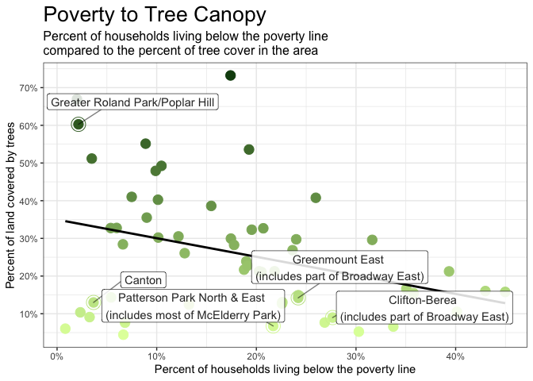
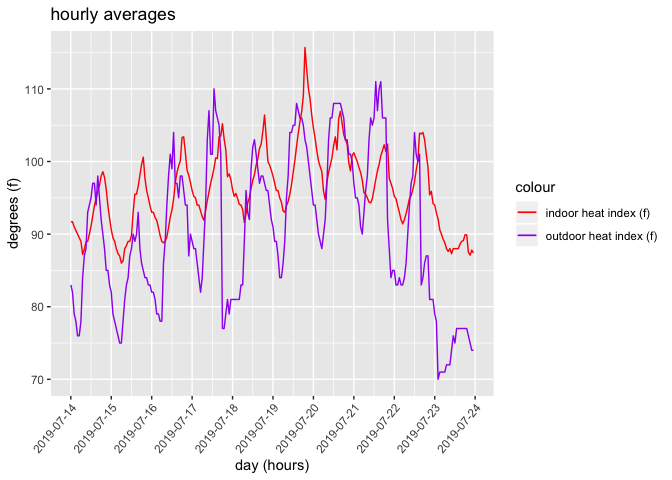
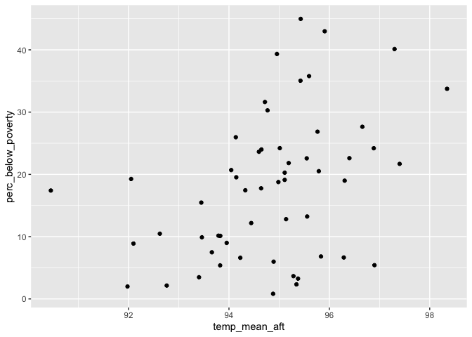

-   [Introduction](#introduction)
-   [Setup](#setup)
    -   [Load packages](#load-packages)
    -   [Load variables and data](#load-variables-and-data)
-   [Line-By-Line Fact-Check](#line-by-line-fact-check)
    -   [Fact: 11-Day Heat Wave](#fact-11-day-heat-wave)
    -   [Fact: Inner Harbor Hit 100
        Degrees](#fact-inner-harbor-hit-100-degrees)
    -   [Fact: McElderry Park is 8 Degrees
        Hotter](#fact-mcelderry-park-is-8-degrees-hotter)
    -   [Fact: McElderry Park is the hottest neighborhood in
        Baltimore](#fact-mcelderry-park-is-the-hottest-neighborhood-in-baltimore)
    -   [Fact: Frequency of EMS Calls Increase with
        Temperature](#fact-frequency-of-ems-calls-increase-with-temperature)
    -   [Fact: Frequency of Diabetes Calls Increases with
        Temperature](#fact-frequency-of-diabetes-calls-increases-with-temperature)
    -   [Fact: Hot Neighborhoods Have Lower
        Incomes](#fact-hot-neighborhoods-have-lower-incomes)
    -   [Fact: Unreliable Public
        Transportation](#fact-unreliable-public-transportation)
    -   [Fact: More Affluence = More Tree
        Canopy](#fact-more-affluence-more-tree-canopy)
    -   [Fact:](#fact)
    -   [Fact: Highset Sensor Values](#fact-highset-sensor-values)
    -   [Fact: Jackson’s House’s Heat Index was 94 on
        7/21](#fact-jacksons-houses-heat-index-was-94-on-721)
    -   [Fact:](#fact-1)
    -   [Fact: Thomas’ House was 96 on
        7-20](#fact-thomas-house-was-96-on-7-20)
    -   [Fact: Pingley’s Indoor Heat Index Greater than
        Outdoor](#fact-pingleys-indoor-heat-index-greater-than-outdoor)
    -   [Fact: East Baltimore Tree
        Cover](#fact-east-baltimore-tree-cover)
    -   [Fact: Blocks without Trees](#fact-blocks-without-trees)
    -   [Fact:](#fact-2)
-   [Fact: Temperature vs. Demographics
    Graphics](#fact-temperature-vs.demographics-graphics)
    -   [Explanation](#explanation-18)
    -   [Supporting Code](#supporting-code-18)
    -   [Fact: Poverty](#fact-poverty)
    -   [Fact: Crime](#fact-crime)
    -   [Fact: Life Expectancy](#fact-life-expectancy)
    -   [Fact: Unemployment rate](#fact-unemployment-rate)
    -   [Fact: Checking WaPo’s data](#fact-checking-wapos-data)
-   [FOR NPR](#for-npr)
    -   [Fact: Franklin Square heat (for
        NPR)](#fact-franklin-square-heat-for-npr)
    -   [Fact: Franklin Square poverty (for
        NPR)](#fact-franklin-square-poverty-for-npr)
    -   [Fact: Neighborhood heat difference (for
        NPR)](#fact-neighborhood-heat-difference-for-npr)
    -   [Fact: Poverty Heat Relationship (for
        NPR)](#fact-poverty-heat-relationship-for-npr)
-   [PINGLEY GRAPHIC MOVE OVER](#pingley-graphic-move-over)

Introduction
------------

REWRITE This R markdown document describes the methodology and results
of a portion of the data analysis we conducted in support of a reporting
project examining the effects of tree canopy inequity across the city of
Baltimore, especially as it relates to climate change.

In general, this document contains the data facts stated in the
“Neighborhoods” story. The quote from the story appears first, followed
by an explanation of the fact and the code which generated the fact. The
code is listed last. The quotes are listed in the order they appear in
the Neighborhoods story.

Setup
-----

Before running this file, **please view and run the [Code Red Data
Cleaning
document](https://github.com/smussenden/2019-baltimore-climate-health-project-data-repo/blob/master/documentation/code-red-data-cleaning.md)**
for this project. As well as outputting necessary cleaned data for the
following ananlysis, that document also includes the following items
necessary to understand this analysis:

-   definitions
-   source data citation and information
-   cleaning methodology
-   software tools used

### Load packages

``` r
#######################
#### Load Packages ####
#######################

library(tidyverse)
library(DescTools) # For %like% operator
library(corrr) # For correlation matrices
library(colorspace) # For improved color palettes
library(ggplot2) # For graphing
library(ggrepel) # For graph labeling
library(lubridate) # For working with and mutating dates
require(scales) # For percent labeling on distribution tables

# Turn off scientific notation in RStudio (prevents coersion to character type)
options(scipen = 999)
```

### Load variables and data

``` r
#########################
#### Store Variables ####
#########################

#### Common path to data ####
path_to_data <- "../data/output-data/"

#### Common save path ####
save_path <- "../data/output-data/"

###################
#### Load Data ####
###################

dmh <- read_csv(paste0(path_to_data, "baltimore_weather_stations/dmh.csv"))
EMS_all <- read_csv(paste0(path_to_data, "ems/EMS_all.csv"))
dmh_ems <- read_csv(paste0(path_to_data, "ems/dmh_ems.csv"))
stephanie_day_averages<- read_csv(paste0(path_to_data, "temperature_sensors/stephanie/stephanie_day_averages.csv"))
stephanie_day_hourly_averages <- read_csv(paste0(path_to_data, "temperature_sensors/stephanie/stephanie_day_hourly_averages.csv"))
stephanie_day_minute_averages <- read_csv(paste0(path_to_data, "temperature_sensors/stephanie/stephanie_day_minute_averages.csv"))
tammy_day_averages <- read_csv(paste0(path_to_data, "temperature_sensors/tammy/tammy_day_averages.csv"))
tammy_day_hourly_averages <- read_csv(paste0(path_to_data, "temperature_sensors/tammy/tammy_day_hourly_averages.csv"))
tammy_day_minute_averages <- read_csv(paste0(path_to_data, "temperature_sensors/tammy/tammy_day_minute_averages.csv"))
michael_day_averages<- read_csv(paste0(path_to_data, "temperature_sensors/michael/michael_day_averages.csv"))
michael_day_hourly_averages <- read_csv(paste0(path_to_data, "temperature_sensors/michael/michael_day_hourly_averages.csv"))
michael_day_minute_averages <- read_csv(paste0(path_to_data, "temperature_sensors/michael/michael_day_minute_averages.csv"))
nsa_tree_temp <- read_csv(paste0(path_to_data,"tree_temp_demographics/nsa_tree_temp.csv"))
csa_tree_temp_demographics <-read_csv(paste0(path_to_data,"tree_temp_demographics/csa_tree_temp_demographics.csv"))
blocks_tree_temp_demographics <- read_csv(paste0(path_to_data, "tree_temp_demographics/blocks_tree_temp_demographics.csv"))

####################################
######## Define Functions ##########
####################################

# Function to save each matrix as CSV
write_matrix_csv <- function(dataframe) {
  # Store dataframe name for later use
  dataframe_name <- deparse(substitute(dataframe))
  
  # Create filename for csv
  filename <- paste0("data/output-data/correlation_matrices/", dataframe_name,".csv")
  
  # Write out csv  
  write_csv(dataframe, path = filename)
  
} 

# Function to make a nice little correlation matrix heatmap for each graphic

make_correlation_matrix_graphic <- function(dataframe, grouping = "GROUPING") {
  
  # Store name of dataframe for use in title
  dataframe_name <- deparse(substitute(dataframe))
  
  # Build chart title
  chart_title <- paste0("Correlations by ", grouping, " in Baltimore City | ", dataframe_name )
  
  # Create graph
  ggplot(data = dataframe, aes(x = variable_2, y = variable)) +
    geom_tile(aes(fill = value)) +
    scale_fill_gradient2(low = "blue", high = "red", mid="white", midpoint=0) +
    geom_text(aes(label = round(value, 2)*100), size = 10) +
    ggtitle(chart_title) +
    theme(axis.text=element_text(size=14),
          axis.text.x = element_text(size=14,angle=50,hjust=1),
          plot.title = element_text(size=14)
    )
  # Create filename and filepath to save image. 
  filename <- paste0(dataframe_name,".png")
  ggsave(filename, plot = last_plot(), device = "png", path = "data/output-data/plots/correlation-matrix-images", scale = 1, width = 20, height = 20, units = "in", dpi = 300)
  
}  

select_x <- function(df){
  return(df %>%
           select_if(is.numeric) 
           # select(-matches("objectid"), 
           #        -matches("csa2010"), 
           #        -matches("id"), 
           #        -matches("09"), 
           #        -matches("1718"), 
           #        -matches("change_percent")
           #        )
         )
}
```

Line-By-Line Fact-Check
-----------------------

### Fact: 11-Day Heat Wave

“…a dangerous, 11-day heat wave tormented the city this summer…”

#### Explanation

By running the code below, you can see July 12-22 had max temperatures
of at least 90 degrees and max heat indexes of at least 92, hence the
11-day heat wave

#### Supporting Code

``` r
 dmh %>%
  filter(month == 7,
         year == 2019) %>%
  group_by(`date`) %>%
  summarise(min_temp = min(avg_hourly_temperature_dmh),
            max_temp = max(avg_hourly_temperature_dmh),
            mean_temp = mean(avg_hourly_temperature_dmh),
            min_heat_index = min(avg_hourly_heat_index_dmh),
            max_heat_index = max(avg_hourly_heat_index_dmh),
            mean_heat_index = mean(avg_hourly_heat_index_dmh) 
  )
```

    ## # A tibble: 31 x 7
    ##    date       min_temp max_temp mean_temp min_heat_index max_heat_index
    ##    <date>        <dbl>    <dbl>     <dbl>          <dbl>          <dbl>
    ##  1 2019-07-01     70       87.1      77.8             69             86
    ##  2 2019-07-02     71.1     95        81.8             71            101
    ##  3 2019-07-03     75       91.9      82.7             76             97
    ##  4 2019-07-04     79       91.9      81.9             82            102
    ##  5 2019-07-05     77       91        83.3             78            104
    ##  6 2019-07-06     75.9     93.9      84.9             77            106
    ##  7 2019-07-07     75       87.1      79.8             76             95
    ##  8 2019-07-08     73       80.1      75.2             74             82
    ##  9 2019-07-09     69.1     87.1      78.9             70             91
    ## 10 2019-07-10     72       89.1      81.2             73             93
    ## # … with 21 more rows, and 1 more variable: mean_heat_index <dbl>

### Fact: Inner Harbor Hit 100 Degrees

““Can’t even put your head out the door,” said Tammy Wilson Jackson, 48,
on a day when the temperature at the Inner Harbor hit 100 degrees."

#### Explanation

Our data below shows that the inner harbor hit a max temperature of 100
on Sunday 7/21. There is no other day in our data when the max
temperature was 100. However our data uses hourly averages. The National
Climatic Data Center also takes weather data hour by hour, but instead
of calculating the average the NCDC records the conditions at the exact
time of the reading. NCDC also has daily summaries detailing the maximum
and minimum temperature experienced over the entire day and the amount
of precipitation in inches. Using the NCDC’s daily summaries for the
month of July 2019, there are two days when the max temperature hit at
least 100: 7/20 and 7/21.

Note: the max temperature on 7/30 was also 100 degrees, but this
interview was before then.

#### Supporting Code

``` r
 dmh %>%
 filter(month == 7,
         year == 2019) %>%
  group_by(`date`) %>%
  summarise(min_temp = min(avg_hourly_temperature_dmh),
            max_temp = max(avg_hourly_temperature_dmh),
            mean_temp = mean(avg_hourly_temperature_dmh),
            min_heat_index = min(avg_hourly_heat_index_dmh),
            max_heat_index = max(avg_hourly_heat_index_dmh),
            mean_heat_index = mean(avg_hourly_heat_index_dmh) 
  )
```

    ## # A tibble: 31 x 7
    ##    date       min_temp max_temp mean_temp min_heat_index max_heat_index
    ##    <date>        <dbl>    <dbl>     <dbl>          <dbl>          <dbl>
    ##  1 2019-07-01     70       87.1      77.8             69             86
    ##  2 2019-07-02     71.1     95        81.8             71            101
    ##  3 2019-07-03     75       91.9      82.7             76             97
    ##  4 2019-07-04     79       91.9      81.9             82            102
    ##  5 2019-07-05     77       91        83.3             78            104
    ##  6 2019-07-06     75.9     93.9      84.9             77            106
    ##  7 2019-07-07     75       87.1      79.8             76             95
    ##  8 2019-07-08     73       80.1      75.2             74             82
    ##  9 2019-07-09     69.1     87.1      78.9             70             91
    ## 10 2019-07-10     72       89.1      81.2             73             93
    ## # … with 21 more rows, and 1 more variable: mean_heat_index <dbl>

``` r
dmh %>%
 filter(month == 7,
         year == 2019,
         day == 20)
```

    ## # A tibble: 24 x 9
    ##    date        year month   day  hour avg_hourly_temp… avg_hourly_dewp…
    ##    <date>     <dbl> <dbl> <dbl> <dbl>            <dbl>            <dbl>
    ##  1 2019-07-20  2019     7    20     0             87.1             72  
    ##  2 2019-07-20  2019     7    20     1             87.1             72  
    ##  3 2019-07-20  2019     7    20     2             86               71.1
    ##  4 2019-07-20  2019     7    20     3             84.9             71.1
    ##  5 2019-07-20  2019     7    20     4             84               71.1
    ##  6 2019-07-20  2019     7    20     5             82.9             71.1
    ##  7 2019-07-20  2019     7    20     6             84               72  
    ##  8 2019-07-20  2019     7    20     7             86               72  
    ##  9 2019-07-20  2019     7    20     8             89.1             73  
    ## 10 2019-07-20  2019     7    20     9             93               73.9
    ## # … with 14 more rows, and 2 more variables:
    ## #   avg_hourly_relative_humidity_dmh <dbl>,
    ## #   avg_hourly_heat_index_dmh <dbl>

### Fact: McElderry Park is 8 Degrees Hotter

“data show that temperatures here \[McElderry Park\] and in surrounding
neighborhoods can run 8 degrees hotter than in communities that have
more trees and less pavement.”

#### Explanation

The code below selects part of the dataframe “nsa\_tree\_temp” - which
lists Baltimore neighborhoods and a variety of temperature data - and
filters it for the neighborhoods with the lowest average temperature in
the afternoon or the highest average temperature in the afternoon. The
results are then arranged in descending order. From this data we can see
that McElderry Park has the highest average temperature in the afternoon
at 99.39 degrees. Dickeyville, on the other hand, has the lowest average
afternoon temperature at 91.01 degrees. The difference between those
temperatures is 8.38 degrees, which is rounded to 8.

\*Note: Gwynns Falls/Leakin Park was removed from the dataset as the
topography of the area is more akin to a park than neighborhood.

#### Supporting Code

``` r
nsa_tree_temp %>%
  select(nsa_name, temp_mean_aft) %>%
  filter(nsa_name != "gwynns falls/leakin park") %>%
  filter((temp_mean_aft == min(temp_mean_aft)) | (temp_mean_aft == max(temp_mean_aft))) %>%
  arrange(desc(temp_mean_aft))
```

    ## # A tibble: 2 x 2
    ##   nsa_name       temp_mean_aft
    ##   <chr>                  <dbl>
    ## 1 mcelderry park          99.4
    ## 2 dickeyville             91.0

### Fact: McElderry Park is the hottest neighborhood in Baltimore

“McElderry Park … which despite its lyrical name offers little green
space, is the hottest neighborhood in Baltimore.”

#### Explanation

Similar to above, the code below selects the neighborhood and average
afternoon temperature columns from the dataframe “nsa\_tree\_temp” -
which lists Baltimore neighborhoods and a variety of temperature data.
The results are then arranged in descending order so the hottest
neighborhood is at the top. From this data we can see that McElderry
Park has the highest average temperature in the afternoon at 99.39
degrees.

#### Supporting Code

``` r
nsa_tree_temp %>%
  select(nsa_name, temp_mean_aft) %>%
  arrange(desc(temp_mean_aft))
```

    ## # A tibble: 278 x 2
    ##    nsa_name              temp_mean_aft
    ##    <chr>                         <dbl>
    ##  1 mcelderry park                 99.4
    ##  2 milton-montford                99.3
    ##  3 patterson place                98.6
    ##  4 dunbar-broadway                98.3
    ##  5 ellwood park/monument          98.3
    ##  6 penn-fallsway                  98.3
    ##  7 pleasant view gardens          98.3
    ##  8 madison-eastend                97.9
    ##  9 old goucher                    97.9
    ## 10 biddle street                  97.9
    ## # … with 268 more rows

### Fact: Frequency of EMS Calls Increase with Temperature

“In hot weather, emergency medical calls for some chronic conditions
increase.”

#### Explanation

The initial code below sorts the number of calls to EMS into groups
based on the outside temperature when the call was made. You’ll see that
calls for help decrease as temperature increases.

The second bit of code, however, breaks the calls down by the illness
for which the call was made and counts the number of calls per condition
during each temperature “bucket.” Many of these illness were selected
since hot weather tends to aggravate their symptoms/conditions. These
numbers show that calls decrease as temperature increases, but a likely
explanation is that hot temperatures occur much less frequently than
cooler ones, limiting the amount of time when calls can be made in that
temperature “bucket.”

To account for the rarity of hotter temperatures, the number of hours
for which the temperature was in a certain bucket is divided by the
total amount of calls. This will give us the frequency of calls,
represented as “hours\_per\_call.” In examining this value per condition
per temperature bucket, the data shows that the freqeuency of many calls
increases during hotter weather.

For example, when the temperature is below 80 degrees, a call is made to
EMS concerning dehydration every 41.74 hours. When the temperature
climbs into the “danger” zone, or 103 to 124 degrees, the rate of calls
for dehydration increases to one every 2.21 hours. Similarly, a call for
a seizure is made every 2.34 hours when the temperature is less than 80
degrees, but increases to a call every 1.4 hours when the temperature is
between 103 and 124 degrees.

Other conditions for which the call frequency increases include: altered
level of consciousness, behavioral/psychiatric disorder, cardiac arrest,
chest pain - STEMI, COPD, dehydration, diabetic hyper- and hypoglycemia,
dizziness/vertigo, hyper- and hypotension, hyperthermia, obvious death,
substance/drug abuse, and others.

#### Supporting Code

``` r
# Five-part NWS heat index danger scale
heat_index_count_per_nws_five_scale_bucket <- dmh_ems %>%
  select(heat_index_nws_five_scale_bucket) %>%
  group_by(heat_index_nws_five_scale_bucket) %>%
  summarise(heat_index_count_per_nws_five_scale_bucket=n()) %>%
  arrange(heat_index_nws_five_scale_bucket)

########### Five NWS Buckets #################
#### Table 1 | Primary Impression Group | Ratio Condition Calls v Heat Index | five NWS Buckets #####
# Ratio of number of calls for each condition type in each heat index bucket to total number of hours in each given temperature bucket. A lower number indicates a higher number of calls for each condition adjusted for the fact that some temperatures are simply more common than other others. It's 70 degrees for many more hours in a year than it is 110.  

call_heat_index_ratio_five_primary_impression_group <- EMS_all %>%
  filter(primary_impression_group != "Other") %>%
  group_by(primary_impression_group, adjusted_heat_index_nws_five_scale_bucket) %>%
  summarise(condition_calls_count_per_bucket=n()) %>%
  inner_join(heat_index_count_per_nws_five_scale_bucket, by = c("adjusted_heat_index_nws_five_scale_bucket" = "heat_index_nws_five_scale_bucket")) %>%
  mutate(hours_per_call = heat_index_count_per_nws_five_scale_bucket/condition_calls_count_per_bucket) %>%
  select(primary_impression_group, adjusted_heat_index_nws_five_scale_bucket, hours_per_call) %>%
  spread(adjusted_heat_index_nws_five_scale_bucket, hours_per_call) %>%
  select(primary_impression_group, `not_unsafe_under_80`,`caution_80_89`,`extreme_caution_90_102`,`danger_103_124`)
```

### Fact: Frequency of Diabetes Calls Increases with Temperature

“The rate of emergency medical calls for cardiac arrest and congestive
heart failure, for example, nearly double when the heat index hits 103
degrees.”

#### Explanation

Using the same code as above, the number of hours inbetween calls for
diabetes are certain temperatures was calculated. At 80 degrees or
below, a call was made every 5.3 hours for Cardiac Arrest and every 15
hours for Congestive Heart Failure. When the heat index is 103 or
greater, however, there is a call to EMS for cardiac arrest every 2.94
hours and for congestive heart failure every 8.83 hours. By dividing the
value at 80 degrees by the value at 103+, we will get 1.8 for cardiac
arrest and 1.7 for congestive heart failure. Those numbers round to 2,
which means the frequency of the calls nearly doubles.

#### Supporting Code

``` r
# Create dataframes with a count of hourly heat_index readings for each bucket ###

# Five-part NWS heat index danger scale
heat_index_count_per_nws_five_scale_bucket <- dmh_ems %>%
  select(heat_index_nws_five_scale_bucket) %>%
  group_by(heat_index_nws_five_scale_bucket) %>%
  summarise(heat_index_count_per_nws_five_scale_bucket=n()) %>%
  arrange(heat_index_nws_five_scale_bucket)

########### Five NWS Buckets #################
#### Table 1 | Primary Impression Group | Ratio Condition Calls v Heat Index | five NWS Buckets #####
# Ratio of number of calls for each condition type in each heat index bucket to total number of hours in each given temperature bucket. A lower number indicates a higher number of calls for each condition adjusted for the fact that some temperatures are simply more common than other others. It's 70 degrees for many more hours in a year than it is 110.

call_heat_index_ratio_five_primary_impression_group <- EMS_all %>%
  filter(primary_impression_group != "Other") %>%
  group_by(primary_impression_group, adjusted_heat_index_nws_five_scale_bucket) %>%
  summarise(condition_calls_count_per_bucket=n()) %>%
  inner_join(heat_index_count_per_nws_five_scale_bucket, by = c("adjusted_heat_index_nws_five_scale_bucket" = "heat_index_nws_five_scale_bucket")) %>%
  mutate(hours_per_call = heat_index_count_per_nws_five_scale_bucket/condition_calls_count_per_bucket) %>%
  select(primary_impression_group, adjusted_heat_index_nws_five_scale_bucket, hours_per_call) %>%
  spread(adjusted_heat_index_nws_five_scale_bucket, hours_per_call) %>%
  select(primary_impression_group, `not_unsafe_under_80`,`caution_80_89`,`extreme_caution_90_102`,`danger_103_124`) %>%
  filter(primary_impression_group == "Cardiac Arrest" | primary_impression_group == "CHF (Congestive Heart Failure)")
```

### Fact: Hot Neighborhoods Have Lower Incomes

“Households in the city’s hottest neighborhoods have lower incomes”

#### Explanation

The code below pulls from the “csa\_tree\_temp\_demographics” dataset,
which includes a variety of information on each neighborhood in
Baltimore. From that dataset, median afternoon temperature and
percentage of family households below the poverty line are isolated to
allow for a comparison of median temperatures to poverty rate. The
temperature is arranged in descending order, putting the hottest
neighborhoods on top.

The two hottest neighborhoods, Madison/East End and Oldtown/Middle East,
have poverty rates of 33.74% and 40.13%, respectively. The ten hottest
neighborhoods all have average afternoon temperatures of at least 96
(when rounded) and only two have single digit poverty rates; the poverty
rates for the other neighborhoods are all at least 19%.

In comparison, the 15 coolest neighborhoods have an average afternoon
temperature of 94.1 degrees or less. The highest poverty rate is 19.53%
in Greater Govans and 19.26% in Forest Park/Walbrook, only greater than
the poverty rating of 7 of the 10 hottest neighborhoods. 8 of the
coolest neighborhoods have a single digit poverty rating (or 7
neighborhoods, if you round Cross-Country/Cheswolde’s poverty rate to
10%).

#### Supporting Code

``` r
 csa_tree_temp_demographics %>%
  select_x() %>%
  as.matrix() %>%
  correlate() %>%
  focus(matches("temp_")) %>%
  mutate(variable=rowname) %>%
  select(variable, temp_median_aft) %>%
  filter(variable=="percent_of_family_households_living_below_the_poverty_line")
```

    ## # A tibble: 1 x 2
    ##   variable                                                  temp_median_aft
    ##   <chr>                                                               <dbl>
    ## 1 percent_of_family_households_living_below_the_poverty_li…           0.378

``` r
csa_tree_temp_demographics %>%
  select(csa2010,temp_median_aft,percent_of_family_households_living_below_the_poverty_line) %>%
  arrange(desc(temp_median_aft))
```

    ## # A tibble: 55 x 3
    ##    csa2010             temp_median_aft percent_of_family_households_living…
    ##    <chr>                         <dbl>                                <dbl>
    ##  1 madison/east end               98.4                                33.7 
    ##  2 oldtown/middle east            97.5                                40.1 
    ##  3 patterson park nor…            97.2                                21.7 
    ##  4 midtown                        97.1                                 5.42
    ##  5 greenmount east                97.0                                24.2 
    ##  6 clifton-berea                  96.9                                27.6 
    ##  7 greater charles vi…            96.8                                19.0 
    ##  8 midway/coldstream              96.4                                22.6 
    ##  9 highlandtown                   96.3                                 6.65
    ## 10 upton/druid heights            95.9                                43.0 
    ## # … with 45 more rows

### Fact: Unreliable Public Transportation

“Public transportation, which many residents here use, is unreliable.”

#### Explanation

The code below returns Baltimore neighborhoods in descending order of
average afternoon temperature as well as the percentage of that
neighborhood’s population that uses public transportation to get to
work. Of all the neighborhoods, only 10 have single digit values for the
percentage of population that uses public transportation. Of the top ten
hottest neighborhoods, only one has a single digit public transportation
usage value; the next lowest is 12.20% and the greatest is 42.55%. Over
30% of the population uses public transportation in 10 neighborhoods,
and five of those neighbors are also among the ten hottest (six of the
highest public transportation using neighborhoods are also among the 12
hottest).

#### Supporting Code

``` r
 csa_tree_temp_demographics %>%
  select_x() %>%
  as.matrix() %>%
  correlate() %>%
  focus(matches("temp_")) %>%
  mutate(variable=rowname) %>%
  select(variable, temp_median_aft) %>%
  filter(variable=="percent_of_population_that_uses_public_transportation_to_get_to_work")
```

    ## # A tibble: 1 x 2
    ##   variable                                                  temp_median_aft
    ##   <chr>                                                               <dbl>
    ## 1 percent_of_population_that_uses_public_transportation_to…           0.410

``` r
csa_tree_temp_demographics %>%
  select(csa2010,temp_median_aft,percent_of_population_that_uses_public_transportation_to_get_to_work) %>%
  arrange(desc(temp_median_aft))
```

    ## # A tibble: 55 x 3
    ##    csa2010            temp_median_aft percent_of_population_that_uses_publ…
    ##    <chr>                        <dbl>                                 <dbl>
    ##  1 madison/east end              98.4                                 34.2 
    ##  2 oldtown/middle ea…            97.5                                 27.0 
    ##  3 patterson park no…            97.2                                 12.2 
    ##  4 midtown                       97.1                                 27.0 
    ##  5 greenmount east               97.0                                 42.5 
    ##  6 clifton-berea                 96.9                                 34.0 
    ##  7 greater charles v…            96.8                                 22.5 
    ##  8 midway/coldstream             96.4                                 32.6 
    ##  9 highlandtown                  96.3                                  7.19
    ## 10 upton/druid heigh…            95.9                                 31.6 
    ## # … with 45 more rows

### Fact: More Affluence = More Tree Canopy

“The streets have fewer trees than those in more affluent communities.”

#### Explanation

The code below below selects from the neighborhood demographic dataset
all the neighborhoods, the poverty rate in those neighborhoods, and the
percentage of tree cover for each neighborhood according to the most
recent LiDar data available for Baltimore from 2015. The selected
observations are then listed in order of greatest tree canopy percentage
to least.

The ggplot code then graphs that dataset, with special attention paid to
the neighborhoods Canton, Clifton-Berea, Patterson Park, Greater Roland
Park/Poplar Hill and Greenmount East. Along the y-axis is percentage of
tree canopy coverage while the x-axis shows poverty rates. The code
geom\_smooth() creates a best fit line over the data and clearly shows a
decrease in tree canopy coverage as poverty rate increases.

#### Supporting Code

``` r
 csa_tree_temp_demographics %>%
  select_x() %>%
  as.matrix() %>%
  correlate() %>%
  focus(matches("15_lid_mean")) %>%
  mutate(variable=rowname) %>%
  select(variable, `15_lid_mean`) %>%
  filter(variable=="percent_of_family_households_living_below_the_poverty_line")
```

    ## # A tibble: 1 x 2
    ##   variable                                                   `15_lid_mean`
    ##   <chr>                                                              <dbl>
    ## 1 percent_of_family_households_living_below_the_poverty_line        -0.340

``` r
csa_tree_temp_demographics %>%
  select(csa2010,`15_lid_mean`,percent_of_family_households_living_below_the_poverty_line) %>%
  arrange(desc(`15_lid_mean`))
```

    ## # A tibble: 55 x 3
    ##    csa2010              `15_lid_mean` percent_of_family_households_living_…
    ##    <chr>                        <dbl>                                 <dbl>
    ##  1 dickeyville/frankli…         0.732                                 17.4 
    ##  2 mount washington/co…         0.670                                  2.00
    ##  3 greater roland park…         0.603                                  2.15
    ##  4 edmondson village            0.551                                  8.89
    ##  5 forest park/walbrook         0.536                                 19.3 
    ##  6 north baltimore/gui…         0.512                                  3.48
    ##  7 beechfield/ten hill…         0.492                                 10.5 
    ##  8 cross-country/chesw…         0.479                                  9.89
    ##  9 lauraville                   0.410                                  7.49
    ## 10 penn north/reservoi…         0.408                                 26.0 
    ## # … with 45 more rows

``` r
# CSAs to call out
callout_ls <- c("Canton", "Clifton-Berea", "Greater Roland Park/Poplar Hill", "Greenmount East")

## POVERTY TO TREE COVER
csa_tree_temp_demographics %>%
  mutate_at(vars("csa2010"), str_to_title) %>%
  # Start ggplot and set x and y for entire plot
  ggplot(aes(
    x = percent_of_family_households_living_below_the_poverty_line/100,
    y = `15_lid_mean`
    )) +
  # This section for the basic scatterplot
  geom_point(aes(color = `15_lid_mean`),
             size=4) +
  # This section for circling all sample neighborhood points
  geom_point(data = csa_tree_temp_demographics %>%
               mutate_at(vars("csa2010"), str_to_title) %>%
               filter((csa2010 %in% callout_ls)
                      # Patterson Park must be included seperately because of its unique label positioning
                      | (csa2010 == "Patterson Park North & East")
                      ),
             aes(color = `15_lid_mean`),
             size=6, shape = 1) +
  # This section shows the trend line
  geom_smooth(se = FALSE, # Removes gray banding
              method = glm,
              color = "black") +
  # This section for labeling Canton, etc.
  ggrepel::geom_label_repel(data = csa_tree_temp_demographics %>%
                              mutate_at(vars("csa2010"), str_to_title) %>%
                              filter(csa2010 %in% callout_ls) %>%
                              mutate(csa2010 = case_when(
                                csa2010 == "Greenmount East" ~ "Greenmount East \n(includes part of Broadway East)",
                                csa2010 == "Clifton-Berea" ~ "Clifton-Berea \n(includes part of Broadway East)",
                                T ~ csa2010)),
            aes(label = csa2010),
            min.segment.length = .1,
            segment.alpha = .5,
            alpha = .85,
            nudge_x = .05,
            nudge_y = .06) +
  # This section for labeling Patterson Park (so its label can be nudged)
  ggrepel::geom_label_repel(data = csa_tree_temp_demographics %>%
                              mutate_at(vars("csa2010"), str_to_title) %>%
                              filter(csa2010 == "Patterson Park North & East") %>%
                              mutate(csa2010 = case_when(
                                csa2010 == "Patterson Park North & East" ~ "Patterson Park North & East \n(includes most of McElderry Park)",
                                T ~ csa2010)),
                            aes(label = csa2010),
                            min.segment.length = .1,
                            segment.alpha = .5,
                            alpha = .85,
                            nudge_x = -.06,
                            nudge_y = .03) +
  # Colors and label formatting follow
  #coord_flip() +
  scale_colour_gradient(low = "#E0FEA9", high = "#144A11") +
  labs(title = "Poverty to Tree Canopy",
       subtitle = "Percent of households living below the poverty line \ncompared to the percent of tree cover in the area",
       x = "Percent of households living below the poverty line",
       y = "Percent of land covered by trees") +
  scale_x_continuous(label = scales::percent_format(accuracy = 1.0),
                     breaks = seq(0, 1, .1)) +
  scale_y_continuous(label = scales::percent_format(accuracy = 1.0),
                     breaks = seq(0, 1, .1)) +
  theme_bw() +
  theme(legend.position = "none",
        plot.title = element_text(size = 20),
        plot.subtitle = element_text(size = 12))
```



### Fact:

“Crime rates are higher, so many people won’t put an air-conditioning
unit in a first-floor window for fear of break-ins.”

#### Explanation

The first set of code returns a dataset with the amount of various
crimes per 1000 residents. The crimes include part 1 crimes, violent
crimes, property crimes, shootings, gun related homicides, common
assault, and narcotics. The next column, titled “temp\_mean\_aft”, lists
the coefficient of the crime rate to temperature. The closer the
coefficient is to 1, the greater the relation.

The crime rates are then paired with Baltimore’s neighborhoods, which
are sorted from highest average afternoon temperature to lowest. The
third column, “part\_1\_crime\_rate\_per\_1\_000\_residents”, lists the
amount of part 1 crimes per 1,000 residents in that neighborhood.

The values are then plotted, with average afternoon temperature on the
y-axis and number of property crimes per 1,000 residents on the x-axis.
The neighborhoods Canton, Clifton-Berea, Greater Roland Park/Poplar
Hill, Greenmount East and Patterson Park North and East are highlighted
for storytelling purposes. A best fit line is applied to show the
average trajectory of the plotted values. It has a positive slope, which
shows that as crime rate rises, so too does the average afternoon
temperature.

#### Supporting Code

``` r
 csa_tree_temp_demographics %>%
  select_x() %>%
  as.matrix() %>%
  correlate() %>%
  focus(matches("temp_")) %>%
  mutate(variable=rowname) %>%
  select(variable, temp_mean_aft) %>%
  filter(str_detect(variable, "crime|shootings|gun|assault|narcotics"))
```

    ## # A tibble: 7 x 2
    ##   variable                                                    temp_mean_aft
    ##   <chr>                                                               <dbl>
    ## 1 part_1_crime_rate_per_1_000_residents                               0.553
    ## 2 violent_crime_rate_per_1_000_residents                              0.580
    ## 3 property_crime_rate_per_1_000_residents                             0.525
    ## 4 number_of_shootings_per_1_000_residents                             0.404
    ## 5 number_of_gun_related_homicides_per_1_000_residents                 0.387
    ## 6 number_of_common_assault_calls_for_service_per_1_000_resid…         0.420
    ## 7 number_of_narcotics_calls_for_service_per_1_000_residents           0.356

``` r
csa_tree_temp_demographics %>%
  select(csa2010,temp_mean_aft,matches("crime|shootings|gun|assault|narcotics")) %>%
  arrange(desc(temp_mean_aft))
```

    ## # A tibble: 55 x 9
    ##    csa2010 temp_mean_aft part_1_crime_ra… violent_crime_r… property_crime_…
    ##    <chr>           <dbl>            <dbl>            <dbl>            <dbl>
    ##  1 madiso…          98.3            119.              28.7             89.3
    ##  2 patter…          97.4            113.              27.4             83.9
    ##  3 oldtow…          97.3            111.              38.0             71.1
    ##  4 midtown          96.9             80.3             20.8             58.6
    ##  5 greenm…          96.9             86.0             32.9             51.7
    ##  6 clifto…          96.7             67.8             25.1             41.5
    ##  7 midway…          96.4             76.3             26.1             48.1
    ##  8 greate…          96.3             67.2             23.5             43.1
    ##  9 highla…          96.3             98.5             28.1             69.8
    ## 10 upton/…          95.9             84.2             30.9             51.7
    ## # … with 45 more rows, and 4 more variables:
    ## #   number_of_shootings_per_1_000_residents <dbl>,
    ## #   number_of_gun_related_homicides_per_1_000_residents <dbl>,
    ## #   number_of_common_assault_calls_for_service_per_1_000_residents <dbl>,
    ## #   number_of_narcotics_calls_for_service_per_1_000_residents <dbl>

``` r
# CSAs to call out
callout_ls <- c("Canton", "Clifton-Berea", "Greater Roland Park/Poplar Hill", "Greenmount East")

## PROPERTY CRIME TO TEMPERATURE
csa_tree_temp_demographics %>%
  mutate_at(vars("csa2010"), str_to_title) %>%
  # Start ggplot and set x and y for entire plot
  ggplot(aes(
    x = property_crime_rate_per_1_000_residents,
    y = temp_mean_aft
    )) +
  # This section for the basic scatterplot
  geom_point(aes(color = temp_mean_aft),
             size=4) +
  # This section for circling all sample neighborhood points
  geom_point(data = csa_tree_temp_demographics %>%
               mutate_at(vars("csa2010"), str_to_title) %>%
               filter((csa2010 %in% callout_ls)
                      # Patterson Park must be included seperately because of its unique label positioning
                      | (csa2010 == "Patterson Park North & East")
                      ),
             aes(color = temp_mean_aft),
             size=6, shape = 1) +
  # This section shows the trend line
  geom_smooth(se = FALSE, # Removes gray banding
              method = glm,
              color = "black") +
  # This section for labeling Canton, etc.
  ggrepel::geom_label_repel(data = csa_tree_temp_demographics %>%
                              mutate_at(vars("csa2010"), str_to_title) %>%
                              filter(csa2010 %in% callout_ls) %>%
                              mutate(csa2010 = case_when(
                                csa2010 == "Greenmount East" ~ "Greenmount East \n(includes part of Broadway East)",
                                csa2010 == "Clifton-Berea" ~ "Clifton-Berea \n(includes part of Broadway East)",
                                T ~ csa2010)),
            aes(label = csa2010),
            min.segment.length = .1,
            segment.alpha = .5,
            alpha = .85,
            nudge_x = .05,
            nudge_y = .06) +
  # This section for labeling Patterson Park (so its label can be nudged)
  ggrepel::geom_label_repel(data = csa_tree_temp_demographics %>%
                              mutate_at(vars("csa2010"), str_to_title) %>%
                              filter(csa2010 == "Patterson Park North & East") %>%
                              mutate(csa2010 = case_when(
                                csa2010 == "Patterson Park North & East" ~ "Patterson Park North & East \n(includes most of McElderry Park)",
                                T ~ csa2010)),
                            aes(label = csa2010),
                            min.segment.length = .1,
                            segment.alpha = .5,
                            alpha = .85,
                            nudge_x = -.06,
                            nudge_y = .03) +
  # Colors and label formatting follow
  #coord_flip() +
  scale_colour_gradient(low = "#E0FEA9", high = "#144A11") +
  labs(title = "PROPERTY CRIME TO TEMPERATURE",
       subtitle = "Property Crime per 1,000",
       x = "Property crime per 1000 people",
       y = "mean aft temperature") +
  scale_x_continuous(label = scales::percent_format(accuracy = 1.0),
                     breaks = seq(0, 1, .1)) +
  scale_y_continuous(label = scales::percent_format(accuracy = 1.0),
                     breaks = seq(0, 1, .1)) +
  theme_bw() +
  theme(legend.position = "none",
        plot.title = element_text(size = 20),
        plot.subtitle = element_text(size = 12))
```


### Fact: Highset Sensor Values

"Reporters from the University of Maryland’s Howard Center for
Investigative Journalism and Capital News Service placed sensors that
record heat and humidity inside several homes in McElderry Park and
nearby neighborhoods.

“Those sensors recorded temperatures that reached as high as 97 degrees
and heat index values of 119 degrees.”

#### Explanation

The code belowing uses the “all\_sensors\_day\_minute\_averages”
dataset, which contains all of the temperature and heat index data
collected by sensors that reporters from the University of Maryland’s
Howard Center for Investigative Journalism and Capital News Service
placed in consenting peoples’ homes. The values are then filtered, first
for the maximum indoor temperature and then for maximum indoor heat
index. The two filtered lines return observations of 96.8 degrees (97
when rounded) for maximum temperature and 119 for maximum indoor heat
index.

#### Supporting Code

``` r
all_sensors_day_minute_averages <- bind_rows(michael_day_minute_averages, tammy_day_minute_averages, stephanie_day_minute_averages)

all_sensors_day_minute_averages %>%
  filter(mean_indoor_temperature == max(mean_indoor_temperature))
```

    ## # A tibble: 4 x 7
    ##   date_hour_minute    mean_indoor_tem… mean_indoor_hea… mean_outdoor_te…
    ##   <dttm>                         <dbl>            <dbl>            <dbl>
    ## 1 2019-07-19 20:55:00             96.8              112             93.9
    ## 2 2019-07-19 21:06:00             96.8              112             91.9
    ## 3 2019-07-19 21:30:00             96.8              112             91.9
    ## 4 2019-07-19 21:45:00             96.8              112             91.9
    ## # … with 3 more variables: mean_outdoor_heat_index <dbl>,
    ## #   indoor_temperature_difference <dbl>,
    ## #   indoor_heat_index_difference <dbl>

``` r
all_sensors_day_minute_averages %>%
  filter(mean_indoor_heat_index == max(mean_indoor_heat_index))
```

    ## # A tibble: 1 x 7
    ##   date_hour_minute    mean_indoor_tem… mean_indoor_hea… mean_outdoor_te…
    ##   <dttm>                         <dbl>            <dbl>            <dbl>
    ## 1 2019-07-20 18:12:00             95.7              119             96.1
    ## # … with 3 more variables: mean_outdoor_heat_index <dbl>,
    ## #   indoor_temperature_difference <dbl>,
    ## #   indoor_heat_index_difference <dbl>

### Fact: Jackson’s House’s Heat Index was 94 on 7/21

“On the first floor of Jackson’s two-story rowhouse, the heat index
registered 93 degrees at 10 p.m. on Sunday, July 21. Outside, the heat
index was 9 degrees lower, 84 degrees.”

#### Explanation

The following code pulls from datasets containing the average weather
condition recordings from sensors for Tammy Jackson’s house. The first
set uses the hourly average values while the second uses the average
recorded values each minute. Both are filtered for July 21, 2019 at 10
p.m. on the dot. Both have the indoor heat index listed as 93 while the
outdoor heat index is 84.

#### Supporting Code

``` r
tammy_day_hourly_averages %>%
  mutate(date = date(date_hour)) %>%
  mutate(hour = hour(date_hour)) %>%
  filter(date == "2019-07-21") %>%
  filter(hour == 22)
```

    ## # A tibble: 1 x 9
    ##   date_hour           mean_indoor_tem… mean_indoor_hea… mean_outdoor_te…
    ##   <dttm>                         <dbl>            <dbl>            <dbl>
    ## 1 2019-07-21 22:00:00             87.9               93               81
    ## # … with 5 more variables: mean_outdoor_heat_index <dbl>,
    ## #   indoor_temperature_difference <dbl>,
    ## #   indoor_heat_index_difference <dbl>, date <date>, hour <int>

``` r
tammy_day_minute_averages %>%
  mutate(date = date(date_hour_minute)) %>%
  mutate(hour = hour(date_hour_minute)) %>%
  mutate(minute = minute(date_hour_minute)) %>%
  filter(date == "2019-07-21") %>%
  filter(hour == 22) %>%
  filter(minute == 0)
```

    ## # A tibble: 1 x 10
    ##   date_hour_minute    mean_indoor_tem… mean_indoor_hea… mean_outdoor_te…
    ##   <dttm>                         <dbl>            <dbl>            <dbl>
    ## 1 2019-07-21 22:00:00             88.2               93               81
    ## # … with 6 more variables: mean_outdoor_heat_index <dbl>,
    ## #   indoor_temperature_difference <dbl>,
    ## #   indoor_heat_index_difference <dbl>, date <date>, hour <int>,
    ## #   minute <int>

### Fact:

“At 7 p.m. Friday, the heat index in Baltimore hit 107 degrees in the
Inner Harbor. Inside the bedroom Stephanie Pingley’s niece shares with
one of her three sons, it was 9 degrees hotter, with a heat index of 116
degrees.”

Note: DIFFERENT VALUES, FIX THESE.

#### Explanation

The following code pulls from datasets containing the average weather
condition recordings from sensors for Stephanie Pingley’s house. The
first set uses the hourly average values while the second uses the
average recorded values each minute. Both are filtered for July 19, 2019
at 7 p.m. on the dot. The heat index for the hourly averages table is
115.7 degrees, while on the minute table the heat index is listed as
115.

The final set of code accesses the dataset containing average hourly
temperatures, dewpoints, relative humidities, and heat indexes for
Baltimore’s Inner Harbor since 1998. The data is filtered for July 19 at
7 p.m., at which time the average heat index was listed as 103.

#### Supporting Code

``` r
stephanie_day_hourly_averages %>%
  mutate(date = date(date_hour)) %>%
  mutate(hour = hour(date_hour)) %>%
  filter(date == "2019-07-19") %>%
  filter(hour == 19)
```

    ## # A tibble: 1 x 9
    ##   date_hour           mean_indoor_tem… mean_indoor_hea… mean_outdoor_te…
    ##   <dttm>                         <dbl>            <dbl>            <dbl>
    ## 1 2019-07-19 19:00:00               96             116.               95
    ## # … with 5 more variables: mean_outdoor_heat_index <dbl>,
    ## #   indoor_temperature_difference <dbl>,
    ## #   indoor_heat_index_difference <dbl>, date <date>, hour <int>

``` r
stephanie_day_minute_averages %>%
  mutate(date = date(date_hour_minute)) %>%
  mutate(hour = hour(date_hour_minute)) %>%
  mutate(minute = minute(date_hour_minute)) %>%
  filter(date == "2019-07-19") %>%
  filter(hour == 19) %>%
  filter(minute == 0)
```

    ## # A tibble: 1 x 10
    ##   date_hour_minute    mean_indoor_tem… mean_indoor_hea… mean_outdoor_te…
    ##   <dttm>                         <dbl>            <dbl>            <dbl>
    ## 1 2019-07-19 19:00:00             95.9              115               95
    ## # … with 6 more variables: mean_outdoor_heat_index <dbl>,
    ## #   indoor_temperature_difference <dbl>,
    ## #   indoor_heat_index_difference <dbl>, date <date>, hour <int>,
    ## #   minute <int>

``` r
dmh %>%
  filter(date == "2019-07-19",
         hour == 19) %>%
  select(avg_hourly_heat_index_dmh)
```

    ## # A tibble: 1 x 1
    ##   avg_hourly_heat_index_dmh
    ##                       <dbl>
    ## 1                       103

### Fact: Thomas’ House was 96 on 7-20

“By Saturday, the temperature inside the second-floor apartment of
Michael Thomas and Alberta Wilkerson hit 96 degrees.”

#### Explanation

The following code pulls from datasets containing the average weather
condition recordings from sensors for Michael’s house. The first sorts
in descending order of mean\_indoor\_temperature values while the second
sorts in descending order of mean\_indoor\_heat\_index values. Both are
filtered for July 20, 2019. Both sets contain a value of 96 or greater
for the mean\_indoor\_temperature at least once during the day.

Note: The heat index hit 112!

#### Supporting Code

``` r
michael_day_hourly_averages %>%
  mutate(date = date(date_hour)) %>%
  mutate(hour = hour(date_hour)) %>%
  filter(date == "2019-07-20") %>%
  arrange(desc(mean_indoor_temperature))
```

    ## # A tibble: 17 x 9
    ##    date_hour           mean_indoor_tem… mean_indoor_hea… mean_outdoor_te…
    ##    <dttm>                         <dbl>            <dbl>            <dbl>
    ##  1 2019-07-20 00:00:00             96.1             110.             87.1
    ##  2 2019-07-20 16:00:00             96               109.             99  
    ##  3 2019-07-20 01:00:00             95.9             111.             87.1
    ##  4 2019-07-20 15:00:00             95.9             110.             98.1
    ##  5 2019-07-20 02:00:00             95.8             111              86  
    ##  6 2019-07-20 03:00:00             95.7             112.             84.9
    ##  7 2019-07-20 04:00:00             95.5             112.             84  
    ##  8 2019-07-20 14:00:00             95.5             109.             97  
    ##  9 2019-07-20 05:00:00             95.3             112.             82.9
    ## 10 2019-07-20 06:00:00             94.9             109.             84  
    ## 11 2019-07-20 13:00:00             94.8             108.             96.1
    ## 12 2019-07-20 07:00:00             94.1             107.             86  
    ## 13 2019-07-20 12:00:00             94.1             108.             96.1
    ## 14 2019-07-20 08:00:00             93.6             106.             89.1
    ## 15 2019-07-20 11:00:00             93.5             107.             95  
    ## 16 2019-07-20 09:00:00             93.3             106.             93  
    ## 17 2019-07-20 10:00:00             93.3             106              93.9
    ## # … with 5 more variables: mean_outdoor_heat_index <dbl>,
    ## #   indoor_temperature_difference <dbl>,
    ## #   indoor_heat_index_difference <dbl>, date <date>, hour <int>

``` r
michael_day_hourly_averages %>%
  mutate(date = date(date_hour)) %>%
  mutate(hour = hour(date_hour)) %>%
  filter(date == "2019-07-20") %>%
  arrange(desc(mean_indoor_heat_index))
```

    ## # A tibble: 17 x 9
    ##    date_hour           mean_indoor_tem… mean_indoor_hea… mean_outdoor_te…
    ##    <dttm>                         <dbl>            <dbl>            <dbl>
    ##  1 2019-07-20 03:00:00             95.7             112.             84.9
    ##  2 2019-07-20 05:00:00             95.3             112.             82.9
    ##  3 2019-07-20 04:00:00             95.5             112.             84  
    ##  4 2019-07-20 02:00:00             95.8             111              86  
    ##  5 2019-07-20 01:00:00             95.9             111.             87.1
    ##  6 2019-07-20 00:00:00             96.1             110.             87.1
    ##  7 2019-07-20 15:00:00             95.9             110.             98.1
    ##  8 2019-07-20 06:00:00             94.9             109.             84  
    ##  9 2019-07-20 16:00:00             96               109.             99  
    ## 10 2019-07-20 14:00:00             95.5             109.             97  
    ## 11 2019-07-20 13:00:00             94.8             108.             96.1
    ## 12 2019-07-20 12:00:00             94.1             108.             96.1
    ## 13 2019-07-20 07:00:00             94.1             107.             86  
    ## 14 2019-07-20 11:00:00             93.5             107.             95  
    ## 15 2019-07-20 10:00:00             93.3             106              93.9
    ## 16 2019-07-20 08:00:00             93.6             106.             89.1
    ## 17 2019-07-20 09:00:00             93.3             106.             93  
    ## # … with 5 more variables: mean_outdoor_heat_index <dbl>,
    ## #   indoor_temperature_difference <dbl>,
    ## #   indoor_heat_index_difference <dbl>, date <date>, hour <int>

### Fact: Pingley’s Indoor Heat Index Greater than Outdoor

“A sensor inside a bedroom showed that the heat index during the heat
wave was consistently higher inside than outside Pingley’s house.”

#### Explanation

The following code pulls from datasets containing the average weather
condition recordings from sensors in Stephanie Pingley’s house. The
first set uses the hourly average values, which is then filtered for the
days during which the heat wave occurred, July 14-23. From that dataset,
the outdoor heat index values are plotted in purple alongside indoor
heat index values in red. The x-axis shows degrees while the y-axis
shows dates. The red line for indoor heat index values is consistently
higher than the outdoor heat index values line, showing that the heat
index inside Pingley’s house was often greater than the heat index
outdoors.

#### Supporting Code

``` r
stephanie_day_hourly_averages %>%
  mutate(hourly_mean_group = "hourly_mean_group") %>%
  group_by(hourly_mean_group) %>%
  summarise(mean_indoor_heat_index_differnence = mean(indoor_heat_index_difference))
```

    ## # A tibble: 1 x 2
    ##   hourly_mean_group mean_indoor_heat_index_differnence
    ##   <chr>                                          <dbl>
    ## 1 hourly_mean_group                               6.91

``` r
stephanie_day_hourly_averages_heat_wave <- stephanie_day_hourly_averages %>%
  mutate(date = date(date_hour)) %>%
  filter(date >= "2019-07-14") %>%
  filter(date <= "2019-07-23")

chart_title <- "hourly averages"
  temp_hourly_graph <- ggplot() +
    geom_line(data = stephanie_day_hourly_averages_heat_wave, aes(x = date_hour, y = mean_indoor_heat_index, colour="indoor heat index (f)")) +
    geom_line(data = stephanie_day_hourly_averages_heat_wave, aes(x = date_hour, y = mean_outdoor_heat_index, colour="outdoor heat index (f)")) +
    scale_color_manual(
      values = c('indoor heat index (f)' = 'red',
                 'outdoor heat index (f)' = 'purple')
    ) +
    ggtitle(chart_title) +
    xlab("day (hours)") +
    ylab("degrees (f)") +
    scale_x_datetime(date_breaks = "1 day") +
    theme(axis.text.x = element_text(angle=50,hjust=1))
  plot(temp_hourly_graph)
```



### Fact: East Baltimore Tree Cover

“And in 2015, many East Baltimore neighborhoods had a tree canopy of
about 10%, according to a Howard Center analysis of tree canopy data
gathered by researchers at the U.S. Forest Service and the University of
Vermont.”

More accurate to say that in East Baltimore, most had less than 10
percent.

#### Explanation

The following code selects neighborhoods in East Baltimore and arranges
them in ascending order of tree canopy coverage as determined by the
2015 LiDar flyover data for Baltimore, the most recent data. 11 of the
15 neighborhoods have single digit percentage canopy cover, while Oliver
with the highest only has 14%, far short of the city’s goal of 40% tree
cover.

#### Supporting Code

``` r
east_baltimore_nsas <- c("Berea", "Broadway East", "Oliver", "Middle East",
                 "Biddle Street","Milton-Montford", "Madison-Eastend",
                 "CARE", "McElderry Park", "Ellwood Park/Monument",
                 "Patterson Place", "Patterson Park Neighborhood",
                 "Baltimore Highlands", "Highlandtown",
                 "Upper Fells Point") %>%
  lapply(tolower)

nsa_tree_temp %>%
  filter(nsa_name %in% east_baltimore_nsas) %>%
  select(nsa_name, `15_lid_mean`) %>%
  arrange(`15_lid_mean`) %>%
  mutate(`15_lid_mean_percentage` = 100*(`15_lid_mean`))
```

    ## # A tibble: 15 x 3
    ##    nsa_name                    `15_lid_mean` `15_lid_mean_percentage`
    ##    <chr>                               <dbl>                    <dbl>
    ##  1 patterson park neighborhood        0.0419                     4.19
    ##  2 highlandtown                       0.0426                     4.26
    ##  3 berea                              0.0597                     5.97
    ##  4 mcelderry park                     0.0614                     6.14
    ##  5 milton-montford                    0.0641                     6.41
    ##  6 ellwood park/monument              0.0645                     6.45
    ##  7 middle east                        0.0676                     6.76
    ##  8 patterson place                    0.0746                     7.46
    ##  9 care                               0.0749                     7.49
    ## 10 madison-eastend                    0.0771                     7.71
    ## 11 baltimore highlands                0.0786                     7.86
    ## 12 broadway east                      0.106                     10.6 
    ## 13 upper fells point                  0.112                     11.2 
    ## 14 biddle street                      0.127                     12.7 
    ## 15 oliver                             0.139                     13.9

### Fact: Blocks without Trees

“Many blocks have no trees at all.”

#### Explanation

The code below scans the “blocks\_trees\_temp\_demographics” dataset for
blocks with 0 tree canopy coverage in 2015 as determined by the 2015
LiDar data. The GeoID is a unique number combining state, county, tract
and block identifiers to designate a specific block in Baltimore. Blocks
without anyone living on them, as in having a recorded population of 0,
are removed from the set. Even after the filtering, 86 blocks remain
with a population greater than 0 and 0% tree canopy coverage.

The GeoID 245100803011000 can be broken down into: State: 24, for
Maryland County: 510, for Baltimore Tract: 080301 Block: 1000

#### Supporting Code

``` r
blocks_tree_temp_demographics %>%
  filter(`15_lid_mean` == 0) %>%
  filter(population_2010 >0) %>%
  filter(aland10 > 0) %>%
  select(geoid10, population_2010, `15_lid_mean`)
```

    ## # A tibble: 86 x 3
    ##    geoid10 population_2010 `15_lid_mean`
    ##      <dbl>           <dbl>         <dbl>
    ##  1 2.45e14               8             0
    ##  2 2.45e14              31             0
    ##  3 2.45e14              37             0
    ##  4 2.45e14              21             0
    ##  5 2.45e14               8             0
    ##  6 2.45e14              18             0
    ##  7 2.45e14             228             0
    ##  8 2.45e14               3             0
    ##  9 2.45e14              20             0
    ## 10 2.45e14               2             0
    ## # … with 76 more rows

### Fact:

“As temperatures at Baltimore’s Inner Harbor reached 100 on July 20,
most everyone around…”

-   Will have to do this by official records, not our data. Put in link
    here.

#### Explanation

#### Supporting Code

Fact: Temperature vs. Demographics Graphics
-------------------------------------------

These data confirm the graphs found
[here](https://amarton.github.io/2019-baltimore-climate-health-project-graphics-repo/heat-demographics-scatterplots/combined-scatterplots.html).

#### Explanation

The data below pulls from the dataset “csa\_tree\_temp\_demographics”
which contains information about average temperature, tree canopy
coverage, crime rate, poverty levels, and more demographics for
neighborhoods in Baltimore. The created subset selects columns for
average afternoon temperature, poverty levels, crime rate, life
expectancy and unemployment rate. The data is then plotted. Temperature
is plotted on the x-axis, with the other values on the y-axis for a
total of four different graphs. The graphs can be seen at the link
above.

#### Supporting Code

``` r
#### Save working table of only the variables needed for this story ####
wk_csa_tree_temp_demographics <- csa_tree_temp_demographics %>%
  select(matches("csa2010"), matches("temp_mean_aft"),
         perc_below_poverty = matches("percent_of_family_households_living_below_the_poverty_line"),
         matches("violent_crime_rate_per_1_000_residents"), matches("life_expectancy"),
         matches("unemployment_rate")) %>%
  arrange(desc(temp_mean_aft))

#### Save the table to CSV for reference ####
#write_csv(wk_csa_tree_temp_demographics, paste0(save_path, "csa_tree_temp_demographics_truncated.csv"))

#### Remove working table from workspace ####
#rm(wk_csa_tree_temp_demographics)
```

### Fact: Poverty

“Percent of families living below the poverty line compared to mean
temperature”

#### Explanation

The first chunk of code below pulls the information on average afternoon
temperatures and poverty rate for Baltimore neighborhoods from the
larger csa\_tree\_temp\_demographics set. The correlation between
temperature values and poverty percentage is calculated by the second
chunk of code using a correlation matrix. The correlation works out to
about .4; again, the closer to 1 a correlation is, the greater the
relationship between one variable and another. .4, while less than half
of 1, still indicates some relationship betwen poverty and temperature.

The poverty and temperature values are mapped, with poverty on the
y-axis and temperature on the x-axis. Despite outliers, there is a clear
trend showing poverty rates increasing as temperature increases.

There is a xxx correlation between temperature and poverty.

#### Supporting Code

``` r
#### Data used ####
csa_tree_temp_demographics %>%
  select(matches("csa2010"), matches("temp_mean_aft"),
         perc_below_poverty = matches("percent_of_family_households_living_below_the_poverty_line")) %>%
  arrange(desc(temp_mean_aft))
```

    ## # A tibble: 55 x 3
    ##    csa2010                         temp_mean_aft perc_below_poverty
    ##    <chr>                                   <dbl>              <dbl>
    ##  1 madison/east end                         98.3              33.7 
    ##  2 patterson park north & east              97.4              21.7 
    ##  3 oldtown/middle east                      97.3              40.1 
    ##  4 midtown                                  96.9               5.42
    ##  5 greenmount east                          96.9              24.2 
    ##  6 clifton-berea                            96.7              27.6 
    ##  7 midway/coldstream                        96.4              22.6 
    ##  8 greater charles village/barclay          96.3              19.0 
    ##  9 highlandtown                             96.3               6.65
    ## 10 upton/druid heights                      95.9              43.0 
    ## # … with 45 more rows

``` r
#### Build correlation matrix ####
wk_corr <- csa_tree_temp_demographics %>%
  select(temp_mean_aft,
         perc_below_poverty = percent_of_family_households_living_below_the_poverty_line) %>%
  as.matrix() %>%
  correlate() %>%
  mutate(variable=rowname) %>%
  select(variable, everything(), -rowname)
#### Print out correlation matrix ####
wk_corr
```

    ## # A tibble: 2 x 3
    ##   variable           temp_mean_aft perc_below_poverty
    ##   <chr>                      <dbl>              <dbl>
    ## 1 temp_mean_aft             NA                  0.398
    ## 2 perc_below_poverty         0.398             NA

``` r
#### Scatterplot ####
csa_tree_temp_demographics %>%
  select(temp_mean_aft,
         perc_below_poverty = percent_of_family_households_living_below_the_poverty_line) %>%
  ggplot(aes(x = temp_mean_aft, y = perc_below_poverty)) +
  geom_point()
```



### Fact: Crime

“Rates of violent crime per 1,000 residents compared to mean
temperature”

#### Explanation

The first chunk of code below pulls the information on average afternoon
temperatures and crime rate for Baltimore neighborhoods from the larger
csa\_tree\_temp\_demographics set. The correlation between temperature
values and crime rate is calculated by the second chunk of code using a
correlation matrix. The correlation works out to about .58; again, the
closer to 1 a correlation is, the greater the relationship between one
variable and another. .58 indicates a moderate relationship betwen
poverty and temperature.

The crime and temperature values are mapped, with crime on the y-axis
and temperature on the x-axis. Outside of a few extremes, there is a
clear trend showing crime rates increasing as temperature increases.

There is a 0.4 correlation between temperature and crime.

#### Supporting Code

``` r
#### Data used ####
csa_tree_temp_demographics %>%
  select(matches("csa2010"), matches("temp_mean_aft"),
         matches("violent_crime_rate_per_1_000_residents")) %>%
  arrange(desc(temp_mean_aft))
```

    ## # A tibble: 55 x 3
    ##    csa2010                   temp_mean_aft violent_crime_rate_per_1_000_re…
    ##    <chr>                             <dbl>                            <dbl>
    ##  1 madison/east end                   98.3                             28.7
    ##  2 patterson park north & e…          97.4                             27.4
    ##  3 oldtown/middle east                97.3                             38.0
    ##  4 midtown                            96.9                             20.8
    ##  5 greenmount east                    96.9                             32.9
    ##  6 clifton-berea                      96.7                             25.1
    ##  7 midway/coldstream                  96.4                             26.1
    ##  8 greater charles village/…          96.3                             23.5
    ##  9 highlandtown                       96.3                             28.1
    ## 10 upton/druid heights                95.9                             30.9
    ## # … with 45 more rows

``` r
#### Build correlation matrix ####
wk_corr <- csa_tree_temp_demographics %>%
  select(temp_mean_aft,
         violent_crime_rate_per_1_000_residents) %>%
  as.matrix() %>%
  correlate() %>%
  mutate(variable=rowname) %>%
  select(variable, everything(), -rowname)
#### Print out correlation matrix ####
wk_corr
```

    ## # A tibble: 2 x 3
    ##   variable                     temp_mean_aft violent_crime_rate_per_1_000_…
    ##   <chr>                                <dbl>                          <dbl>
    ## 1 temp_mean_aft                       NA                              0.580
    ## 2 violent_crime_rate_per_1_00…         0.580                         NA

``` r
#### Scatterplot ####
csa_tree_temp_demographics %>%
  select(temp_mean_aft,
         violent_crime_rate_per_1_000_residents) %>%
  ggplot(aes(x = temp_mean_aft, y = violent_crime_rate_per_1_000_residents)) +
  geom_point()
```


### Fact: Life Expectancy

“Average life expectancy of neighborhood residents compared to mean
temperature”

#### Explanation

The first chunk of code below pulls the information on average afternoon
temperatures and life expectancy for Baltimore neighborhoods from the
larger csa\_tree\_temp\_demographics set. The correlation between
temperature values and life expectancy is calculated by the second chunk
of code using a correlation matrix. The correlation works out to about
-.41; again, the closer to 1 a correlation is, the greater the
relationship between one variable and another. A negative correlation
indicates an inverse relationship; as one variable increases, the other
decreases. In this case -.41 indicates an inverse relationship betwen
life expectancy and temperature.

The life expectancy and temperature values are mapped, with life
expectancy on the y-axis and temperature on the x-axis. There is a trend
showing life expectancy decreasing as temperature increases.

There is a 0.58 correlation between temperature and life expectancy.

#### Supporting Code

``` r
#### Data used ####
csa_tree_temp_demographics %>%
  select(matches("csa2010"), matches("temp_mean_aft"),
         matches("life_expectancy")) %>%
  arrange(desc(temp_mean_aft))
```

    ## # A tibble: 55 x 3
    ##    csa2010                         temp_mean_aft life_expectancy
    ##    <chr>                                   <dbl>           <dbl>
    ##  1 madison/east end                         98.3            68.7
    ##  2 patterson park north & east              97.4            72.3
    ##  3 oldtown/middle east                      97.3            69.4
    ##  4 midtown                                  96.9            76.3
    ##  5 greenmount east                          96.9            67.4
    ##  6 clifton-berea                            96.7            67.6
    ##  7 midway/coldstream                        96.4            67.6
    ##  8 greater charles village/barclay          96.3            74  
    ##  9 highlandtown                             96.3            75.2
    ## 10 upton/druid heights                      95.9            68.1
    ## # … with 45 more rows

``` r
#### Build correlation matrix ####
wk_corr <- csa_tree_temp_demographics %>%
  select(temp_mean_aft,
         life_expectancy) %>%
  as.matrix() %>%
  correlate() %>%
  mutate(variable=rowname) %>%
  select(variable, everything(), -rowname)
#### Print out correlation matrix ####
wk_corr
```

    ## # A tibble: 2 x 3
    ##   variable        temp_mean_aft life_expectancy
    ##   <chr>                   <dbl>           <dbl>
    ## 1 temp_mean_aft          NA              -0.409
    ## 2 life_expectancy        -0.409          NA

``` r
#### Scatterplot ####
csa_tree_temp_demographics %>%
  select(temp_mean_aft,
         life_expectancy) %>%
  ggplot(aes(x = temp_mean_aft, y = life_expectancy)) +
  geom_point()
```


### Fact: Unemployment rate

“Unemployment rates among residents compared to mean temperature”

#### Explanation

The first chunk of code below pulls the information on average afternoon
temperatures and unemployment rates for Baltimore neighborhoods from the
larger csa\_tree\_temp\_demographics set. The correlation between
temperature values and unemployment rates is calculated by the second
chunk of code using a correlation matrix. The correlation works out to
about .32; again, the closer to 1 a correlation is, the greater the
relationship between one variable and another. .32 indicates a slight
relationship betwen unemployment rates and temperature.

The unemployment rates and temperature values are mapped, with
unemployment rates on the y-axis and temperature on the x-axis. While
there are some values showing lower unemployment at higher temperatures,
the graph still plots a trend showing that, overall, unemployment rates
increase as temperature increases.

There is a -0.41 correlation between temperature and unemployment rate.

#### Supporting Code

``` r
#### Data used ####
csa_tree_temp_demographics %>%
  select(matches("csa2010"), matches("temp_mean_aft"),
         matches("unemployment_rate")) %>%
  arrange(desc(temp_mean_aft))
```

    ## # A tibble: 55 x 3
    ##    csa2010                         temp_mean_aft unemployment_rate
    ##    <chr>                                   <dbl>             <dbl>
    ##  1 madison/east end                         98.3             21.9 
    ##  2 patterson park north & east              97.4              5.85
    ##  3 oldtown/middle east                      97.3             14.2 
    ##  4 midtown                                  96.9              5.89
    ##  5 greenmount east                          96.9             23.1 
    ##  6 clifton-berea                            96.7             18.0 
    ##  7 midway/coldstream                        96.4             25.7 
    ##  8 greater charles village/barclay          96.3              8.24
    ##  9 highlandtown                             96.3              4.44
    ## 10 upton/druid heights                      95.9             12.5 
    ## # … with 45 more rows

``` r
#### Build correlation matrix ####
wk_corr <- csa_tree_temp_demographics %>%
  select(temp_mean_aft,
         unemployment_rate) %>%
  as.matrix() %>%
  correlate() %>%
  mutate(variable=rowname) %>%
  select(variable, everything(), -rowname)
#### Print out correlation matrix ####
wk_corr
```

    ## # A tibble: 2 x 3
    ##   variable          temp_mean_aft unemployment_rate
    ##   <chr>                     <dbl>             <dbl>
    ## 1 temp_mean_aft            NA                 0.316
    ## 2 unemployment_rate         0.316            NA

``` r
#### Scatterplot ####
csa_tree_temp_demographics %>%
  select(temp_mean_aft,
         unemployment_rate) %>%
  ggplot(aes(x = temp_mean_aft, y = unemployment_rate)) +
  geom_point()
```


### Fact: Checking WaPo’s data

The following code is used to check and verify the numbers for
increasing temperature in this Washington Post story:
<a href="https://www.washingtonpost.com/graphics/2019/national/climate-environment/climate-change-america/" class="uri">https://www.washingtonpost.com/graphics/2019/national/climate-environment/climate-change-america/</a>

\*Goal: Find increase in temperature from 1895-2018, compare Baltimore
City’s to the US’

``` r
##Read in temperature files from NCDC
us_change_temp <- read_csv("../data/input-data/us-change-temp.csv") 
baltimore_change_temp <- read_csv("../data/input-data/baltimore-change-temp.csv")

#Get rid of the `12` at the end of each date
us_change_temp$clean_date <- (us_change_temp$Date - 12) / 100
baltimore_change_temp$clean_date <- (baltimore_change_temp$Date - 12) / 100

#Get rid of old date column
us_change_temp <-  us_change_temp %>%
  select("clean_date", "Value", "Anomaly")
baltimore_change_temp <-  baltimore_change_temp %>%
  select("clean_date", "Value", "Anomaly")

##Plot the above datasets
 # Start ggplot for US temperature
  ggplot(us_change_temp, aes(
    x = clean_date,
    y = Anomaly
    )) +
  # This section for the basic scatterplot
  geom_point(aes(color = Anomaly),
             size=2) +
  # This section shows the trend line
  geom_smooth(se = FALSE, # Removes gray banding
              method = glm,
              color = "black") +
  # Colors and label formatting follow
  #coord_flip() +
  scale_colour_gradient(low = "#E0FEA9", high = "#144A11") +
  labs(title = "Change in US Temperatures Over Time",
       x = "Year",
       y = "Variance from average temperature") +
  scale_x_continuous(breaks = c(1900, 1910, 1920, 1930, 1940, 1950, 1960, 1970, 1980, 1990, 2000, 2010, 2018)) +
  theme_bw() +
  theme(legend.position = "none",
        plot.title = element_text(size = 20),
        plot.subtitle = element_text(size = 12))
  
# Start ggplot for Baltimore temperature
    ggplot(baltimore_change_temp, aes(
    x = clean_date,
    y = Anomaly
    )) +
  # This section for the basic scatterplot
  geom_point(aes(color = Anomaly),
             size=2) +
  # This section shows the trend line
  geom_smooth(se = FALSE, # Removes gray banding
              method = glm,
              color = "black") +
  # Colors and label formatting follow
  #coord_flip() +
  scale_colour_gradient(low = "#E0FEA9", high = "#144A11") +
  labs(title = "Change in Baltimore Temperatures Over Time",
       x = "Year",
       y = "Variance from average temperature") +
  scale_x_continuous(breaks = c(1900, 1910, 1920, 1930, 1940, 1950, 1960, 1970, 1980, 1990, 2000, 2010, 2018)) +
  theme_bw() +
  theme(legend.position = "none",
        plot.title = element_text(size = 20),
        plot.subtitle = element_text(size = 12))
    
#Function to calculate regression/slope of best fit line
## Found this function at https://sejohnston.com/2012/08/09/a-quick-and-easy-function-to-plot-lm-results-in-r/ 
    
ggplotRegression <- function (fit) {

require(ggplot2)

ggplot(fit$model, aes_string(x = names(fit$model)[2], y = names(fit$model)[1])) + 
  geom_point() +
  stat_smooth(method = "lm", 
              se = FALSE, # Removes gray banding
              color = "green") +
  labs(title = "Temperature Changes",
       subtitle = paste("Adj R2 = ",signif(summary(fit)$adj.r.squared, 5),
                     "Intercept =",signif(fit$coef[[1]],5 ),
                     " Slope =",signif(fit$coef[[2]], 5),
                     " P =",signif(summary(fit)$coef[2,4], 5)))
}

##Use the function to find slope    
us_slope <- lm(Anomaly ~ clean_date, data = us_change_temp)
ggplotRegression(us_slope) 
## Slope value is .0152, which means temperature rises .0152 degrees per year
## Multiply by number of years plotted (1895 to 2018 = 124) and multiply by slope
## .0152 x 124 = 1.8848

baltimore_slope <- lm(Anomaly ~ clean_date, data = baltimore_change_temp)
ggplotRegression(baltimore_slope) 
## Slope value is .0275, which means temperature rises .0275 degrees per year
## Multiply by number of years plotted (1895 to 2018 = 124) and multiply by slope
## .0275 x 124 = 3.41
```

FOR NPR
-------

### Fact: Franklin Square heat (for NPR)

“Franklin isn’t imagining that: Her neighborhood – Franklin Square – is
literally hotter than about two thirds of the neighborhoods in
Baltimore.”

#### Explanation

With a median afternoon temperature as measured by researchers in August
2018 of 95.4 degrees, Franklin Square was in the top-third of the city’s
278 neighborhoods. 66.9 percent were cooler.

#### Supporting code

``` r
nsa_tree_temp %>%
  select(nsa_name, temp_median_aft) %>%
  mutate(rank = dense_rank(temp_median_aft), pct_nhoods_cooler = (rank/max(rank))) %>%
  filter(nsa_name == "franklin square")
```

    ## # A tibble: 1 x 4
    ##   nsa_name        temp_median_aft  rank pct_nhoods_cooler
    ##   <chr>                     <dbl> <int>             <dbl>
    ## 1 franklin square            95.4   186             0.669

### Fact: Franklin Square poverty (for NPR)

“It’s \[Franklin Square\] also one of the poorer communities in the
city.”

#### Explanation

True. There isn’t good demographic data at the neighborhood level, so we
have to use the slightly larger “community statistical area” geography
to analyze this. Franklin Square is entirely contained by a slightly
larger grouping of neighborhoods known as “Southwest Baltimore”. The
poverty rate here is 36 percent. There are 55 CSAs in Baltimore.
Southwest Baltimore has the 51st highest poverty rate, making it poorer
than more than 90 percent of CSAs.

#### Supporting code

``` r
csa_tree_temp_demographics %>%
  select(`csa2010`, percent_of_family_households_living_below_the_poverty_line) %>%
  mutate(rank = dense_rank(percent_of_family_households_living_below_the_poverty_line), pct_nhoods_wealthier = (rank/max(rank))) %>%
  filter(`csa2010` == "southwest baltimore")
```

    ## # A tibble: 1 x 4
    ##   csa2010       percent_of_family_households_livin…  rank pct_nhoods_wealt…
    ##   <chr>                                       <dbl> <int>             <dbl>
    ## 1 southwest ba…                                35.8    51             0.927

### Fact: Neighborhood heat difference (for NPR)

Citywide in Baltimore, the hottest neighborhoods differ by as much as 10
degrees from the coolest neighborhoods.

#### Explanation

Using median afternoon temperature in a 2018 study by researchers
analyzing the city’s urban heat island, there was a 10 degree
difference.

``` r
nsa_tree_temp %>%
  select(nsa_name, temp_median_aft) %>%
  filter((temp_median_aft == min(temp_median_aft)) | (temp_median_aft == max(temp_median_aft)))
```

    ## # A tibble: 2 x 2
    ##   nsa_name                 temp_median_aft
    ##   <chr>                              <dbl>
    ## 1 gwynns falls/leakin park            89.3
    ## 2 mcelderry park                      99.3

### Fact: Poverty Heat Relationship (for NPR)

“And those hot spots had higher rates of poverty.”

#### Explanation

There is a moderate positive correlation (r = .38) between median
afternoon temperature in a “community statistical area” (groupings of
neighborhoods) in August 2018 and the percent of households living in
poverty.

#### Supporting Code

``` r
csa_tree_temp_demographics %>%
  select_x() %>%
  as.matrix() %>%
  correlate() %>%
  focus(matches("temp_")) %>%
  mutate(variable=rowname) %>%
  select(variable, temp_median_aft) %>%
  filter(variable=="percent_of_family_households_living_below_the_poverty_line")
```

    ## # A tibble: 1 x 2
    ##   variable                                                  temp_median_aft
    ##   <chr>                                                               <dbl>
    ## 1 percent_of_family_households_living_below_the_poverty_li…           0.378

``` r
csa_tree_temp_demographics %>%
  select(csa2010,temp_median_aft,percent_of_family_households_living_below_the_poverty_line) %>%
  arrange(desc(temp_median_aft))
```

    ## # A tibble: 55 x 3
    ##    csa2010             temp_median_aft percent_of_family_households_living…
    ##    <chr>                         <dbl>                                <dbl>
    ##  1 madison/east end               98.4                                33.7 
    ##  2 oldtown/middle east            97.5                                40.1 
    ##  3 patterson park nor…            97.2                                21.7 
    ##  4 midtown                        97.1                                 5.42
    ##  5 greenmount east                97.0                                24.2 
    ##  6 clifton-berea                  96.9                                27.6 
    ##  7 greater charles vi…            96.8                                19.0 
    ##  8 midway/coldstream              96.4                                22.6 
    ##  9 highlandtown                   96.3                                 6.65
    ## 10 upton/druid heights            95.9                                43.0 
    ## # … with 45 more rows

PINGLEY GRAPHIC MOVE OVER
-------------------------

``` r
# The seven-day stretch between July 16 and July 22 were the hottest consecutive days of the summer. 

# The OUTDOOR heat index reached 111 degrees on July 21 at 8 p.m. (CHANGE TO 4 PM)
dmh %>%
  filter(date == "2019-07-21") %>%
  arrange(desc(avg_hourly_heat_index_dmh)) %>%
  select(avg_hourly_heat_index_dmh, everything())

# The mean indoor heat index for that seven-day period was 98 degrees and the hourly average heat index climbed to 113. (Looks like 8 pm on July 19). TECHNICALLY, THIS IS TRUE. WE ARE IMPLYING THIS IS THE HIGHEST IT WENT.  BUT IT WENT TO 115.7 at 7/19, at 7 pm and 112.7 at 7/19 at 8 p.m. 

# The heat index in the bedroom never dropped below 89 degrees. # TRUE, if we are rounding up, go to 88.8

stephanie_day_hourly_averages %>%
  filter(date_hour >= "2019-07-16",
         date_hour < "2019-07-23") %>%
  summarise(avg_indoor_heat_index = mean(mean_indoor_heat_index),
            max_indoor_heat_index = max(mean_indoor_heat_index),
            min_indoor_heat_index = min(mean_indoor_heat_index))

stephanie_day_hourly_averages %>%
  filter(date_hour == "2019-07-19 20:00:00") %>%
  summarise(avg_indoor_heat_index = mean(mean_indoor_heat_index),
            max_indoor_heat_index = max(mean_indoor_heat_index),
            min_indoor_heat_index = min(mean_indoor_heat_index))

# The heat index in Stephanie’s home consistently exceeded that of the outdoors. # TRUE, 108 to 60 hours during that period

stephanie_day_hourly_averages %>%
  filter(date_hour >= "2019-07-16",
         date_hour < "2019-07-23") %>%
  mutate(difference = case_when(
      indoor_heat_index_difference > 0 ~ "hotter_inside",
      indoor_heat_index_difference <= 0 ~ "hotter_outside"
  )) %>%
  group_by(difference) %>%
  summarise(count=n())

# On Friday, July 19 at 8 p.m., in the midst of the summer's most brutal heat wave, the heat index hit a blistering 106 degrees in the Inner Harbor. Inside Stephanie Pingley's house, it was 7 degrees hotter, with a heat index of 113 degrees. # 102 DEGREES at Inner Harbor. 11 DEGREES HOTTER, heat index of 113 degrees

stephanie_day_hourly_averages %>%
  filter(date_hour == "2019-7-19 20:00:00") %>%
  select(date_hour, mean_indoor_heat_index, mean_outdoor_heat_index)

# On Saturday, July 20, the heat index in Baltimore was still 94 degrees at 4 a.m. in the Inner Harbor. # 89 degrees at 4 am

# Inside Stephanie Pingley's house, in the bedroom where two children sleep, it felt even hotter, with a heat index of 99 degrees. # 99 degrees at 4 am

stephanie_day_hourly_averages %>%
  filter(date_hour == "2019-7-20 04:00:00") %>%
  select(date_hour, mean_indoor_heat_index, mean_outdoor_heat_index)

# Export 
stephanie_day_hourly_averages_graphic <- stephanie_day_hourly_averages %>%
  mutate(date = date(date_hour)) %>%
  mutate(hour = hour(date_hour)) %>%
  filter(hour %in% c(0,4,8,12,16,20)) %>%
  filter(date_hour >= "2019-07-16",
         date_hour < "2019-07-23") %>%
  select(date_hour, date, hour, mean_indoor_heat_index, mean_outdoor_heat_index)

# Path to Data
path_to_data <- "../data/output-data/cleaned/"
```
