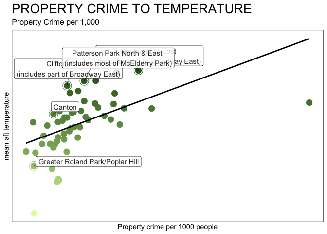
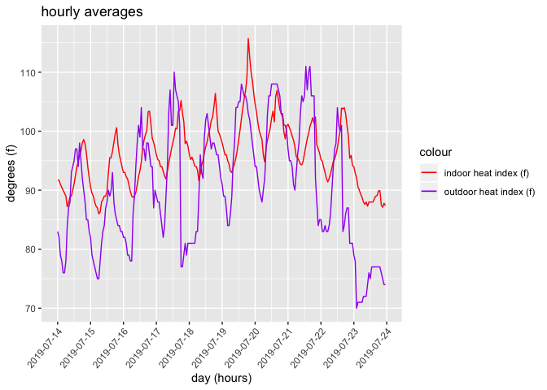
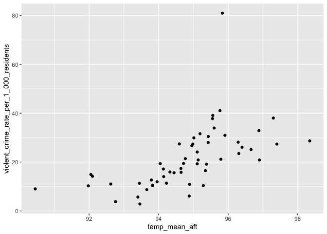
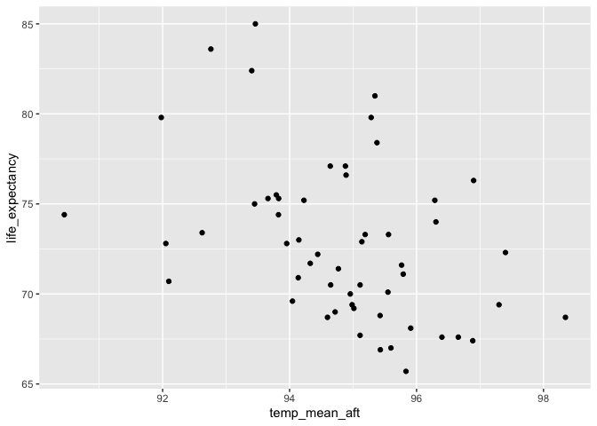
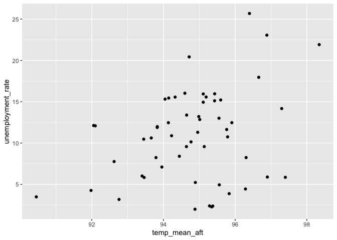

-   [Introduction](#introduction)
-   [Setup](#setup)
    -   [Load packages](#load-packages)
    -   [Load variables and data](#load-variables-and-data)
-   [Line-By-Line Fact-Check](#line-by-line-fact-check)
-   [Graphics: Temperature vs. Demographics](#graphics-temperature-vs.-demographics)
    -   [Poverty](#poverty)
    -   [Crime](#crime)
    -   [Life expectancy](#life-expectancy)
    -   [Unemployment rate](#unemployment-rate)

Introduction
------------

REWRITE This R markdown document describes the methodology and results of a portion of the data analysis we conducted in support of a reporting project examining the effects of tree canopy inequity across the city of Baltimore, especially as it relates to climate change.

In general, this document is arranged into analyses of the following categories, though there are some cases where one statistic depends on multiple categories (e.g. the canopy cover in a hot neighborhood):

-   Temperature
-   Demographics
-   Tree Canopy
-   Street Trees (individual tree tracking)

Setup
-----

Before running this file, **please view and run the [Code Red Data Cleaning document](https://github.com/smussenden/2019-baltimore-climate-health-project-data-repo/blob/master/documentation/code-red-data-cleaning.md)** for this project. As well as outputting necessary cleaned data for the following ananlysis, that document also includes the following items necessary to understand this analysis:

-   definitions
-   source data citation and information
-   cleaning methodology
-   software tools used

### Load packages

``` r
#######################
#### Load Packages ####
#######################

library(tidyverse)
library(DescTools) # For %like% operator
library(corrr) # For correlation matrices
library(colorspace) # For improved color palettes
library(ggplot2) # For graphing
library(ggrepel) # For graph labeling
require(scales) # For percent labeling on distribution tables

# Turn off scientific notation in RStudio (prevents coersion to character type)
options(scipen = 999)
```

### Load variables and data

``` r
#########################
#### Store Variables ####
#########################

#### Common path to data ####
path_to_data <- "../data/output-data/cleaned/"

#### Common save path ####
save_path <- "../data/output-data/cleaned/"

###################
#### Load Data ####
###################

dmh <- read_csv(paste0(path_to_data, "dmh.csv"))
EMS_all <- read_csv(paste0(path_to_data, "EMS_all.csv"))
dmh_ems <- read_csv(paste0(path_to_data, "dmh_ems.csv"))
stephanie_day_averages<- read_csv(paste0(path_to_data, "stephanie_day_averages.csv"))
stephanie_day_hourly_averages <- read_csv(paste0(path_to_data, "stephanie_day_hourly_averages.csv"))
stephanie_day_minute_averages <- read_csv(paste0(path_to_data, "stephanie_day_minute_averages.csv"))
tammy_day_averages <- read_csv(paste0(path_to_data, "tammy_day_averages.csv"))
tammy_day_hourly_averages <- read_csv(paste0(path_to_data, "tammy_day_hourly_averages.csv"))
tammy_day_minute_averages <- read_csv(paste0(path_to_data, "tammy_day_minute_averages.csv"))
michael_day_averages<- read_csv(paste0(path_to_data, "michael_day_averages.csv"))
michael_day_hourly_averages <- read_csv(paste0(path_to_data, "michael_day_hourly_averages.csv"))
michael_day_minute_averages <- read_csv(paste0(path_to_data, "michael_day_minute_averages.csv"))
nsa_tree_temp <- read_csv(paste0(path_to_data,"nsa_tree_temp.csv"))
csa_tree_temp_demographics <- read_csv(paste0(path_to_data,"csa_tree_temp_demographics.csv"))
blocks_tree_temp_demographics <- read_csv(paste0(path_to_data, "blocks_tree_temp_demographics.csv"))

####################################
######## Define Functions ##########
####################################

# Function to save each matrix as CSV
write_matrix_csv <- function(dataframe) {
  # Store dataframe name for later use
  dataframe_name <- deparse(substitute(dataframe))
  
  # Create filename for csv
  filename <- paste0("data/output-data/correlation_matrices/", dataframe_name,".csv")
  
  # Write out csv  
  write_csv(dataframe, path = filename)
  
} 

# Function to make a nice little correlation matrix heatmap for each graphic

make_correlation_matrix_graphic <- function(dataframe, grouping = "GROUPING") {
  
  # Store name of dataframe for use in title
  dataframe_name <- deparse(substitute(dataframe))
  
  # Build chart title
  chart_title <- paste0("Correlations by ", grouping, " in Baltimore City | ", dataframe_name )
  
  # Create graph
  ggplot(data = dataframe, aes(x = variable_2, y = variable)) +
    geom_tile(aes(fill = value)) +
    scale_fill_gradient2(low = "blue", high = "red", mid="white", midpoint=0) +
    geom_text(aes(label = round(value, 2)*100), size = 10) +
    ggtitle(chart_title) +
    theme(axis.text=element_text(size=14),
          axis.text.x = element_text(size=14,angle=50,hjust=1),
          plot.title = element_text(size=14)
    )
  # Create filename and filepath to save image. 
  filename <- paste0(dataframe_name,".png")
  ggsave(filename, plot = last_plot(), device = "png", path = "data/output-data/plots/correlation-matrix-images", scale = 1, width = 20, height = 20, units = "in", dpi = 300)
  
}  

select_x <- function(df){
  return(df %>%
           select_if(is.numeric) 
           # select(-matches("objectid"), 
           #        -matches("csa2010"), 
           #        -matches("id"), 
           #        -matches("09"), 
           #        -matches("1718"), 
           #        -matches("change_percent")
           #        )
         )
}
```

Line-By-Line Fact-Check
-----------------------

...a dangerous, 11-day heat wave tormented the city this summer... Some issues here, let's talk about this line

``` r
 dmh %>%
  filter(`date` >= date("2019-07-01") & `date` <= ("2019-07-31")) %>%
  group_by(`date`) %>%
  summarise(min_temp = min(avg_hourly_temperature_dmh),
            max_temp = max(avg_hourly_temperature_dmh),
            mean_temp = mean(avg_hourly_temperature_dmh),
            min_heat_index = min(avg_hourly_heat_index_dmh),
            max_heat_index = max(avg_hourly_heat_index_dmh),
            mean_heat_index = mean(avg_hourly_heat_index_dmh) 
  )
```

    ## # A tibble: 31 x 7
    ##    date       min_temp max_temp mean_temp min_heat_index max_heat_index
    ##    <date>        <dbl>    <dbl>     <dbl>          <dbl>          <dbl>
    ##  1 2019-07-01     70       87.1      77.8             69             86
    ##  2 2019-07-02     71.1     95        81.8             71            101
    ##  3 2019-07-03     75       91.9      82.7             76             97
    ##  4 2019-07-04     79       91.9      81.9             82            102
    ##  5 2019-07-05     77       91        83.3             78            104
    ##  6 2019-07-06     75.9     93.9      84.9             77            106
    ##  7 2019-07-07     75       87.1      79.8             76             95
    ##  8 2019-07-08     73       80.1      75.2             74             82
    ##  9 2019-07-09     69.1     87.1      78.9             70             91
    ## 10 2019-07-10     72       89.1      81.2             73             93
    ## # … with 21 more rows, and 1 more variable: mean_heat_index <dbl>

“Can’t even put your head out the door,” said Tammy Wilson Jackson, 48, on a day when the temperature at the Inner Harbor hit 100 degrees. Was this Sunday 7/21? If so, we can use our data, which is hourly averages. If it was Saturday 7/20, then we're going to have to use NWS official records, which captures minute by minute records

``` r
 dmh %>%
  filter(`date` >= date("2019-07-01") & `date` <= ("2019-07-31")) %>%
  group_by(`date`) %>%
  summarise(min_temp = min(avg_hourly_temperature_dmh),
            max_temp = max(avg_hourly_temperature_dmh),
            mean_temp = mean(avg_hourly_temperature_dmh),
            min_heat_index = min(avg_hourly_heat_index_dmh),
            max_heat_index = max(avg_hourly_heat_index_dmh),
            mean_heat_index = mean(avg_hourly_heat_index_dmh) 
  )
```

    ## # A tibble: 31 x 7
    ##    date       min_temp max_temp mean_temp min_heat_index max_heat_index
    ##    <date>        <dbl>    <dbl>     <dbl>          <dbl>          <dbl>
    ##  1 2019-07-01     70       87.1      77.8             69             86
    ##  2 2019-07-02     71.1     95        81.8             71            101
    ##  3 2019-07-03     75       91.9      82.7             76             97
    ##  4 2019-07-04     79       91.9      81.9             82            102
    ##  5 2019-07-05     77       91        83.3             78            104
    ##  6 2019-07-06     75.9     93.9      84.9             77            106
    ##  7 2019-07-07     75       87.1      79.8             76             95
    ##  8 2019-07-08     73       80.1      75.2             74             82
    ##  9 2019-07-09     69.1     87.1      78.9             70             91
    ## 10 2019-07-10     72       89.1      81.2             73             93
    ## # … with 21 more rows, and 1 more variable: mean_heat_index <dbl>

data show that temperatures here \[McElderry Park\] and in surrounding neighborhoods can run 10 degrees hotter than in communities that have more trees and less pavement. IF WE USE MEAN IT'S 8.3 degrees NOTE I TOOK OUT GWYNNS FALLS

``` r
nsa_tree_temp %>%
  select(nsa_name, temp_mean_aft) %>%
  filter(nsa_name != "gwynns falls/leakin park") %>%
  filter((temp_mean_aft == min(temp_mean_aft)) | (temp_mean_aft == max(temp_mean_aft))) %>%
  arrange(desc(temp_mean_aft))
```

    ## # A tibble: 2 x 2
    ##   nsa_name       temp_mean_aft
    ##   <chr>                  <dbl>
    ## 1 mcelderry park          99.4
    ## 2 dickeyville             91.0

McElderry Park ... which despite its lyrical name offers little green space, is the hottest neighborhood in Baltimore.

``` r
nsa_tree_temp %>%
  select(nsa_name, temp_mean_aft) %>%
  arrange(desc(temp_mean_aft))
```

    ## # A tibble: 278 x 2
    ##    nsa_name              temp_mean_aft
    ##    <chr>                         <dbl>
    ##  1 mcelderry park                 99.4
    ##  2 milton-montford                99.3
    ##  3 patterson place                98.6
    ##  4 dunbar-broadway                98.3
    ##  5 ellwood park/monument          98.3
    ##  6 penn-fallsway                  98.3
    ##  7 pleasant view gardens          98.3
    ##  8 madison-eastend                97.9
    ##  9 old goucher                    97.9
    ## 10 biddle street                  97.9
    ## # … with 268 more rows

Residents on these blocks tend to make more emergency calls for illness, city data show. NO IDEA.

In hot weather, calls for help increase. LETS TALK TO SANDY ABOUT A BETTER WAY

``` r
# Five-part NWS heat index danger scale
heat_index_count_per_nws_five_scale_bucket <- dmh_ems %>%
  select(heat_index_nws_five_scale_bucket) %>%
  group_by(heat_index_nws_five_scale_bucket) %>%
  summarise(heat_index_count_per_nws_five_scale_bucket=n()) %>%
  arrange(heat_index_nws_five_scale_bucket)

########### Five NWS Buckets #################
#### Table 1 | Primary Impression Group | Ratio Condition Calls v Heat Index | five NWS Buckets #####
# Ratio of number of calls for each condition type in each heat index bucket to total number of hours in each given temperature bucket. A lower number indicates a higher number of calls for each condition adjusted for the fact that some temperatures are simply more common than other others. It's 70 degrees for many more hours in a year than it is 110.  

call_heat_index_ratio_five_primary_impression_group <- EMS_all %>%
  filter(primary_impression_group != "Other") %>%
  group_by(primary_impression_group, adjusted_heat_index_nws_five_scale_bucket) %>%
  summarise(condition_calls_count_per_bucket=n()) %>%
  inner_join(heat_index_count_per_nws_five_scale_bucket, by = c("adjusted_heat_index_nws_five_scale_bucket" = "heat_index_nws_five_scale_bucket")) %>%
  mutate(hours_per_call = heat_index_count_per_nws_five_scale_bucket/condition_calls_count_per_bucket) %>%
  select(primary_impression_group, adjusted_heat_index_nws_five_scale_bucket, hours_per_call) %>%
  spread(adjusted_heat_index_nws_five_scale_bucket, hours_per_call) %>%
  select(primary_impression_group, `not_unsafe_under_80`,`caution_80_89`,`extreme_caution_90_102`,`danger_103_124`)
```

Ambulance calls related to diabetes, for example, where 6.5 times more frequent when the heat index rose to 103. LETS TALK TO SANDY ABOUT COMING UP WITH A BETTER WAY

``` r
# Create dataframes with a count of hourly heat_index readings for each bucket ###

# Five-part NWS heat index danger scale
heat_index_count_per_nws_five_scale_bucket <- dmh_ems %>%
  select(heat_index_nws_five_scale_bucket) %>%
  group_by(heat_index_nws_five_scale_bucket) %>%
  summarise(heat_index_count_per_nws_five_scale_bucket=n()) %>%
  arrange(heat_index_nws_five_scale_bucket)

########### Five NWS Buckets #################
#### Table 1 | Primary Impression Group | Ratio Condition Calls v Heat Index | five NWS Buckets #####
# Ratio of number of calls for each condition type in each heat index bucket to total number of hours in each given temperature bucket. A lower number indicates a higher number of calls for each condition adjusted for the fact that some temperatures are simply more common than other others. It's 70 degrees for many more hours in a year than it is 110.  

call_heat_index_ratio_five_primary_impression_group <- EMS_all %>%
  filter(primary_impression_group != "Other") %>%
  group_by(primary_impression_group, adjusted_heat_index_nws_five_scale_bucket) %>%
  summarise(condition_calls_count_per_bucket=n()) %>%
  inner_join(heat_index_count_per_nws_five_scale_bucket, by = c("adjusted_heat_index_nws_five_scale_bucket" = "heat_index_nws_five_scale_bucket")) %>%
  mutate(hours_per_call = heat_index_count_per_nws_five_scale_bucket/condition_calls_count_per_bucket) %>%
  select(primary_impression_group, adjusted_heat_index_nws_five_scale_bucket, hours_per_call) %>%
  spread(adjusted_heat_index_nws_five_scale_bucket, hours_per_call) %>%
  select(primary_impression_group, `not_unsafe_under_80`,`caution_80_89`,`extreme_caution_90_102`,`danger_103_124`)
```

Households in the city’s hottest neighborhoods have lower incomes, WOULD SUGGEST REWRITING AS POVERTY RATE AND AREAS

``` r
 csa_tree_temp_demographics %>%
  select_x() %>%
  as.matrix() %>%
  correlate() %>%
  focus(matches("temp_")) %>%
  mutate(variable=rowname) %>%
  select(variable, temp_median_aft) %>%
  filter(variable=="percent_of_family_households_living_below_the_poverty_line")
```

    ## # A tibble: 1 x 2
    ##   variable                                                  temp_median_aft
    ##   <chr>                                                               <dbl>
    ## 1 percent_of_family_households_living_below_the_poverty_li…           0.378

``` r
csa_tree_temp_demographics %>%
  select(csa2010,temp_median_aft,percent_of_family_households_living_below_the_poverty_line) %>%
  arrange(desc(temp_median_aft))
```

    ## # A tibble: 55 x 3
    ##    csa2010             temp_median_aft percent_of_family_households_living…
    ##    <chr>                         <dbl>                                <dbl>
    ##  1 madison/east end               98.4                                33.7 
    ##  2 oldtown/middle east            97.5                                40.1 
    ##  3 patterson park nor…            97.2                                21.7 
    ##  4 midtown                        97.1                                 5.42
    ##  5 greenmount east                97.0                                24.2 
    ##  6 clifton-berea                  96.9                                27.6 
    ##  7 greater charles vi…            96.8                                19.0 
    ##  8 midway/coldstream              96.4                                22.6 
    ##  9 highlandtown                   96.3                                 6.65
    ## 10 upton/druid heights            95.9                                43.0 
    ## # … with 45 more rows

Public transportation, which many residents here use, is unreliable.

``` r
 csa_tree_temp_demographics %>%
  select_x() %>%
  as.matrix() %>%
  correlate() %>%
  focus(matches("temp_")) %>%
  mutate(variable=rowname) %>%
  select(variable, temp_median_aft) %>%
  filter(variable=="percent_of_population_that_uses_public_transportation_to_get_to_work")
```

    ## # A tibble: 1 x 2
    ##   variable                                                  temp_median_aft
    ##   <chr>                                                               <dbl>
    ## 1 percent_of_population_that_uses_public_transportation_to…           0.410

``` r
csa_tree_temp_demographics %>%
  select(csa2010,temp_median_aft,percent_of_population_that_uses_public_transportation_to_get_to_work) %>%
  arrange(desc(temp_median_aft))
```

    ## # A tibble: 55 x 3
    ##    csa2010            temp_median_aft percent_of_population_that_uses_publ…
    ##    <chr>                        <dbl>                                 <dbl>
    ##  1 madison/east end              98.4                                 34.2 
    ##  2 oldtown/middle ea…            97.5                                 27.0 
    ##  3 patterson park no…            97.2                                 12.2 
    ##  4 midtown                       97.1                                 27.0 
    ##  5 greenmount east               97.0                                 42.5 
    ##  6 clifton-berea                 96.9                                 34.0 
    ##  7 greater charles v…            96.8                                 22.5 
    ##  8 midway/coldstream             96.4                                 32.6 
    ##  9 highlandtown                  96.3                                  7.19
    ## 10 upton/druid heigh…            95.9                                 31.6 
    ## # … with 45 more rows

The streets have fewer trees than those in more affluent communities. TECHNICALLY LESS TREE CANOPY

``` r
 csa_tree_temp_demographics %>%
  select_x() %>%
  as.matrix() %>%
  correlate() %>%
  focus(matches("15_lid_mean")) %>%
  mutate(variable=rowname) %>%
  select(variable, `15_lid_mean`) %>%
  filter(variable=="percent_of_family_households_living_below_the_poverty_line")
```

    ## # A tibble: 1 x 2
    ##   variable                                                   `15_lid_mean`
    ##   <chr>                                                              <dbl>
    ## 1 percent_of_family_households_living_below_the_poverty_line        -0.340

``` r
csa_tree_temp_demographics %>%
  select(csa2010,`15_lid_mean`,percent_of_family_households_living_below_the_poverty_line) %>%
  arrange(desc(`15_lid_mean`))
```

    ## # A tibble: 55 x 3
    ##    csa2010              `15_lid_mean` percent_of_family_households_living_…
    ##    <chr>                        <dbl>                                 <dbl>
    ##  1 dickeyville/frankli…         0.732                                 17.4 
    ##  2 mount washington/co…         0.670                                  2.00
    ##  3 greater roland park…         0.603                                  2.15
    ##  4 edmondson village            0.551                                  8.89
    ##  5 forest park/walbrook         0.536                                 19.3 
    ##  6 north baltimore/gui…         0.512                                  3.48
    ##  7 beechfield/ten hill…         0.492                                 10.5 
    ##  8 cross-country/chesw…         0.479                                  9.89
    ##  9 lauraville                   0.410                                  7.49
    ## 10 penn north/reservoi…         0.408                                 26.0 
    ## # … with 45 more rows

``` r
# CSAs to call out
callout_ls <- c("Canton", "Clifton-Berea", "Greater Roland Park/Poplar Hill", "Greenmount East")

## POVERTY TO TREE COVER
csa_tree_temp_demographics %>%
  mutate_at(vars("csa2010"), str_to_title) %>%
  # Start ggplot and set x and y for entire plot
  ggplot(aes(
    x = percent_of_family_households_living_below_the_poverty_line/100, 
    y = `15_lid_mean`
    )) +
  # This section for the basic scatterplot
  geom_point(aes(color = `15_lid_mean`),
             size=4) +
  # This section for circling all sample neighborhood points
  geom_point(data = csa_tree_temp_demographics %>%
               mutate_at(vars("csa2010"), str_to_title) %>%
               filter((csa2010 %in% callout_ls) 
                      # Patterson Park must be included seperately because of its unique label positioning
                      | (csa2010 == "Patterson Park North & East") 
                      ),
             aes(color = `15_lid_mean`),
             size=6, shape = 1) +
  # This section shows the trend line
  geom_smooth(se = FALSE, # Removes gray banding
              method = glm, 
              color = "black") +
  # This section for labeling Canton, etc.
  ggrepel::geom_label_repel(data = csa_tree_temp_demographics %>%
                              mutate_at(vars("csa2010"), str_to_title) %>%
                              filter(csa2010 %in% callout_ls) %>%
                              mutate(csa2010 = case_when(
                                csa2010 == "Greenmount East" ~ "Greenmount East \n(includes part of Broadway East)", 
                                csa2010 == "Clifton-Berea" ~ "Clifton-Berea \n(includes part of Broadway East)",
                                T ~ csa2010)),
            aes(label = csa2010),
            min.segment.length = .1,
            segment.alpha = .5,
            alpha = .85,
            nudge_x = .05,
            nudge_y = .06) +
  # This section for labeling Patterson Park (so its label can be nudged)
  ggrepel::geom_label_repel(data = csa_tree_temp_demographics %>%
                              mutate_at(vars("csa2010"), str_to_title) %>%
                              filter(csa2010 == "Patterson Park North & East") %>%
                              mutate(csa2010 = case_when(
                                csa2010 == "Patterson Park North & East" ~ "Patterson Park North & East \n(includes most of McElderry Park)",
                                T ~ csa2010)),
                            aes(label = csa2010),
                            min.segment.length = .1,
                            segment.alpha = .5,
                            alpha = .85,
                            nudge_x = -.06,
                            nudge_y = .03) +
  # Colors and label formatting follow
  #coord_flip() +
  scale_colour_gradient(low = "#E0FEA9", high = "#144A11") +
  labs(title = "Poverty to Tree Canopy",
       subtitle = "Percent of households living below the poverty line \ncompared to the percent of tree cover in the area",
       x = "Percent of households living below the poverty line",
       y = "Percent of land covered by trees") +
  scale_x_continuous(label = scales::percent_format(accuracy = 1.0),
                     breaks = seq(0, 1, .1)) + 
  scale_y_continuous(label = scales::percent_format(accuracy = 1.0),
                     breaks = seq(0, 1, .1)) + 
  theme_bw() +
  theme(legend.position = "none",
        plot.title = element_text(size = 20),
        plot.subtitle = element_text(size = 12))
```


Crime rates are higher, so many people won’t put an air-conditioning unit in a first-floor window for fear of break-ins.

``` r
 csa_tree_temp_demographics %>%
  select_x() %>%
  as.matrix() %>%
  correlate() %>%
  focus(matches("temp_")) %>%
  mutate(variable=rowname) %>%
  select(variable, temp_mean_aft) %>% 
  filter(str_detect(variable, "crime|shootings|gun|assault|narcotics"))
```

    ## # A tibble: 7 x 2
    ##   variable                                                    temp_mean_aft
    ##   <chr>                                                               <dbl>
    ## 1 part_1_crime_rate_per_1_000_residents                               0.553
    ## 2 violent_crime_rate_per_1_000_residents                              0.580
    ## 3 property_crime_rate_per_1_000_residents                             0.525
    ## 4 number_of_shootings_per_1_000_residents                             0.404
    ## 5 number_of_gun_related_homicides_per_1_000_residents                 0.387
    ## 6 number_of_common_assault_calls_for_service_per_1_000_resid…         0.420
    ## 7 number_of_narcotics_calls_for_service_per_1_000_residents           0.356

``` r
csa_tree_temp_demographics %>%
  select(csa2010,temp_mean_aft,matches("crime|shootings|gun|assault|narcotics")) %>%
  arrange(desc(temp_mean_aft))
```

    ## # A tibble: 55 x 9
    ##    csa2010 temp_mean_aft part_1_crime_ra… violent_crime_r… property_crime_…
    ##    <chr>           <dbl>            <dbl>            <dbl>            <dbl>
    ##  1 madiso…          98.3            119.              28.7             89.3
    ##  2 patter…          97.4            113.              27.4             83.9
    ##  3 oldtow…          97.3            111.              38.0             71.1
    ##  4 midtown          96.9             80.3             20.8             58.6
    ##  5 greenm…          96.9             86.0             32.9             51.7
    ##  6 clifto…          96.7             67.8             25.1             41.5
    ##  7 midway…          96.4             76.3             26.1             48.1
    ##  8 greate…          96.3             67.2             23.5             43.1
    ##  9 highla…          96.3             98.5             28.1             69.8
    ## 10 upton/…          95.9             84.2             30.9             51.7
    ## # … with 45 more rows, and 4 more variables:
    ## #   number_of_shootings_per_1_000_residents <dbl>,
    ## #   number_of_gun_related_homicides_per_1_000_residents <dbl>,
    ## #   number_of_common_assault_calls_for_service_per_1_000_residents <dbl>,
    ## #   number_of_narcotics_calls_for_service_per_1_000_residents <dbl>

``` r
# CSAs to call out
callout_ls <- c("Canton", "Clifton-Berea", "Greater Roland Park/Poplar Hill", "Greenmount East")

## PROPERTY CRIME TO TEMPERATURE
csa_tree_temp_demographics %>%
  mutate_at(vars("csa2010"), str_to_title) %>%
  # Start ggplot and set x and y for entire plot
  ggplot(aes(
    x = property_crime_rate_per_1_000_residents, 
    y = temp_mean_aft
    )) +
  # This section for the basic scatterplot
  geom_point(aes(color = temp_mean_aft),
             size=4) +
  # This section for circling all sample neighborhood points
  geom_point(data = csa_tree_temp_demographics %>%
               mutate_at(vars("csa2010"), str_to_title) %>%
               filter((csa2010 %in% callout_ls) 
                      # Patterson Park must be included seperately because of its unique label positioning
                      | (csa2010 == "Patterson Park North & East") 
                      ),
             aes(color = temp_mean_aft),
             size=6, shape = 1) +
  # This section shows the trend line
  geom_smooth(se = FALSE, # Removes gray banding
              method = glm, 
              color = "black") +
  # This section for labeling Canton, etc.
  ggrepel::geom_label_repel(data = csa_tree_temp_demographics %>%
                              mutate_at(vars("csa2010"), str_to_title) %>%
                              filter(csa2010 %in% callout_ls) %>%
                              mutate(csa2010 = case_when(
                                csa2010 == "Greenmount East" ~ "Greenmount East \n(includes part of Broadway East)", 
                                csa2010 == "Clifton-Berea" ~ "Clifton-Berea \n(includes part of Broadway East)",
                                T ~ csa2010)),
            aes(label = csa2010),
            min.segment.length = .1,
            segment.alpha = .5,
            alpha = .85,
            nudge_x = .05,
            nudge_y = .06) +
  # This section for labeling Patterson Park (so its label can be nudged)
  ggrepel::geom_label_repel(data = csa_tree_temp_demographics %>%
                              mutate_at(vars("csa2010"), str_to_title) %>%
                              filter(csa2010 == "Patterson Park North & East") %>%
                              mutate(csa2010 = case_when(
                                csa2010 == "Patterson Park North & East" ~ "Patterson Park North & East \n(includes most of McElderry Park)",
                                T ~ csa2010)),
                            aes(label = csa2010),
                            min.segment.length = .1,
                            segment.alpha = .5,
                            alpha = .85,
                            nudge_x = -.06,
                            nudge_y = .03) +
  # Colors and label formatting follow
  #coord_flip() +
  scale_colour_gradient(low = "#E0FEA9", high = "#144A11") +
  labs(title = "PROPERTY CRIME TO TEMPERATURE",
       subtitle = "Property Crime per 1,000",
       x = "Property crime per 1000 people",
       y = "mean aft temperature") +
  scale_x_continuous(label = scales::percent_format(accuracy = 1.0),
                     breaks = seq(0, 1, .1)) + 
  scale_y_continuous(label = scales::percent_format(accuracy = 1.0),
                     breaks = seq(0, 1, .1)) + 
  theme_bw() +
  theme(legend.position = "none",
        plot.title = element_text(size = 20),
        plot.subtitle = element_text(size = 12))
```



Reporters from the University of Maryland’s Howard Center for Investigative Journalism and Capital News Service placed sensors that record heat and humidity inside several homes in McElderry Park (BG 8/8/19) and nearby neighborhoods.

Those sensors recorded temperatures that reached as high as 97 degrees and heat index values of 119 degrees.
CORRECT

``` r
all_sensors_day_minute_averages <- bind_rows(michael_day_minute_averages, tammy_day_minute_averages, stephanie_day_minute_averages) 

all_sensors_day_minute_averages %>%
  filter(mean_indoor_temperature == max(mean_indoor_temperature)) 
```

    ## # A tibble: 4 x 7
    ##   date_hour_minute    mean_indoor_tem… mean_indoor_hea… mean_outdoor_te…
    ##   <dttm>                         <dbl>            <dbl>            <dbl>
    ## 1 2019-07-19 20:55:00             96.8              112             93.9
    ## 2 2019-07-19 21:06:00             96.8              112             91.9
    ## 3 2019-07-19 21:30:00             96.8              112             91.9
    ## 4 2019-07-19 21:45:00             96.8              112             91.9
    ## # … with 3 more variables: mean_outdoor_heat_index <dbl>,
    ## #   indoor_temperature_difference <dbl>,
    ## #   indoor_heat_index_difference <dbl>

``` r
all_sensors_day_minute_averages %>%
  filter(mean_indoor_heat_index == max(mean_indoor_heat_index)) 
```

    ## # A tibble: 1 x 7
    ##   date_hour_minute    mean_indoor_tem… mean_indoor_hea… mean_outdoor_te…
    ##   <dttm>                         <dbl>            <dbl>            <dbl>
    ## 1 2019-07-20 18:12:00             95.7              119             96.1
    ## # … with 3 more variables: mean_outdoor_heat_index <dbl>,
    ## #   indoor_temperature_difference <dbl>,
    ## #   indoor_heat_index_difference <dbl>

On the first floor of Wilson Jackson’s two-story rowhouse, the heat index registered 94 degrees at 10 p.m. on Sunday, July 21. Outside, the heat index was 9 degrees lower, 84 degrees. NOTE: SHOULD BE 93 DEGREES.

``` r
tammy_day_hourly_averages %>%
  mutate(date = date(date_hour)) %>%
  mutate(hour = hour(date_hour)) %>%
  filter(date == "2019-07-21") %>%
  filter(hour == 22)
```

    ## # A tibble: 1 x 9
    ##   date_hour           mean_indoor_tem… mean_indoor_hea… mean_outdoor_te…
    ##   <dttm>                         <dbl>            <dbl>            <dbl>
    ## 1 2019-07-21 22:00:00             87.9               93               81
    ## # … with 5 more variables: mean_outdoor_heat_index <dbl>,
    ## #   indoor_temperature_difference <dbl>,
    ## #   indoor_heat_index_difference <dbl>, date <date>, hour <int>

``` r
tammy_day_minute_averages %>%
  mutate(date = date(date_hour_minute)) %>%
  mutate(hour = hour(date_hour_minute)) %>%
  mutate(minute = minute(date_hour_minute)) %>%
  filter(date == "2019-07-21") %>%
  filter(hour == 22) %>%
  filter(minute == 0)
```

    ## # A tibble: 1 x 10
    ##   date_hour_minute    mean_indoor_tem… mean_indoor_hea… mean_outdoor_te…
    ##   <dttm>                         <dbl>            <dbl>            <dbl>
    ## 1 2019-07-21 22:00:00             88.2               93               81
    ## # … with 6 more variables: mean_outdoor_heat_index <dbl>,
    ## #   indoor_temperature_difference <dbl>,
    ## #   indoor_heat_index_difference <dbl>, date <date>, hour <int>,
    ## #   minute <int>

At 7 p.m. Friday, the heat index in Baltimore hit 107 degrees in the Inner Harbor. Inside Stephanie Pingley’s house, it was 9 degrees hotter, with a heat index of 116 degrees. DIFFERENT VALUES, FIX THESE.

``` r
stephanie_day_hourly_averages %>%
  mutate(date = date(date_hour)) %>%
  mutate(hour = hour(date_hour)) %>%
  filter(date == "2019-07-19") %>%
  filter(hour == 19)
```

    ## # A tibble: 1 x 9
    ##   date_hour           mean_indoor_tem… mean_indoor_hea… mean_outdoor_te…
    ##   <dttm>                         <dbl>            <dbl>            <dbl>
    ## 1 2019-07-19 19:00:00               96             116.               95
    ## # … with 5 more variables: mean_outdoor_heat_index <dbl>,
    ## #   indoor_temperature_difference <dbl>,
    ## #   indoor_heat_index_difference <dbl>, date <date>, hour <int>

``` r
stephanie_day_minute_averages %>%
  mutate(date = date(date_hour_minute)) %>%
  mutate(hour = hour(date_hour_minute)) %>%
  mutate(minute = minute(date_hour_minute)) %>%
  filter(date == "2019-07-19") %>%
  filter(hour == 19) %>%
  filter(minute == 0)
```

    ## # A tibble: 1 x 10
    ##   date_hour_minute    mean_indoor_tem… mean_indoor_hea… mean_outdoor_te…
    ##   <dttm>                         <dbl>            <dbl>            <dbl>
    ## 1 2019-07-19 19:00:00             95.9              115               95
    ## # … with 6 more variables: mean_outdoor_heat_index <dbl>,
    ## #   indoor_temperature_difference <dbl>,
    ## #   indoor_heat_index_difference <dbl>, date <date>, hour <int>,
    ## #   minute <int>

By Saturday, the temperature inside the second-floor apartment of Michael Thomas and Alberta Wilkerson hit 96 degrees. YES, BUT the heat index hit 112!

``` r
michael_day_hourly_averages %>%
  mutate(date = date(date_hour)) %>%
  mutate(hour = hour(date_hour)) %>%
  filter(date == "2019-07-20") %>%
  arrange(desc(mean_indoor_temperature))
```

    ## # A tibble: 17 x 9
    ##    date_hour           mean_indoor_tem… mean_indoor_hea… mean_outdoor_te…
    ##    <dttm>                         <dbl>            <dbl>            <dbl>
    ##  1 2019-07-20 00:00:00             96.1             110.             87.1
    ##  2 2019-07-20 16:00:00             96               109.             99  
    ##  3 2019-07-20 01:00:00             95.9             111.             87.1
    ##  4 2019-07-20 15:00:00             95.9             110.             98.1
    ##  5 2019-07-20 02:00:00             95.8             111              86  
    ##  6 2019-07-20 03:00:00             95.7             112.             84.9
    ##  7 2019-07-20 04:00:00             95.5             112.             84  
    ##  8 2019-07-20 14:00:00             95.5             109.             97  
    ##  9 2019-07-20 05:00:00             95.3             112.             82.9
    ## 10 2019-07-20 06:00:00             94.9             109.             84  
    ## 11 2019-07-20 13:00:00             94.8             108.             96.1
    ## 12 2019-07-20 07:00:00             94.1             107.             86  
    ## 13 2019-07-20 12:00:00             94.1             108.             96.1
    ## 14 2019-07-20 08:00:00             93.6             106.             89.1
    ## 15 2019-07-20 11:00:00             93.5             107.             95  
    ## 16 2019-07-20 09:00:00             93.3             106.             93  
    ## 17 2019-07-20 10:00:00             93.3             106              93.9
    ## # … with 5 more variables: mean_outdoor_heat_index <dbl>,
    ## #   indoor_temperature_difference <dbl>,
    ## #   indoor_heat_index_difference <dbl>, date <date>, hour <int>

``` r
michael_day_hourly_averages %>%
  mutate(date = date(date_hour)) %>%
  mutate(hour = hour(date_hour)) %>%
  filter(date == "2019-07-20") %>%
  arrange(desc(mean_indoor_heat_index))
```

    ## # A tibble: 17 x 9
    ##    date_hour           mean_indoor_tem… mean_indoor_hea… mean_outdoor_te…
    ##    <dttm>                         <dbl>            <dbl>            <dbl>
    ##  1 2019-07-20 03:00:00             95.7             112.             84.9
    ##  2 2019-07-20 05:00:00             95.3             112.             82.9
    ##  3 2019-07-20 04:00:00             95.5             112.             84  
    ##  4 2019-07-20 02:00:00             95.8             111              86  
    ##  5 2019-07-20 01:00:00             95.9             111.             87.1
    ##  6 2019-07-20 00:00:00             96.1             110.             87.1
    ##  7 2019-07-20 15:00:00             95.9             110.             98.1
    ##  8 2019-07-20 06:00:00             94.9             109.             84  
    ##  9 2019-07-20 16:00:00             96               109.             99  
    ## 10 2019-07-20 14:00:00             95.5             109.             97  
    ## 11 2019-07-20 13:00:00             94.8             108.             96.1
    ## 12 2019-07-20 12:00:00             94.1             108.             96.1
    ## 13 2019-07-20 07:00:00             94.1             107.             86  
    ## 14 2019-07-20 11:00:00             93.5             107.             95  
    ## 15 2019-07-20 10:00:00             93.3             106              93.9
    ## 16 2019-07-20 08:00:00             93.6             106.             89.1
    ## 17 2019-07-20 09:00:00             93.3             106.             93  
    ## # … with 5 more variables: mean_outdoor_heat_index <dbl>,
    ## #   indoor_temperature_difference <dbl>,
    ## #   indoor_heat_index_difference <dbl>, date <date>, hour <int>

A sensor inside a bedroom showed that the heat index during the heat wave was consistently higher inside than outside Pingley’s house.

``` r
stephanie_day_hourly_averages %>%
  mutate(hourly_mean_group = "hourly_mean_group") %>%
  group_by(hourly_mean_group) %>%
  summarise(mean_indoor_heat_index_differnence = mean(indoor_heat_index_difference))
```

    ## # A tibble: 1 x 2
    ##   hourly_mean_group mean_indoor_heat_index_differnence
    ##   <chr>                                          <dbl>
    ## 1 hourly_mean_group                               6.91

``` r
stephanie_day_hourly_averages_heat_wave <- stephanie_day_hourly_averages %>%
  mutate(date = date(date_hour)) %>%
  filter(date >= "2019-07-14") %>%
  filter(date <= "2019-07-23")
  
chart_title <- "hourly averages"
  temp_hourly_graph <- ggplot() +
    geom_line(data = stephanie_day_hourly_averages_heat_wave, aes(x = date_hour, y = mean_indoor_heat_index, colour="indoor heat index (f)")) +
    geom_line(data = stephanie_day_hourly_averages_heat_wave, aes(x = date_hour, y = mean_outdoor_heat_index, colour="outdoor heat index (f)")) +
    scale_color_manual(
      values = c('indoor heat index (f)' = 'red',
                 'outdoor heat index (f)' = 'purple')
    ) +
    ggtitle(chart_title) +  
    xlab("day (hours)") +
    ylab("degrees (f)") +
    scale_x_datetime(date_breaks = "1 day") +
    theme(axis.text.x = element_text(angle=50,hjust=1))
  plot(temp_hourly_graph)
```



But citywide, the tree canopy is just 27%, up from 26% X years before. Washington’s is XX%.

``` r
# TBD
```

And in 2015, many East Baltimore neighborhoods had a tree canopy of about 10%, according to a Howard Center analysis of tree canopy data gathered by researchers at the U.S. Forest Service and the University of Vermont.
MORE ACCURATE TO SAY IN EAST BALTIMORE, MOST HAD LESS THAN 10 percent.

``` r
east_baltimore_nsas <- c("Berea", "Broadway East", "Oliver", "Middle East", 
                 "Biddle Street","Milton-Montford", "Madison-Eastend", 
                 "CARE", "McElderry Park", "Ellwood Park/Monument", 
                 "Patterson Place", "Patterson Park Neighborhood", 
                 "Baltimore Highlands", "Highlandtown", 
                 "Upper Fells Point") %>%
  lapply(tolower)

nsa_tree_temp %>%
  filter(nsa_name %in% east_baltimore_nsas) %>%
  select(nsa_name, `15_lid_mean`) %>%
  arrange(`15_lid_mean`)
```

    ## # A tibble: 15 x 2
    ##    nsa_name                    `15_lid_mean`
    ##    <chr>                               <dbl>
    ##  1 patterson park neighborhood        0.0419
    ##  2 highlandtown                       0.0426
    ##  3 berea                              0.0597
    ##  4 mcelderry park                     0.0614
    ##  5 milton-montford                    0.0641
    ##  6 ellwood park/monument              0.0645
    ##  7 middle east                        0.0676
    ##  8 patterson place                    0.0746
    ##  9 care                               0.0749
    ## 10 madison-eastend                    0.0771
    ## 11 baltimore highlands                0.0786
    ## 12 broadway east                      0.106 
    ## 13 upper fells point                  0.112 
    ## 14 biddle street                      0.127 
    ## 15 oliver                             0.139

Some blocks have no trees at all. ALSO TRUE FROM OBSERVATIONS

``` r
blocks_tree_temp_demographics %>%
  filter(`15_lid_mean` == 0) %>%
  filter(population_2010 >0) %>%
  filter(aland10 > 0) %>%
  select(geoid10, population_2010, `15_lid_mean`)
```

    ## # A tibble: 86 x 3
    ##    geoid10 population_2010 `15_lid_mean`
    ##      <dbl>           <dbl>         <dbl>
    ##  1 2.45e14               8             0
    ##  2 2.45e14              31             0
    ##  3 2.45e14              37             0
    ##  4 2.45e14              21             0
    ##  5 2.45e14               8             0
    ##  6 2.45e14              18             0
    ##  7 2.45e14             228             0
    ##  8 2.45e14               3             0
    ##  9 2.45e14              20             0
    ## 10 2.45e14               2             0
    ## # … with 76 more rows

As temperatures at Baltimore’s Inner Harbor reached 100 on July 20, most everyone around \* Will have to do this by official records, not our data. Put in link here.

Graphics: Temperature vs. Demographics
--------------------------------------

These data confirm the graphs found [here](https://amarton.github.io/2019-baltimore-climate-health-project-graphics-repo/heat-demographics-scatterplots/combined-scatterplots.html).

``` r
#### Save working table of only the variables needed for this story ####
wk_csa_tree_temp_demographics <- csa_tree_temp_demographics %>%
  select(matches("csa2010"), matches("temp_mean_aft"),
         perc_below_poverty = matches("percent_of_family_households_living_below_the_poverty_line"),
         matches("violent_crime_rate_per_1_000_residents"), matches("life_expectancy"),
         matches("unemployment_rate")) %>%
  arrange(desc(temp_mean_aft))

#### Save the table to CSV for reference ####
write_csv(wk_csa_tree_temp_demographics, paste0(save_path, "csa_tree_temp_demographics_truncated.csv"))

#### Remove working table from workspace ####
rm(wk_csa_tree_temp_demographics)
```

### Poverty

Percent of families living below the poverty line compared to mean temperature:

``` r
#### Data used ####
csa_tree_temp_demographics %>%
  select(matches("csa2010"), matches("temp_mean_aft"),
         perc_below_poverty = matches("percent_of_family_households_living_below_the_poverty_line")) %>%
  arrange(desc(temp_mean_aft))
```

    ## # A tibble: 55 x 3
    ##    csa2010                         temp_mean_aft perc_below_poverty
    ##    <chr>                                   <dbl>              <dbl>
    ##  1 madison/east end                         98.3              33.7 
    ##  2 patterson park north & east              97.4              21.7 
    ##  3 oldtown/middle east                      97.3              40.1 
    ##  4 midtown                                  96.9               5.42
    ##  5 greenmount east                          96.9              24.2 
    ##  6 clifton-berea                            96.7              27.6 
    ##  7 midway/coldstream                        96.4              22.6 
    ##  8 greater charles village/barclay          96.3              19.0 
    ##  9 highlandtown                             96.3               6.65
    ## 10 upton/druid heights                      95.9              43.0 
    ## # … with 45 more rows

``` r
#### Build correlation matrix ####
wk_corr <- csa_tree_temp_demographics %>%
  select(temp_mean_aft, 
         perc_below_poverty = percent_of_family_households_living_below_the_poverty_line) %>%
  as.matrix() %>%
  correlate() %>%
  mutate(variable=rowname) %>%
  select(variable, everything(), -rowname)
#### Print out correlation matrix ####
wk_corr
```

    ## # A tibble: 2 x 3
    ##   variable           temp_mean_aft perc_below_poverty
    ##   <chr>                      <dbl>              <dbl>
    ## 1 temp_mean_aft             NA                  0.398
    ## 2 perc_below_poverty         0.398             NA

``` r
#### Scatterplot ####
csa_tree_temp_demographics %>%
  select(temp_mean_aft, 
         perc_below_poverty = percent_of_family_households_living_below_the_poverty_line) %>%
  ggplot(aes(x = temp_mean_aft, y = perc_below_poverty)) +
  geom_point()
```



There is a 0.4 correlation between temperature and poverty.

### Crime

Rates of violent crime per 1,000 residents compared to mean temperature:

``` r
#### Data used ####
csa_tree_temp_demographics %>%
  select(matches("csa2010"), matches("temp_mean_aft"),
         matches("violent_crime_rate_per_1_000_residents"), matches("life_expectancy")) %>%
  arrange(desc(temp_mean_aft))
```

    ## # A tibble: 55 x 4
    ##    csa2010           temp_mean_aft violent_crime_rate_per_… life_expectancy
    ##    <chr>                     <dbl>                    <dbl>           <dbl>
    ##  1 madison/east end           98.3                     28.7            68.7
    ##  2 patterson park n…          97.4                     27.4            72.3
    ##  3 oldtown/middle e…          97.3                     38.0            69.4
    ##  4 midtown                    96.9                     20.8            76.3
    ##  5 greenmount east            96.9                     32.9            67.4
    ##  6 clifton-berea              96.7                     25.1            67.6
    ##  7 midway/coldstream          96.4                     26.1            67.6
    ##  8 greater charles …          96.3                     23.5            74  
    ##  9 highlandtown               96.3                     28.1            75.2
    ## 10 upton/druid heig…          95.9                     30.9            68.1
    ## # … with 45 more rows

``` r
#### Build correlation matrix ####
wk_corr <- csa_tree_temp_demographics %>%
  select(temp_mean_aft, 
         violent_crime_rate_per_1_000_residents) %>%
  as.matrix() %>%
  correlate() %>%
  mutate(variable=rowname) %>%
  select(variable, everything(), -rowname)
#### Print out correlation matrix ####
wk_corr
```

    ## # A tibble: 2 x 3
    ##   variable                     temp_mean_aft violent_crime_rate_per_1_000_…
    ##   <chr>                                <dbl>                          <dbl>
    ## 1 temp_mean_aft                       NA                              0.580
    ## 2 violent_crime_rate_per_1_00…         0.580                         NA

``` r
#### Scatterplot ####
csa_tree_temp_demographics %>%
  select(temp_mean_aft, 
         violent_crime_rate_per_1_000_residents) %>%
  ggplot(aes(x = temp_mean_aft, y = violent_crime_rate_per_1_000_residents)) +
  geom_point()
```



There is a 0.58 correlation between temperature and crime.

### Life expectancy

Average life expectancy of neighborhood residents compared to mean temperature:

``` r
#### Data used ####
csa_tree_temp_demographics %>%
  select(matches("csa2010"), matches("temp_mean_aft"),
         matches("life_expectancy")) %>%
  arrange(desc(temp_mean_aft))
```

    ## # A tibble: 55 x 3
    ##    csa2010                         temp_mean_aft life_expectancy
    ##    <chr>                                   <dbl>           <dbl>
    ##  1 madison/east end                         98.3            68.7
    ##  2 patterson park north & east              97.4            72.3
    ##  3 oldtown/middle east                      97.3            69.4
    ##  4 midtown                                  96.9            76.3
    ##  5 greenmount east                          96.9            67.4
    ##  6 clifton-berea                            96.7            67.6
    ##  7 midway/coldstream                        96.4            67.6
    ##  8 greater charles village/barclay          96.3            74  
    ##  9 highlandtown                             96.3            75.2
    ## 10 upton/druid heights                      95.9            68.1
    ## # … with 45 more rows

``` r
#### Build correlation matrix ####
wk_corr <- csa_tree_temp_demographics %>%
  select(temp_mean_aft, 
         life_expectancy) %>%
  as.matrix() %>%
  correlate() %>%
  mutate(variable=rowname) %>%
  select(variable, everything(), -rowname) 
#### Print out correlation matrix ####
wk_corr
```

    ## # A tibble: 2 x 3
    ##   variable        temp_mean_aft life_expectancy
    ##   <chr>                   <dbl>           <dbl>
    ## 1 temp_mean_aft          NA              -0.409
    ## 2 life_expectancy        -0.409          NA

``` r
#### Scatterplot ####
csa_tree_temp_demographics %>%
  select(temp_mean_aft, 
         life_expectancy) %>%
  ggplot(aes(x = temp_mean_aft, y = life_expectancy)) +
  geom_point()
```



There is a -0.41 correlation between temperature and life expectancy.

### Unemployment rate

Unemployment rates among residents compared to mean temperature:

``` r
#### Data used ####
csa_tree_temp_demographics %>%
  select(matches("csa2010"), matches("temp_mean_aft"),
         matches("unemployment_rate")) %>%
  arrange(desc(temp_mean_aft))
```

    ## # A tibble: 55 x 3
    ##    csa2010                         temp_mean_aft unemployment_rate
    ##    <chr>                                   <dbl>             <dbl>
    ##  1 madison/east end                         98.3             21.9 
    ##  2 patterson park north & east              97.4              5.85
    ##  3 oldtown/middle east                      97.3             14.2 
    ##  4 midtown                                  96.9              5.89
    ##  5 greenmount east                          96.9             23.1 
    ##  6 clifton-berea                            96.7             18.0 
    ##  7 midway/coldstream                        96.4             25.7 
    ##  8 greater charles village/barclay          96.3              8.24
    ##  9 highlandtown                             96.3              4.44
    ## 10 upton/druid heights                      95.9             12.5 
    ## # … with 45 more rows

``` r
#### Build correlation matrix ####
wk_corr <- csa_tree_temp_demographics %>%
  select(temp_mean_aft, 
         unemployment_rate) %>%
  as.matrix() %>%
  correlate() %>%
  mutate(variable=rowname) %>%
  select(variable, everything(), -rowname)
#### Print out correlation matrix ####
wk_corr
```

    ## # A tibble: 2 x 3
    ##   variable          temp_mean_aft unemployment_rate
    ##   <chr>                     <dbl>             <dbl>
    ## 1 temp_mean_aft            NA                 0.316
    ## 2 unemployment_rate         0.316            NA

``` r
#### Scatterplot ####
csa_tree_temp_demographics %>%
  select(temp_mean_aft, 
         unemployment_rate) %>%
  ggplot(aes(x = temp_mean_aft, y = unemployment_rate)) +
  geom_point()
```


There is a 0.32 correlation between temperature and unemployment rate.
