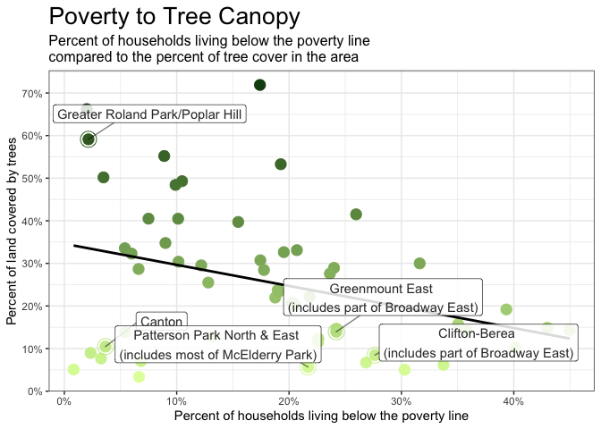
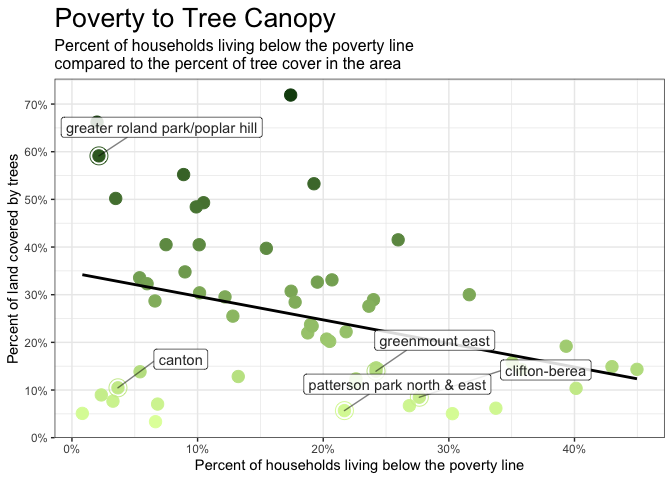

-   [LEFT TO DO:](#left-to-do)
-   [Introduction](#introduction)
-   [Setup](#setup)
    -   [Load packages](#load-packages)
    -   [Store variables](#store-variables)
    -   [Load data](#load-data)
-   [Line-by-Line Facts](#line-by-line-facts)
    -   [Fact: Hottest Streets in
        Baltimore](#fact-hottest-streets-in-baltimore)
    -   [Fact: A certain block in Broadway East is one of the city’s
        hottest](#fact-a-certain-block-in-broadway-east-is-one-of-the-citys-hottest)
    -   [Fact: Broadway East is one of the poorest
        NSAs](#fact-broadway-east-is-one-of-the-poorest-nsas)
    -   [Fact: Poorest NSAs have less tree
        canopy](#fact-poorest-nsas-have-less-tree-canopy)
    -   [Fact: Canopy-to-poverty correlation is pronounced on the east
        side](#fact-canopy-to-poverty-correlation-is-pronounced-on-the-east-side)
    -   [Fact: Coolest NSAs have 10x the canopy of
        hottest](#fact-coolest-nsas-have-10x-the-canopy-of-hottest)
    -   [Fact: 89 degrees at 1 p.m. on
        7/10/2019](#fact-89-degrees-at-1-p.m.-on-7102019)
    -   [Fact: Street trees & plots on North Milton
        Ave.](#fact-street-trees-plots-on-north-milton-ave.)
    -   [Fact: Northern CSAs are both wealthier and
        cooler](#fact-northern-csas-are-both-wealthier-and-cooler)
    -   [Fact: Wealthier CSAs have many trees around 35 feet
        tall](#fact-wealthier-csas-have-many-trees-around-35-feet-tall)
    -   [Fact: Broadway East lacks many 35-foot
        trees](#fact-broadway-east-lacks-many-35-foot-trees)
    -   [Fact: Tree types living on N. Milton in Broadway
        East](#fact-tree-types-living-on-n.-milton-in-broadway-east)
    -   [Fact: Broadway East is a low-income
        neighborhood](#fact-broadway-east-is-a-low-income-neighborhood)
    -   [Fact: McElderry Park temperature, wealth and
        canopy](#fact-mcelderry-park-temperature-wealth-and-canopy)
    -   [Fact: Broadway East is one of the hottest
        neighborhoods](#fact-broadway-east-is-one-of-the-hottest-neighborhoods)
    -   [Fact: Roland Park has dense canopy and is
        cool](#fact-roland-park-has-dense-canopy-and-is-cool)
    -   [Fact: 2/3 of Roland Park is covered in
        canopy](#fact-23-of-roland-park-is-covered-in-canopy)
    -   [Fact: Broadway East has about 10% canopy, 6x Roland
        Park](#fact-broadway-east-has-about-10-canopy-6x-roland-park)
    -   [Fact: Inverse relationship between tree cover and
        temperature](#fact-inverse-relationship-between-tree-cover-and-temperature)
    -   [Fact: Roland park is one of the coolest NSAs, Broadway East is
        one of the
        hottest](#fact-roland-park-is-one-of-the-coolest-nsas-broadway-east-is-one-of-the-hottest)
    -   [Fact: About 1/4 of families in Broadway East live in
        poverty](#fact-about-14-of-families-in-broadway-east-live-in-poverty)
    -   [Fact: Broadway East is one of the poorest
        NSAs](#fact-broadway-east-is-one-of-the-poorest-nsas-1)
    -   [Fact: Poorer neighborhoods have less tree cover, with some
        exceptions](#fact-poorer-neighborhoods-have-less-tree-cover-with-some-exceptions)
    -   [Fact: Broadway East and Roland Park canopy correlates to
        historic
        redlining](#fact-broadway-east-and-roland-park-canopy-correlates-to-historic-redlining)
    -   [Fact: Roland Park is one of Baltimore’s wealthiest and whitest;
        Broadway East is one of the poorest and
        blackest](#fact-roland-park-is-one-of-baltimores-wealthiest-and-whitest-broadway-east-is-one-of-the-poorest-and-blackest)
    -   [Fact: Baltimore tree cover went from 27% in 2007 to 28% in
        2015](#fact-baltimore-tree-cover-went-from-27-in-2007-to-28-in-2015)
    -   [Fact: Hot East Baltimore NSAs are nowhere near 40%
        canopy](#fact-hot-east-baltimore-nsas-are-nowhere-near-40-canopy)
    -   [Fact: Canopy growth has been
        “measured”](#fact-canopy-growth-has-been-measured)
    -   [Fact: 1/3 of Broadway East blocks lost canopy cover, but
        overall canopy increased by 1.6 points; Roland Park increased by
        2.1
        points](#fact-13-of-broadway-east-blocks-lost-canopy-cover-but-overall-canopy-increased-by-1.6-points-roland-park-increased-by-2.1-points)
    -   [Fact: Citywide canopy loss and
        gain](#fact-citywide-canopy-loss-and-gain)
    -   [Fact:](#fact)
    -   [Fact: The hottest NSAs did not grow enough to correct canopy
        inequity](#fact-the-hottest-nsas-did-not-grow-enough-to-correct-canopy-inequity)
    -   [Fact: Broadway East has \~1,000 spaces to put a tree, but most
        require breaking
        concrete](#fact-broadway-east-has-1000-spaces-to-put-a-tree-but-most-require-breaking-concrete)
    -   [Fact: There is a 35-foot Callery pear tree in front of a
        specific house on E. Lanvale St. in fair
        condition](#fact-there-is-a-35-foot-callery-pear-tree-in-front-of-a-specific-house-on-e.-lanvale-st.in-fair-condition)
    -   [Fact: A 35-foot tree is unusual in Broadway East and average
        for Roland
        Park](#fact-a-35-foot-tree-is-unusual-in-broadway-east-and-average-for-roland-park)
    -   [Fact: Number, condition and height of other trees on the E.
        Lanvale
        St. block](#fact-number-condition-and-height-of-other-trees-on-the-e.-lanvale-st.block)
    -   [Fact: Trees in Broadway East are less healthy than those in
        Roland Park and similar
        NSAs](#fact-trees-in-broadway-east-are-less-healthy-than-those-in-roland-park-and-similar-nsas)
    -   [Fact: The BPD has requested at least around 100 trees be
        trimmed to clear CCTV
        views](#fact-the-bpd-has-requested-at-least-around-100-trees-be-trimmed-to-clear-cctv-views)
    -   [Fact: The poorest CSAs have higher crime
        rates](#fact-the-poorest-csas-have-higher-crime-rates)
    -   [Fact: \~1/3 of Broadway East homes are
        vacant](#fact-13-of-broadway-east-homes-are-vacant)
-   [For NPR](#for-npr)
    -   [Fact: Franklin Square tree canopy in recent years (for
        NPR)](#fact-franklin-square-tree-canopy-in-recent-years-for-npr)
    -   [Fact: Franklin Square tree canopy level (for
        NPR)](#fact-franklin-square-tree-canopy-level-for-npr)

LEFT TO DO:
-----------

*Search \[SEAN\] for unfinished sections*

Introduction
------------

This R markdown document describes the methodology and results of a
portion of the data analysis we conducted in support of a reporting
project examining the effects of tree canopy inequity across the city of
Baltimore, especially as it relates to climate change.

Per editor request, this document is arranged in order of the facts as
they appear in the story. Therefore, there is some recognized
duplication of both code and facts.

Setup
-----

Before running this file, **please view and run the [Code Red Data
Cleaning
document](https://github.com/smussenden/2019-baltimore-climate-health-project-data-repo/blob/master/documentation/code-red-data-cleaning.md)**
for this project. As well as outputting necessary cleaned data for the
following ananlysis, that document also includes the following items
necessary to understand this analysis:

-   definitions
-   source data citation and information
-   cleaning methodology
-   software tools used

### Load packages

``` r
#######################
#### Load Packages ####
#######################

library(tidyverse)
library(DescTools) # For %like% operator
library(corrr) # For correlation matrices
library(colorspace) # For improved color palettes
library(ggplot2) # For graphing
library(ggrepel) # For graph labeling
require(scales) # For percent labeling on distribution tables

# Turn off scientific notation in RStudio (prevents coersion to character type)
options(scipen = 999)
```

### Store variables

``` r
#########################
#### Store Variables ####
#########################

# Common path to data
path_to_data <- "../data/output-data/"

# NSAs of interest
target_nsas <- c("Berea", "Broadway East", "Oliver", "Middle East", 
                 "Biddle Street","Milton-Montford", "Madison-Eastend", 
                 "CARE", "McElderry Park", "Ellwood Park/Monument", 
                 "Patterson Place", "Patterson Park Neighborhood", 
                 "Baltimore Highlands", "Highlandtown", 
                 "Upper Fells Point") %>%
                lapply(tolower)

# Counterpoint NSAs of interest
counterpoint_nsas <- c("Butcher's Hill", "Canton", "Washington Hill", "Roland Park") %>%
  lapply(tolower)

# CSAs of interest
target_csas <- c("Greater Roland Park/Poplar Hill", "Canton", "Patterson Park North & East", "Greenmount East", "Clifton-Berea") %>%
  lapply(tolower)

# Colorblind-friendly palette
cbPalette <- c("#999999", # Dark Gray
               "#E69F00", # Mustard Yellow
               "#56B4E9", # Sky Blue
               "#009E73", # Strong Green
               "#F0E442", # Lemon Yellow
               "#0072B2", # Denim Blue
               "#D55E00", # Rust Orange
               "#CC79A7") # Lavender
```

### Load data

``` r
###################
#### Load Data ####
###################

blocks_tree_temp_demographics <- 
  read_csv(paste0(path_to_data, "tree_temp_demographics/blocks_tree_temp_demographics.csv")) %>%
  mutate_at(vars(matches("geoid10")), as.character) # Recast non-calculable variables as characters

csa_tree_temp_demographics <- 
  read_csv(paste0(path_to_data, "tree_temp_demographics/csa_tree_temp_demographics.csv"))

nsa_tree_temp <- 
  read_csv(paste0(path_to_data, "tree_temp_demographics/nsa_tree_temp.csv"))

zcta_tree_temp_demographics <- 
  read_csv(paste0(path_to_data, "tree_temp_demographics/zcta_temp_demographics.csv")) %>%
  mutate_at(vars(matches("zcta")), as.character) # Recast non-calculable variables as characters

redlining_tree <- read_csv(paste0(path_to_data, "redlining_trees/redlining_tree.csv"))

street_trees_nsa_categorized <- 
  read_csv(paste0(path_to_data, "street_trees/street_trees_nsa_categorized.csv"))

street_trees_nsa_summarized <- 
  read_csv(paste0(path_to_data, "street_trees/street_trees_nsa_summarized.csv"))

#citywide_lidar_data <- read_csv(paste0(path_to_data, "citywide_2007_2015_lidar.csv"))

#canopy_2007_2015_gains_losses <- read_csv(paste0(path_to_data, "canopy_2007_2015_gains_losses.csv"))

#cctv_cameras_street_trees <- read_csv(paste0(path_to_data, "cctv_cameras_street_trees.csv"))
```

Line-by-Line Facts
------------------

### Fact: Hottest Streets in Baltimore

“Kwamel Couther stands on the front lines of a campaign to bring
thousands of cooling shade trees to some of the **hottest streets in
Baltimore**.”

#### Explanation

All of the top 10 hottest NSAs are located in the south of the city, and
many are in the south-east.

#### Supporting Code

``` r
# Rank NSAs by temperature
nsa_tree_temp %>%
  select(nsa_name, temp_mean_aft) %>%
  mutate(rank = rank(-temp_mean_aft)) %>%
  arrange(rank)
```

    ## # A tibble: 278 x 3
    ##    nsa_name              temp_mean_aft  rank
    ##    <chr>                         <dbl> <dbl>
    ##  1 mcelderry park                 99.4     1
    ##  2 milton-montford                99.3     2
    ##  3 patterson place                98.6     3
    ##  4 dunbar-broadway                98.3     4
    ##  5 ellwood park/monument          98.3     5
    ##  6 penn-fallsway                  98.3     6
    ##  7 pleasant view gardens          98.3     7
    ##  8 madison-eastend                97.9     8
    ##  9 old goucher                    97.9     9
    ## 10 biddle street                  97.9    10
    ## # … with 268 more rows

### Fact: A certain block in Broadway East is one of the city’s hottest

“He needs a lot of water too, working in the summer heat here at the
edge of the **Broadway East** neighborhood, on one of the city’s
**hottest** – and poorest – blocks.”

#### Explanation

Below, we see the block on N. Milton Avenue between Oliver and Federal
is one of the city’s hottest, ranking at 236 out of 13,598 blocks. The
GEOID for this block was pulled from QGIS and breaks down into the
following codes:

-   State: 24
-   County: 510
-   Tract: 080301
-   Block: 1000

#### Supporting Code

``` r
# Block of interest ranked by heat
blocks_tree_temp_demographics %>%
  select(geoid10, temp_mean_aft) %>%
  mutate(rank = rank(-temp_mean_aft)) %>%
  filter(geoid10 == "245100803011000")
```

    ## # A tibble: 1 x 3
    ##   geoid10         temp_mean_aft  rank
    ##   <chr>                   <dbl> <dbl>
    ## 1 245100803011000          98.3   236

### Fact: Broadway East is one of the poorest NSAs

“He needs a lot of water too, working in the summer heat here at the
edge of the **Broadway East** neighborhood, on one of the city’s hottest
– and **poorest** – blocks.”

#### Explanation

**Broadway East** ranked by percent of families living below the poverty
line (out of 55 ranks). The Broadway East NSA is split vertically down
the middle between the **Clifton-Berea** and **Greenmount East** CSAs,
which also include large portions of the surrounding NSAs. It also
includes an insignificant sliver of Oldtown/Middle East, which was
disregarded in this analysis.

Broadway East, as a combination of Clifton-Berea and Greenmount East,
has a total percent of family households living below the poverty line
of 25.93 according to:

#### Supporting Code

``` r
# Average Clifton-Berea and Greenmount East CSAs to find Broadway East NSA
(csa_tree_temp_demographics$percent_of_family_households_living_below_the_poverty_line[csa_tree_temp_demographics$csa2010 %like% "%greenmount%"] +
csa_tree_temp_demographics$percent_of_family_households_living_below_the_poverty_line[csa_tree_temp_demographics$csa2010 %like% "%clifton%"]) / 2
```

    ## [1] 25.92508

``` r
# The two CSAs that make up Broadway East average income and percent below poverty
csa_tree_temp_demographics %>%
  mutate(rank = rank(-percent_of_family_households_living_below_the_poverty_line)) %>%
  arrange(rank) %>%
  mutate(associated_nsa = case_when(
    (csa2010 %like% "%clifton%") | (csa2010 %like% "%greenmount%") ~ "broadway east",
    T ~ NA_character_
  )) %>%
  select(csa2010, associated_nsa, 
         avg_household_income = median_household_income, 
         perc_below_poverty = percent_of_family_households_living_below_the_poverty_line, 
         rank) %>%
  filter((csa2010 %like% "%clifton%") | 
           (csa2010 %like% "%greenmount%"))
```

    ## # A tibble: 2 x 5
    ##   csa2010        associated_nsa avg_household_inco… perc_below_pover…  rank
    ##   <chr>          <chr>                        <dbl>             <dbl> <dbl>
    ## 1 clifton-berea  broadway east               32289.              27.6    10
    ## 2 greenmount ea… broadway east               26563.              24.2    14

### Fact: Poorest NSAs have less tree canopy

“The city’s **poorest** neighborhoods tend to have **less tree canopy
than wealthier areas**…”

#### Discussion

A correlation matrix of poverty and canopy cover shows a negative
correlation of -.34. In other words, places with a high poverty rate
will have fewer trees, in general.

#### Supporting Code

``` r
# Build correlation matrix between poverty and tree canopy
csa_tree_temp_demographics %>%
  select(perc_below_poverty = percent_of_family_households_living_below_the_poverty_line,
         avg_canopy_2015 = `15_lid_mean`) %>%
  as.matrix() %>%
  correlate() %>%
  mutate(variable=rowname) %>%
  select(variable, everything(), -rowname)
```

    ## # A tibble: 2 x 3
    ##   variable           perc_below_poverty avg_canopy_2015
    ##   <chr>                           <dbl>           <dbl>
    ## 1 perc_below_poverty             NA              -0.340
    ## 2 avg_canopy_2015                -0.340          NA

### Fact: Canopy-to-poverty correlation is pronounced on the east side

“The city’s poorest neighborhoods tend to have less tree canopy than
wealthier areas, **a pattern that is especially pronounced on the
concrete-dense east side**, in neighborhoods like **Broadway East**.”

#### Explanation

Poverty, income and canopy at the top and bottom 10 CSAs when ranked for
poverty.

#### Supporting Code

``` r
# Top and bottom 10 CSAs ranked for poverty, also showing tree canopy ranking
csa_tree_temp_demographics %>%
  select(csa2010,
         perc_below_poverty = percent_of_family_households_living_below_the_poverty_line,
         avg_canopy_2015 = `15_lid_mean`) %>%
  mutate(rank_poverty = rank(-perc_below_poverty),
         rank_canopy = rank(-avg_canopy_2015)) %>%
  filter(between(rank_poverty, 1L, 10L) |
           between(rank_poverty, 46L, 55L)) %>%
  mutate(associated_nsa = case_when(
    (csa2010 %like% "%clifton%") | (csa2010 %like% "%greenmount%") ~ "broadway east",
    (csa2010 %like% "%madison%") | (csa2010 %like% "%park north%") ~ "mcelderry park",
    (csa2010 %like% "%poplar%") ~ "roland park",
    T ~ NA_character_
  )) %>%
  select(csa2010,
         associated_nsa,
         perc_below_poverty,
         avg_canopy_2015,
         rank_poverty, rank_canopy) %>%
  arrange(rank_poverty)
```

    ## # A tibble: 20 x 6
    ##    csa2010 associated_nsa perc_below_pove… avg_canopy_2015 rank_poverty
    ##    <chr>   <chr>                     <dbl>           <dbl>        <dbl>
    ##  1 popple… <NA>                     45.0            0.158             1
    ##  2 upton/… <NA>                     43.0            0.160             2
    ##  3 oldtow… <NA>                     40.1            0.105             3
    ##  4 cherry… <NA>                     39.3            0.212             4
    ##  5 southw… <NA>                     35.8            0.154             5
    ##  6 sandto… <NA>                     35.0            0.166             6
    ##  7 madiso… mcelderry park           33.7            0.0660            7
    ##  8 southe… <NA>                     31.6            0.296             8
    ##  9 southe… <NA>                     30.3            0.0525            9
    ## 10 clifto… broadway east            27.6            0.0899           10
    ## 11 medfie… <NA>                      5.98           0.328            46
    ## 12 midtown <NA>                      5.42           0.143            47
    ## 13 loch r… <NA>                      5.39           0.327            48
    ## 14 canton  <NA>                      3.66           0.130            49
    ## 15 north … <NA>                      3.48           0.512            50
    ## 16 fells … <NA>                      3.26           0.0911           51
    ## 17 inner … <NA>                      2.34           0.104            52
    ## 18 greate… roland park               2.15           0.603            53
    ## 19 mount … <NA>                      2.00           0.670            54
    ## 20 south … <NA>                      0.826          0.0604           55
    ## # … with 1 more variable: rank_canopy <dbl>

### Fact: Coolest NSAs have 10x the canopy of hottest

“…the coolest neighborhoods have an order of magnitude more tree canopy
than the hottest neighborhoods.”

“…there was a 10-degree difference between the coolest and hottest
neighborhoods in the city.”

#### Explanation

An “order of magnitude” is an imprecise term but is generally considered
to be 10. Whether the figure is 10 or approaching 10 depends on whether
mean or median is used.

-   McElderry Park was the hottest, at a mean of 99.39 and a median of
    99.3 degrees Fahrenheit.
-   Gwynns Falls/Leakin Park was the coolest, at a mean of 90.75 and a
    median of 89.32 degrees Fahrenheit.

The difference in temperatures between the city’s mean hottest and
coolest neighborhoods is -8.65 degrees Fahrenheit, whereas the
difference between median is -9.98 degrees.

#### Supporting Code

``` r
# The hottest and coolest NSAs
nsa_tree_temp %>%
  select(nsa_name, temp_mean_aft, temp_median_aft) %>%
  filter(
    ((temp_mean_aft == min(temp_mean_aft)) | (temp_mean_aft == max(temp_mean_aft))) |
    ((temp_median_aft == min(temp_median_aft)) | (temp_median_aft == max(temp_median_aft)))
         ) %>%
  arrange(desc(temp_mean_aft))
```

    ## # A tibble: 2 x 3
    ##   nsa_name                 temp_mean_aft temp_median_aft
    ##   <chr>                            <dbl>           <dbl>
    ## 1 mcelderry park                    99.4            99.3
    ## 2 gwynns falls/leakin park          90.7            89.3

### Fact: 89 degrees at 1 p.m. on 7/10/2019

“By 1 p.m., when the heat index registered 89 degrees and the sun loomed
almost directly overhead, working in the shade was no longer an option.”

#### Explanation

\[INCOMPLETE\] \[SEAN\]

#### Supporting Code

``` r
# Code here
```

### Fact: Street trees & plots on North Milton Ave.

“A 35-foot linden tree in the middle of the block once provided serious
cover from the sun, but it died within the last few years.”

“Across the street, another linden, a 25-footer, also appeared dead…”

“…under a 35-foot linden – alive, but only in “fair” condition, as
scored by the city – with a broad leaf canopy. It was the only tree on
the sidewalk to provide any meaningful temperature reduction…"

#### Explanation

All trees and potential tree locations along that stretch of road are
referenced below.

#### Supporting Code

``` r
# All street trees & locations along N. Milton in Broadway East
street_trees_nsa_categorized %>%
  filter((nbrdesc %like% "broadway%") & ((street %like% "n milton%"))) %>%
  select(nbrdesc, address, street, genus_clean, common, dbh, condition, date_inspected = inspect_dt) %>%
  arrange(street, address)
```

    ## # A tibble: 58 x 8
    ##    nbrdesc address street genus_clean common   dbh condition date_inspected
    ##    <chr>     <dbl> <chr>  <chr>       <chr>  <dbl> <chr>     <date>        
    ##  1 broadw…    1200 n mil… vacant      vacan…     0 absent    2018-05-16    
    ##  2 broadw…    1204 n mil… vacant      vacan…     0 absent    2018-05-16    
    ##  3 broadw…    1214 n mil… vacant      vacan…     0 absent    2018-05-16    
    ##  4 broadw…    1220 n mil… vacant      vacan…     0 absent    2018-05-16    
    ##  5 broadw…    1304 n mil… vacant      vacan…     0 absent    2018-05-14    
    ##  6 broadw…    1308 n mil… vacant      vacan…     0 absent    2018-05-14    
    ##  7 broadw…    1312 n mil… vacant      vacan…     0 absent    2018-05-14    
    ##  8 broadw…    1318 n mil… vacant      vacan…     0 absent    2018-05-14    
    ##  9 broadw…    1322 n mil… vacant      vacan…     0 absent    2018-05-14    
    ## 10 broadw…    1400 n mil… vacant      vacan…     0 absent    2018-05-15    
    ## # … with 48 more rows

### Fact: Northern CSAs are both wealthier and cooler

“In the **wealthier**, more **temperate** neighborhoods **north of
Broadway East** – like **Roland Park** … – a 35-foot street tree like
this would be of roughly average height, with plenty of company.”

#### Explanation

Poverty and temperature shows a correlation of .398. In other words,
poorer neighborhoods tend to be more temperate.

Secondly, the top and bottom 10 CSAs ranked for poverty in general show
norther neighborhoods are both wealthier and cooler.

#### Supporting Code

``` r
# Build correlation matrix between poverty and temperature
csa_tree_temp_demographics %>%
  select(perc_below_poverty = percent_of_family_households_living_below_the_poverty_line,
         temp_mean_aft) %>%
  as.matrix() %>%
  correlate() %>%
  mutate(variable=rowname) %>%
  select(variable, everything(), -rowname)
```

    ## # A tibble: 2 x 3
    ##   variable           perc_below_poverty temp_mean_aft
    ##   <chr>                           <dbl>         <dbl>
    ## 1 perc_below_poverty             NA             0.398
    ## 2 temp_mean_aft                   0.398        NA

``` r
# Top and bottom 10 CSAs ranked for poverty, also showing average temperature
csa_tree_temp_demographics %>%
  select(csa2010,
         perc_below_poverty = percent_of_family_households_living_below_the_poverty_line,
         temp_mean_aft) %>%
  mutate(rank_poverty = rank(-perc_below_poverty),
         rank_temp = rank(-temp_mean_aft)) %>%
  filter(between(rank_poverty, 1L, 10L) |
           between(rank_poverty, 46L, 55L)) %>%
  mutate(associated_nsa = case_when(
    (csa2010 %like% "%clifton%") | (csa2010 %like% "%greenmount%") ~ "broadway east",
    (csa2010 %like% "%madison%") | (csa2010 %like% "%park north%") ~ "mcelderry park",
    (csa2010 %like% "%poplar%") ~ "roland park",
    T ~ NA_character_
  )) %>%
  select(csa2010,
         associated_nsa,
         perc_below_poverty,
         temp_mean_aft,
         rank_poverty, rank_temp) %>%
  arrange(rank_poverty)
```

    ## # A tibble: 20 x 6
    ##    csa2010 associated_nsa perc_below_pove… temp_mean_aft rank_poverty
    ##    <chr>   <chr>                     <dbl>         <dbl>        <dbl>
    ##  1 popple… <NA>                     45.0            95.4            1
    ##  2 upton/… <NA>                     43.0            95.9            2
    ##  3 oldtow… <NA>                     40.1            97.3            3
    ##  4 cherry… <NA>                     39.3            95.0            4
    ##  5 southw… <NA>                     35.8            95.6            5
    ##  6 sandto… <NA>                     35.0            95.4            6
    ##  7 madiso… mcelderry park           33.7            98.3            7
    ##  8 southe… <NA>                     31.6            94.7            8
    ##  9 southe… <NA>                     30.3            94.8            9
    ## 10 clifto… broadway east            27.6            96.7           10
    ## 11 medfie… <NA>                      5.98           94.9           46
    ## 12 midtown <NA>                      5.42           96.9           47
    ## 13 loch r… <NA>                      5.39           93.8           48
    ## 14 canton  <NA>                      3.66           95.3           49
    ## 15 north … <NA>                      3.48           93.4           50
    ## 16 fells … <NA>                      3.26           95.4           51
    ## 17 inner … <NA>                      2.34           95.3           52
    ## 18 greate… roland park               2.15           92.8           53
    ## 19 mount … <NA>                      2.00           92.0           54
    ## 20 south … <NA>                      0.826          94.9           55
    ## # … with 1 more variable: rank_temp <dbl>

### Fact: Wealthier CSAs have many trees around 35 feet tall

“In the wealthier, more temperate **neighborhoods north of Broadway
East** – like **Roland Park** … – a **35-foot street tree** like this
would be of **roughly average height**, with **plenty of company**.”

#### Explanation

Roland Park has an average tree height of 30.86 feet. 42.8 percent of
the trees there are 35 feet tall or taller.

#### Supporting Code

``` r
# See average height of trees in NSAs of interest
# and counts/percentages of trees greater than 35 feet tall
street_trees_nsa_categorized %>%
  select(nbrdesc, tree_ht) %>%
  group_by(nbrdesc) %>%
  summarize(avg_ht = mean(tree_ht),
            total_trees = n()) %>%
  left_join(
    street_trees_nsa_categorized %>%
    select(nbrdesc, tree_ht) %>%
    group_by(nbrdesc) %>%
    filter(tree_ht >= 35) %>%
    summarize(count_35_or_taller = n())
  ) %>%
  mutate(perc_35_or_taller = round(100*(count_35_or_taller/total_trees), 2)) %>%
  mutate(rank_avg_ht = rank(-avg_ht)) %>%
  filter((nbrdesc %in% target_nsas) | (nbrdesc %in% counterpoint_nsas)) %>%
  arrange(desc(avg_ht))
```

    ## # A tibble: 19 x 6
    ##    nbrdesc avg_ht total_trees count_35_or_tal… perc_35_or_tall… rank_avg_ht
    ##    <chr>    <dbl>       <int>            <int>            <dbl>       <dbl>
    ##  1 roland…  30.9         3382             1449            42.8           11
    ##  2 butche…  23.8          628              142            22.6           37
    ##  3 upper …  20.7          908              200            22.0           60
    ##  4 patter…  17.4          274               20             7.3          106
    ##  5 biddle…  16.1          368               80            21.7          118
    ##  6 washin…  15.8         1020              157            15.4          125
    ##  7 canton   15.0         4132              560            13.6          136
    ##  8 mcelde…  14.6          942               46             4.88         140
    ##  9 patter…  13.7         1319               39             2.96         164
    ## 10 care     13.4          544               30             5.51         171
    ## 11 ellwoo…  13.1         1067               51             4.78         177
    ## 12 oliver   12.1         1526              162            10.6          200
    ## 13 highla…  11.6          955               43             4.5          207
    ## 14 madiso…  11.6          559               47             8.41         211
    ## 15 milton…  11.4          391               22             5.63         220
    ## 16 middle…  10.9          990               52             5.25         227
    ## 17 berea    10.7          937               89             9.5          228
    ## 18 baltim…  10.1          597               17             2.85         239
    ## 19 broadw…   5.75        1526               80             5.24         273

``` r
# Plot height by of NSAs of interest using controled averages
street_trees_nsa_summarized %>%
  filter((nbrdesc %in% target_nsas) | (nbrdesc %in% counterpoint_nsas)) %>%
  ggplot(aes(x = reorder(nbrdesc, avg_ht_controled), 
           y = avg_ht_controled, 
           fill = factor(is_target_nsa, 
                         # Rename fill levels in legend
                         labels=c("Counterpoint NSA"," Target NSA"))
           )) +
  geom_col() +
  coord_flip() +
  labs(title = "Average Tree Height of Target NSAs",
       x = "",
       y = "",
       fill = "") +
  scale_fill_manual(values=cbPalette) +
  theme(legend.position = "bottom")
```


``` r
# Plot height for all NSAs using controled averages
# (For an overview, not intended for reading each NSA name)
ggplot(filter(street_trees_nsa_summarized, !is.na(avg_ht_controled)), 
       aes(x = reorder(nbrdesc, avg_ht_controled), 
           y = avg_ht_controled, 
           fill = factor(is_target_nsa, 
                         # Rename fill levels in legend
                         labels=c("Not Target NSA", "Target NSA"))
           )) +
  geom_col() +
  labs(title = "Average Tree Height of NSAs",
       x = "",
       y = "",
       fill = "") +
  scale_fill_manual(values=cbPalette) +
  theme(legend.position = "top", 
        axis.text.x = element_text(angle = 90, hjust = 1, size = 5))
```



### Fact: Broadway East lacks many 35-foot trees

“Here in **Broadway East**, in an area of Baltimore that has suffered
from decades of disinvestment, this **lonely 35-footer stands out as one
of the neighborhood’s largest sidewalk trees**.”

#### Explanation

Broadway East has an average tree height of 5.75 feet. 5.24 percent of
the trees there are 35 feet tall or taller.

#### Supporting Code

``` r
# See average height of trees in Broadway East only
# and counts/percentages of trees greater than 35 feet tall
street_trees_nsa_categorized %>%
  select(nbrdesc, tree_ht) %>%
  group_by(nbrdesc) %>%
  summarize(avg_ht = mean(tree_ht),
            total_trees = n()) %>%
  left_join(
    street_trees_nsa_categorized %>%
    select(nbrdesc, tree_ht) %>%
    group_by(nbrdesc) %>%
    filter(tree_ht >= 35) %>%
    summarize(count_35_or_taller = n())
  ) %>%
  mutate(perc_35_or_taller = round(100*(count_35_or_taller/total_trees), 2)) %>%
  mutate(rank_avg_ht = rank(-avg_ht)) %>%
  filter(nbrdesc %like% "broadway%")
```

    ## # A tibble: 1 x 6
    ##   nbrdesc  avg_ht total_trees count_35_or_tal… perc_35_or_tall… rank_avg_ht
    ##   <chr>     <dbl>       <int>            <int>            <dbl>       <dbl>
    ## 1 broadwa…   5.75        1526               80             5.24         273

### Fact: Tree types living on N. Milton in Broadway East

“The rest of the living trees on this street – 10-foot red maples,
London planes and elms…”

#### Supporting Code

``` r
# All street trees & locations along N. Milton in Broadway East
street_trees_nsa_categorized %>%
  filter((nbrdesc %like% "broadway%") & (street %like% "n milton%") & (condition != "absent")
         ) %>%
  select(nbrdesc, address, street, genus_clean, common, dbh, condition, tree_ht, date_inspected = inspect_dt) %>%
  arrange(street, address)
```

    ## # A tibble: 13 x 9
    ##    nbrdesc address street genus_clean common   dbh condition tree_ht
    ##    <chr>     <dbl> <chr>  <chr>       <chr>  <dbl> <chr>       <dbl>
    ##  1 broadw…    1420 n mil… ulmus       elm, …  24.3 good           55
    ##  2 broadw…    1420 n mil… pyrus       pear,…   9.5 fair           18
    ##  3 broadw…    1536 n mil… tilia       linde…  13.9 dead           35
    ##  4 broadw…    1538 n mil… stump       stump    2   stump           0
    ##  5 broadw…    1538 n mil… tilia       linde…  15.4 fair           35
    ##  6 broadw…    1600 n mil… tilia       linde…  14.1 fair           20
    ##  7 broadw…    1600 n mil… tilia       linde…  13.1 good           25
    ##  8 broadw…    1624 n mil… prunus      cherr…   5.7 good            8
    ##  9 broadw…    1800 n mil… ulmus       elm, …   1.3 good           10
    ## 10 broadw…    1804 n mil… gleditsia   honey…   1.2 good           10
    ## 11 broadw…    1808 n mil… acer        maple…   1.4 good           10
    ## 12 broadw…    1810 n mil… gleditsia   honey…   1.2 good           10
    ## 13 broadw…    1816 n mil… ulmus       elm, …   1.2 good           10
    ## # … with 1 more variable: date_inspected <date>

### Fact: Broadway East is a low-income neighborhood

“…in the heat of this low-income neighborhood.”

#### Explanation

The CSAs that include Broadway East rank near the bottom in terms of
average household income (at 45 and 48 out of 55) and percent below the
poverty line (10 and 14).

#### Supporting Code

``` r
# See how Broadway East CSAs rank in comparison to the other 53 CSAs in terms of poverty
csa_tree_temp_demographics %>%
  mutate(rank_avg_income = rank(-median_household_income),
         rank_perc_poverty = rank(-percent_of_family_households_living_below_the_poverty_line)) %>%
  arrange(rank_avg_income) %>%
  mutate(associated_nsa = case_when(
    (csa2010 %like% "%clifton%") | (csa2010 %like% "%greenmount%") ~ "broadway east",
    T ~ NA_character_
  )) %>%
  select(csa2010, associated_nsa, 
         avg_household_income = median_household_income, 
         perc_below_poverty = percent_of_family_households_living_below_the_poverty_line, 
         rank_avg_income,
         rank_perc_poverty) %>%
  filter(associated_nsa %like% "%broadway east%")
```

    ## # A tibble: 2 x 6
    ##   csa2010 associated_nsa avg_household_i… perc_below_pove… rank_avg_income
    ##   <chr>   <chr>                     <dbl>            <dbl>           <dbl>
    ## 1 clifto… broadway east            32289.             27.6              45
    ## 2 greenm… broadway east            26563.             24.2              48
    ## # … with 1 more variable: rank_perc_poverty <dbl>

### Fact: McElderry Park temperature, wealth and canopy

“…McElderry Park, the city’s **hottest neighborhood** and also **among
its poorest**. It also has some of the **lowest levels of tree
canopy**…”

#### Explanation

The **McElderry Park** NSA is split horizontally across the middle
between **Madison/East End** and **Patterson Park North & East**, both
of which contain large portions of surrounding NSAs.

The McElderry Park CSAs have a high poverty rate, are the first and
third hottest CSAs, and have the 52nd and 51st least tree canopy.

#### Supporting Code

``` r
csa_tree_temp_demographics %>%
  mutate(
    # Wealth
    rank_perc_poverty = rank(-percent_of_family_households_living_below_the_poverty_line),
    # Temperature
    rank_temp = rank(-temp_median_aft),
    # Canopy
    rank_canopy = rank(-`15_lid_mean`)
    ) %>%
  arrange(rank_perc_poverty) %>%
  mutate(associated_nsa = case_when(
    (csa2010 %like% "%madison%") | (csa2010 %like% "%park north%") ~ "mcelderry park",
    T ~ NA_character_
  )) %>%
  select(csa2010, associated_nsa,
         perc_below_poverty = percent_of_family_households_living_below_the_poverty_line, 
         rank_perc_poverty,
         temp_median_aft,
         rank_temp,
         canopy_2015 = `15_lid_mean`,
         rank_canopy
         ) %>%
  filter(associated_nsa %like% "%mcelderry park%")
```

    ## # A tibble: 2 x 8
    ##   csa2010 associated_nsa perc_below_pove… rank_perc_pover… temp_median_aft
    ##   <chr>   <chr>                     <dbl>            <dbl>           <dbl>
    ## 1 madiso… mcelderry park             33.7                7            98.4
    ## 2 patter… mcelderry park             21.7               20            97.2
    ## # … with 3 more variables: rank_temp <dbl>, canopy_2015 <dbl>,
    ## #   rank_canopy <dbl>

### Fact: Broadway East is one of the hottest neighborhoods

“A future where **the hottest city neighborhoods, like Broadway East**,
have the kind of dense canopy that help keep places like Roland Park
cool as global temperatures rise.”

#### Explanation

Broadway East is the 16th-hottest NSA out of 278.

#### Supporting Code

``` r
# Broadway East ranked by mean afternoon heat
nsa_tree_temp %>%
  select(nsa_name, temp_mean_aft) %>%
  mutate(rank = rank(-temp_mean_aft)) %>%
  filter(nsa_name == "broadway east")
```

    ## # A tibble: 1 x 3
    ##   nsa_name      temp_mean_aft  rank
    ##   <chr>                 <dbl> <dbl>
    ## 1 broadway east          97.4    16

### Fact: Roland Park has dense canopy and is cool

“A future where the hottest city neighborhoods, like Broadway East, have
the kind of **dense canopy that help keep places like Roland Park cool**
as global temperatures rise.”

#### Explanation

Roland Park is ranked 9th-most dense and 263rd-hottest, out of 278 NSAs.

#### Supporting Code

``` r
# Roland Park ranked by mean afternoon heat and amount canopy cover
nsa_tree_temp %>%
  select(nsa_name, temp_mean_aft, avg_canopy = `15_lid_mean`) %>%
  mutate(rank_temp = rank(-temp_mean_aft),
         rank_canopy = (rank(-avg_canopy))) %>%
  filter(nsa_name %like% "roland%")
```

    ## # A tibble: 1 x 5
    ##   nsa_name    temp_mean_aft avg_canopy rank_temp rank_canopy
    ##   <chr>               <dbl>      <dbl>     <dbl>       <dbl>
    ## 1 roland park          93.3      0.645       263           9

### Fact: 2/3 of Roland Park is covered in canopy

“Two-thirds of the neighborhood \[Roland Park\] is covered with tree
canopy in the summer.”

#### Explanation

Roland Park has an average of .65 percent canopy cover.

#### Supporting Code

``` r
# Roland Park's average canopy cover
nsa_tree_temp %>%
  select(nsa_name, avg_canopy = `15_lid_mean`) %>%
  filter(nsa_name %like% "roland%")
```

    ## # A tibble: 1 x 2
    ##   nsa_name    avg_canopy
    ##   <chr>            <dbl>
    ## 1 roland park      0.645

### Fact: Broadway East has about 10% canopy, 6x Roland Park

“Broadway East has about 10% canopy coverage. That’s 6 times less than
Roland Park.”

#### Supporting Code

``` r
# Broadway East and Roland Park's average canopy cover
nsa_tree_temp %>%
  select(nsa_name, avg_canopy = `15_lid_mean`) %>%
  filter((nsa_name %like% "broadway%") | (nsa_name %like% "roland%"))
```

    ## # A tibble: 2 x 2
    ##   nsa_name      avg_canopy
    ##   <chr>              <dbl>
    ## 1 broadway east      0.106
    ## 2 roland park        0.645

### Fact: Inverse relationship between tree cover and temperature

“Trees have a big impact on temperature.”

“That’s one reason Baltimore’s tree canopy map looks like a
photonegative of this map, showing the difference in summer temperature
averages by neighborhood.”

#### Explanation

When comparing temperature to tree canopy, we see a strong correllation
of -.89. In other words, places with high temperatures tend to have
fewer trees. This negative correllation confirms the visual
representation in the story.

#### Supporting Code

``` r
# Correlation matrix of temperature to canopy cover
csa_tree_temp_demographics %>%
  select(temp_mean_aft,
         avg_canopy_2015 = `15_lid_mean`) %>%
  as.matrix() %>%
  correlate() %>%
  mutate(variable=rowname) %>%
  select(variable, everything(), -rowname)
```

    ## # A tibble: 2 x 3
    ##   variable        temp_mean_aft avg_canopy_2015
    ##   <chr>                   <dbl>           <dbl>
    ## 1 temp_mean_aft          NA              -0.891
    ## 2 avg_canopy_2015        -0.891          NA

``` r
# Canopy and afternoon temperature averages across neighborhoods
nsa_tree_temp %>%
  select(nsa_name, temp_mean_aft, avg_canopy_2015 = `15_lid_mean`)
```

    ## # A tibble: 278 x 3
    ##    nsa_name            temp_mean_aft avg_canopy_2015
    ##    <chr>                       <dbl>           <dbl>
    ##  1 abell                        96.7          0.191 
    ##  2 allendale                    94.6          0.188 
    ##  3 arcadia                      94.1          0.260 
    ##  4 arlington                    95.6          0.255 
    ##  5 armistead gardens            95.0          0.404 
    ##  6 ashburton                    94.4          0.334 
    ##  7 baltimore highlands          96.5          0.0786
    ##  8 barclay                      97.6          0.125 
    ##  9 barre circle                 95.7          0.263 
    ## 10 bayview                      94.9          0.0483
    ## # … with 268 more rows

### Fact: Roland park is one of the coolest NSAs, Broadway East is one of the hottest

“Roland Park is one of the coolest.”

“Broadway East is one of the hottest.”

#### Explanation

Roland Park and Broadway East are ranked at 263 and 16, respectively, in
terms of temperature, out of 278 NSAs.

#### Supporting Code

``` r
# Afternoon temperature averages of Roland Park and Broadway East
nsa_tree_temp %>%
  select(nsa_name, temp_mean_aft) %>%
  mutate(temp_rank = rank(-temp_mean_aft)) %>%
  filter((nsa_name %like% "roland%") | (nsa_name %like% "broadway%"))
```

    ## # A tibble: 2 x 3
    ##   nsa_name      temp_mean_aft temp_rank
    ##   <chr>                 <dbl>     <dbl>
    ## 1 broadway east          97.4        16
    ## 2 roland park            93.3       263

### Fact: About 1/4 of families in Broadway East live in poverty

“Broadway East, with approximately 1 in 4 families below the poverty
line…”

#### Explanation

When both CSAs containing Broadway East are combined, they show an
average of 25.9 percent of families living below the poverty line.

#### Supporting Code

``` r
# The two CSAs that make up Broadway East average percent below poverty
csa_tree_temp_demographics %>%
  mutate(associated_nsa = case_when(
    (csa2010 %like% "%clifton%") | (csa2010 %like% "%greenmount%") ~ "broadway east",
    T ~ NA_character_
  )) %>%
  filter(associated_nsa == "broadway east") %>%
  group_by(associated_nsa) %>%
  summarize(avg_below_poverty_line = mean(percent_of_family_households_living_below_the_poverty_line))
```

    ## # A tibble: 1 x 2
    ##   associated_nsa avg_below_poverty_line
    ##   <chr>                           <dbl>
    ## 1 broadway east                    25.9

### Fact: Broadway East is one of the poorest NSAs

“Broadway East… is also among the poorest neighborhoods.”

#### Explanation

The CSAs that include Broadway East rank near the bottom in terms of
average household income (at 45 and 48 out of 55).

#### Supporting Code

``` r
# See how Broadway East CSAs rank in comparison to the other 53 CSAs in terms of poverty
csa_tree_temp_demographics %>%
  mutate(rank_avg_income = rank(-median_household_income)) %>%
  arrange(rank_avg_income) %>%
  mutate(associated_nsa = case_when(
    (csa2010 %like% "%clifton%") | (csa2010 %like% "%greenmount%") ~ "broadway east",
    T ~ NA_character_
  )) %>%
  select(csa2010, associated_nsa, 
         avg_household_income = median_household_income, 
         perc_below_poverty = percent_of_family_households_living_below_the_poverty_line, 
         rank_avg_income) %>%
  filter(associated_nsa %like% "%broadway east%")
```

    ## # A tibble: 2 x 5
    ##   csa2010  associated_nsa avg_household_i… perc_below_pove… rank_avg_income
    ##   <chr>    <chr>                     <dbl>            <dbl>           <dbl>
    ## 1 clifton… broadway east            32289.             27.6              45
    ## 2 greenmo… broadway east            26563.             24.2              48

### Fact: Poorer neighborhoods have less tree cover, with some exceptions

“In Baltimore, as in several other cities, poorer neighborhoods tend to
have less tree cover than wealthier areas.”

#### Explanation

A correlation matrix of poverty and canopy cover shows a negative
correlation of -.34. In other words, places with a high poverty rate
will have fewer trees, in general.

There are some exceptions to this trend, such as Penn North/Reservoir
Hill and Greater Rosemont, which both have relatively high rates of both
poverty and tree canopy.

#### Supporting Code

``` r
# Correlation matrix between poverty and tree canopy
csa_tree_temp_demographics %>%
  select(perc_below_poverty = percent_of_family_households_living_below_the_poverty_line,
         avg_canopy_2015 = `15_lid_mean`) %>%
  as.matrix() %>%
  correlate() %>%
  mutate(variable=rowname) %>%
  select(variable, everything(), -rowname)
```

    ## # A tibble: 2 x 3
    ##   variable           perc_below_poverty avg_canopy_2015
    ##   <chr>                           <dbl>           <dbl>
    ## 1 perc_below_poverty             NA              -0.340
    ## 2 avg_canopy_2015                -0.340          NA

``` r
# Poverty to canopy GRAPH
csa_tree_temp_demographics %>%
  # Start ggplot and set x and y for entire plot
  ggplot(aes(
    x = percent_of_family_households_living_below_the_poverty_line/100, 
    y = `07_lid_mean`
    )) +
  # This section for the basic scatterplot
  geom_point(aes(color = `07_lid_mean`),
             size=4) +
  # This section for circling all sample neighborhood points
  geom_point(data = csa_tree_temp_demographics %>%
               filter((csa2010 %in% target_csas) 
                      # Patterson Park must be included seperately because of its unique label positioning
                      | (csa2010 == "Patterson Park North & East") 
                      ),
             aes(color = `07_lid_mean`),
             size=6, shape = 1) +
  # This section shows the trend line
  geom_smooth(se = FALSE, # Removes gray banding
              method = glm, 
              color = "black") +
  # This section for labeling Canton, etc.
  ggrepel::geom_label_repel(data = csa_tree_temp_demographics %>%
                              filter(csa2010 %in% target_csas) %>%
                              mutate(csa2010 = case_when(
                                csa2010 == "Greenmount East" ~ "Greenmount East \n(includes part of Broadway East)", 
                                csa2010 == "Clifton-Berea" ~ "Clifton-Berea \n(includes part of Broadway East)",
                                T ~ csa2010)),
            aes(label = csa2010),
            min.segment.length = .1,
            segment.alpha = .5,
            alpha = .85,
            nudge_x = .05,
            nudge_y = .06) +
  # This section for labeling Patterson Park (so it can be nudged)
  ggrepel::geom_label_repel(data = csa_tree_temp_demographics %>%
                              filter(csa2010 == "Patterson Park North & East") %>%
                              mutate(csa2010 = case_when(
                                csa2010 == "Patterson Park North & East" ~ "Patterson Park North & East \n(includes most of McElderry Park)",
                                T ~ csa2010)),
                            aes(label = csa2010),
                            min.segment.length = .1,
                            segment.alpha = .5,
                            alpha = .85,
                            nudge_x = -.06,
                            nudge_y = .03) +
  # Colors and label formatting follow
  #coord_flip() +
  scale_colour_gradient(low = "#E0FEA9", high = "#144A11") +
  labs(title = "Poverty to Tree Canopy",
       subtitle = "Percent of households living below the poverty line \ncompared to the percent of tree cover in the area",
       x = "Percent of households living below the poverty line",
       y = "Percent of land covered by trees") +
  scale_x_continuous(label = scales::percent_format(accuracy = 1.0),
                     breaks = seq(0, 1, .1)) + 
  scale_y_continuous(label = scales::percent_format(accuracy = 1.0),
                     breaks = seq(0, 1, .1)) + 
  theme_bw() +
  theme(legend.position = "none",
        plot.title = element_text(size = 20),
        plot.subtitle = element_text(size = 12))
```



``` r
# Show exceptions to poverty/canopy correlation
csa_tree_temp_demographics %>%
  select(csa2010, 
         perc_below_poverty = percent_of_family_households_living_below_the_poverty_line,
         avg_canopy_2015 = `15_lid_mean`) %>%
  mutate(rank_perc_poverty = rank(-perc_below_poverty),
         rank_perc_canopy = rank(-avg_canopy_2015)) %>%
  arrange(rank_perc_canopy) %>%
  filter((csa2010 %like% "%penn north%") | (csa2010 %like% "%rosemont%"))
```

    ## # A tibble: 2 x 5
    ##   csa2010 perc_below_pove… avg_canopy_2015 rank_perc_pover…
    ##   <chr>              <dbl>           <dbl>            <dbl>
    ## 1 penn n…             26.0           0.408               12
    ## 2 greate…             23.6           0.269               16
    ## # … with 1 more variable: rank_perc_canopy <dbl>

### Fact: Broadway East and Roland Park canopy correlates to historic redlining

“Most of Roland Park … was classified as “still desirable,” with some
parts labeled “best” and others as “definitely declining.”"

“Broadway East … was labeled “definitely declining” and “hazardous.”"

#### Explanation

For this section, reporters looked at overlapping shapefiles in QGIS and
made determinations visually. *\[SEAN\] may run computations later*.

#### Supporting Code

``` r
# Summaries of canopy-to-area percent for each redlining classification
redlining_tree %>%
  group_by(holc_grade, grade_descr) %>%
  summarise(total_area_pixels = sum(`count_all_pix_15`),
            total_canopy_pixels = sum(`sum_canopy_pix_15`)) %>%
  mutate(avg_canopy_perc = round(100*(total_canopy_pixels/total_area_pixels), 2))
```

    ## # A tibble: 4 x 5
    ## # Groups:   holc_grade [4]
    ##   holc_grade grade_descr  total_area_pixe… total_canopy_pi… avg_canopy_perc
    ##   <chr>      <chr>                   <dbl>            <dbl>           <dbl>
    ## 1 A          best                105616661         47482092            45.0
    ## 2 B          still desir…        478996371        176083758            36.8
    ## 3 C          definitely …        305953084         62659386            20.5
    ## 4 D          hazardous           220227837         25042255            11.4

### Fact: Roland Park is one of Baltimore’s wealthiest and whitest; Broadway East is one of the poorest and blackest

“Most of Roland Park – today one of the wealthiest and whitest parts of
Baltimore…”

“Broadway East – today one of the poorest parts of Baltimore, with one
of the highest percentages of African Americans…”

#### Explanation

Roland Park is ranked 53 of 55 for percent of people living below the
poverty line, and 3rd of 55 for percent of white residents.

Broadway East – split between Clifton-Berea and Greenmount East – is
ranked 10th/14th for poverty and 10th/9th for percent of black
residents.

#### Supporting Code

``` r
# Show poverty and race in Roland Park and Broadway East
# compared to other neighborhoods
csa_tree_temp_demographics %>%
  select(csa2010, 
         perc_below_poverty = percent_of_family_households_living_below_the_poverty_line, 
         perc_white = percent_of_residents_white_caucasian_non_hispanic,
         perc_black = percent_of_residents_black_african_american_non_hispanic,
         racial_diversity_index) %>%
  mutate(associated_nsa = case_when(
    (csa2010 %like% "%clifton%") | (csa2010 %like% "%greenmount%") ~ "broadway east",
    (csa2010 %like% "%madison%") | (csa2010 %like% "%park north%") ~ "mcelderry park",
    (csa2010 %like% "%poplar%") ~ "roland park",
    T ~ NA_character_
  )) %>%
  mutate(rank_poverty = rank(-perc_below_poverty),
         rank_black = rank(-perc_black),
         rank_white = rank(-perc_white)) %>%
  filter(csa2010 %in% target_csas) %>%
  select(csa2010, associated_nsa, rank_poverty, rank_black, rank_white, everything()) %>%
  arrange(associated_nsa)
```

    ## # A tibble: 5 x 9
    ##   csa2010 associated_nsa rank_poverty rank_black rank_white
    ##   <chr>   <chr>                 <dbl>      <dbl>      <dbl>
    ## 1 clifto… broadway east            10         10         48
    ## 2 greenm… broadway east            14          9         44
    ## 3 patter… mcelderry park           20         40         13
    ## 4 greate… roland park              53         52          3
    ## 5 canton  <NA>                     49         54          2
    ## # … with 4 more variables: perc_below_poverty <dbl>, perc_white <dbl>,
    ## #   perc_black <dbl>, racial_diversity_index <dbl>

### Fact: Baltimore tree cover went from 27% in 2007 to 28% in 2015

“Baltimore was at 28% in 2015, up from 27% in 2007.”

#### Explanation

This statistic is according to researchers with the U.S. Forest Service
and the University of Vermont Spatial Analysis Lab. Our analysis shows a smaller change.

#### Supporting Code

``` r
# Calculate citywide canopy change
citywide_lidar_data %>%
  rename_all(tolower) %>%
  mutate_if(is.character, tolower) %>%
  select(county, `07_mean`, `15_mean`) %>%
  mutate(real_change = round(`15_mean` - `07_mean`, 4),
         perc_change = round((`15_mean` - `07_mean`)/`07_mean`, 4)
         )
```

### Fact: Hot East Baltimore NSAs are nowhere near 40% canopy

“Even with a flurry of planting in recent years, Broadway East and other
hot East Baltimore neighborhoods are nowhere near 40%…”

#### Explanation

Of the NSAs of interest, only two are above 10% canopy cover.

#### Supporting Code

``` r
# Calculate average canopy percent of area in NSAs of interest
nsa_tree_temp %>%
  select(nsa_name, mean_canopy_2015 = `15_lid_mean`) %>%
  filter(nsa_name %in% target_nsas) %>%
  mutate(avg_canopy_perc_2015 = round((mean_canopy_2015)*100, 2)) %>%
  select(-mean_canopy_2015)
```

    ## # A tibble: 15 x 2
    ##    nsa_name                    avg_canopy_perc_2015
    ##    <chr>                                      <dbl>
    ##  1 baltimore highlands                         7.86
    ##  2 berea                                       5.97
    ##  3 biddle street                              12.7 
    ##  4 broadway east                              10.6 
    ##  5 care                                        7.49
    ##  6 ellwood park/monument                       6.45
    ##  7 highlandtown                                4.26
    ##  8 madison-eastend                             7.71
    ##  9 mcelderry park                              6.14
    ## 10 middle east                                 6.76
    ## 11 milton-montford                             6.41
    ## 12 oliver                                     13.9 
    ## 13 patterson park neighborhood                 4.19
    ## 14 patterson place                             7.46
    ## 15 upper fells point                          11.2

### Fact: Canopy growth has been “measured”

“…canopy growth has been relatively measured despite recent planting
efforts.”

#### Explanation

As shown above, the canopy has only increased by a small amount.

#### Supporting Code

``` r
# Calculate citywide canopy change
citywide_lidar_data %>%
  rename_all(tolower) %>%
  mutate_if(is.character, tolower) %>%
  select(county, `07_mean`, `15_mean`) %>%
  mutate(real_change = round(`15_mean` - `07_mean`, 4),
         perc_change = round((`15_mean` - `07_mean`)/`07_mean`, 4)
         )
```

### Fact: 1/3 of Broadway East blocks lost canopy cover, but overall canopy increased by 1.6 points; Roland Park increased by 2.1 points

“Between 2007 and 2015, about a third of blocks in Broadway East lost
tree canopy cover, while about two-thirds gained. Overall, tree canopy
in Broadway East grew 1.6 percentage points, from 9% to 10.6%, over
those eight years.”

“Roland Park, already covered with trees, grew by 2.1 percentage
points.”

#### Supporting Code

``` r
# NSAs of interest in terms of average canopy and change as percentage point
nsa_tree_temp %>%
  select(nsa_name, `07_lid_mean`, `15_lid_mean`, lid_change_percent_point) %>%
  filter((nsa_name %in% target_nsas) | (nsa_name %in% counterpoint_nsas)) %>%
  mutate(lid_change_percent_point = round(lid_change_percent_point*100, 2),
         `07_lid_mean` = round(`07_lid_mean`*100, 2),
         `15_lid_mean` = round(`15_lid_mean`*100, 2)) %>%
  rename(avg_canopy_2007 = `07_lid_mean`,
         avg_canopy_2015 = `15_lid_mean`,
         change_perc_point = lid_change_percent_point
         )
```

    ## # A tibble: 19 x 4
    ##    nsa_name                avg_canopy_2007 avg_canopy_2015 change_perc_poi…
    ##    <chr>                             <dbl>           <dbl>            <dbl>
    ##  1 baltimore highlands                6.1             7.86             1.76
    ##  2 berea                              5.55            5.97             0.43
    ##  3 biddle street                     12.0            12.7              0.64
    ##  4 broadway east                      9.03           10.6              1.59
    ##  5 butcher's hill                    15.0            16.2              1.26
    ##  6 canton                             5.57            7.66             2.09
    ##  7 care                               8.64            7.49            -1.14
    ##  8 ellwood park/monument              5.43            6.45             1.02
    ##  9 highlandtown                       2.98            4.26             1.28
    ## 10 madison-eastend                    6.79            7.71             0.92
    ## 11 mcelderry park                     4.51            6.14             1.63
    ## 12 middle east                        7.37            6.76            -0.62
    ## 13 milton-montford                    5.36            6.41             1.05
    ## 14 oliver                            14.4            13.9             -0.43
    ## 15 patterson park neighbo…            2.91            4.19             1.28
    ## 16 patterson place                    5.93            7.46             1.53
    ## 17 roland park                       62.4            64.5              2.09
    ## 18 upper fells point                  8.49           11.2              2.68
    ## 19 washington hill                   11.1            12.2              1.12

### Fact: Citywide canopy loss and gain

“While some neighborhoods showed gains and others, losses, the net gain
was about 1%.”

#### Explanation

Using shapefiles, reporters calculated the percent of land area occupied
by canopy that were tagged as canopy gained and canopy lost.

#### Supporting Code

``` r
# Calculate gains and losses as percentages of the total area
canopy_2007_2015_gains_losses %>%
  # Clean
  rename_all(tolower) %>%
  mutate_if(is_character, tolower) %>%
  # Categorize
  group_by(class) %>%
  summarise(totals = sum(shape_area)) %>%
  spread(class, totals) %>%
  rename(no_change = `no change`) %>%
  # Calculate
  mutate(old_07 = loss + no_change) %>%
  mutate(gain_as_perc = (gain/old_07)*100,
         loss_as_perc = (loss/old_07)*100,
         difference = round(gain_as_perc - loss_as_perc, 2))
```

### Fact:

“Those gains and losses were not distributed equitably. About 40% of
city neighborhoods had net losses. The rest had net gains…”

``` r
# Count and percent of NSAs that gained and lost canopy
as.data.frame(table(sign(nsa_tree_temp$lid_change_percent))) %>%
  mutate(total = sum(Freq),
         perc = round(100*(Freq/total), 2)) %>%
  mutate(type = case_when(
    Var1 == -1 ~ "losses",
    Var1 == 1 ~ "gains",
    T ~ NA_character_
  )) %>%
  select(
    type,
    number = Freq,
    total, perc
  )
```

    ##     type number total  perc
    ## 1 losses    112   277 40.43
    ## 2  gains    165   277 59.57

### Fact: The hottest NSAs did not grow enough to correct canopy inequity

“…none of Baltimore’s hottest neighborhoods saw enough growth to even
approach correcting the \[tree canopy\] inequity.”

#### Supporting Code

``` r
# NSAs of interest in terms of average canopy and change as percentage point
# and ranked by temperature out of 278 NSAs
nsa_tree_temp %>%
  select(nsa_name, temp_mean_aft, `07_lid_mean`, `15_lid_mean`, lid_change_percent_point) %>%
  mutate(rank_by_temp =rank(-temp_mean_aft)) %>%
  filter((nsa_name %in% target_nsas) | (nsa_name %in% counterpoint_nsas)) %>%
  mutate(lid_change_percent_point = round(lid_change_percent_point*100, 2),
         `07_lid_mean` = round(`07_lid_mean`*100, 2),
         `15_lid_mean` = round(`15_lid_mean`*100, 2)) %>%
  rename(avg_canopy_2007 = `07_lid_mean`,
         avg_canopy_2015 = `15_lid_mean`,
         change_perc_point = lid_change_percent_point
         ) %>%
  select(nsa_name, temp_mean_aft, rank_by_temp, everything())
```

    ## # A tibble: 19 x 6
    ##    nsa_name temp_mean_aft rank_by_temp avg_canopy_2007 avg_canopy_2015
    ##    <chr>            <dbl>        <dbl>           <dbl>           <dbl>
    ##  1 baltimo…          96.5           33            6.1             7.86
    ##  2 berea             95.8           62            5.55            5.97
    ##  3 biddle …          97.9           10           12.0            12.7 
    ##  4 broadwa…          97.4           16            9.03           10.6 
    ##  5 butcher…          97.7           12           15.0            16.2 
    ##  6 canton            95.5           82            5.57            7.66
    ##  7 care              97.7           13            8.64            7.49
    ##  8 ellwood…          98.3            5            5.43            6.45
    ##  9 highlan…          96.4           35            2.98            4.26
    ## 10 madison…          97.9            8            6.79            7.71
    ## 11 mcelder…          99.4            1            4.51            6.14
    ## 12 middle …          96.3           38            7.37            6.76
    ## 13 milton-…          99.3            2            5.36            6.41
    ## 14 oliver            97.0           21           14.4            13.9 
    ## 15 patters…          97.0           24            2.91            4.19
    ## 16 patters…          98.6            3            5.93            7.46
    ## 17 roland …          93.3          263           62.4            64.5 
    ## 18 upper f…          95.8           57            8.49           11.2 
    ## 19 washing…          97.3           18           11.1            12.2 
    ## # … with 1 more variable: change_perc_point <dbl>

### Fact: Broadway East has \~1,000 spaces to put a tree, but most require breaking concrete

“The city has identified about a thousand spaces in Broadway East where
new trees could go, but 96% are currently covered by sidewalk.”

#### Supporting Code

``` r
# Find percent of suitable spaces at each difficulty level for Broadway East
street_trees_nsa_categorized %>%
  # Count the spaces at each level
  select(nbrdesc, difficulty_level_num, difficulty_level) %>%
  filter((nbrdesc %like% "broadway%") & (difficulty_level != "has live tree")) %>%
  group_by(nbrdesc, difficulty_level_num, difficulty_level) %>%
  summarize(count_spaces = n()) %>%
  ungroup() %>%
  mutate(total_vacant_spaces = sum(count_spaces)) %>%
  # Count the suitable spaces in Broadway East
  left_join(
    street_trees_nsa_categorized %>%
      select(nbrdesc, difficulty_level_num, difficulty_level) %>%
      filter((nbrdesc %like% "broadway%") & (difficulty_level != "has live tree") & (difficulty_level != "unsuitable")) %>%
      group_by(nbrdesc, difficulty_level_num, difficulty_level) %>%
      summarize(count_suitable = n()) %>%
      ungroup() %>%
      mutate(total_suitable = sum(count_suitable)) %>%
      select(-count_suitable)
  ) %>%
  # Calculate the percent of suitable spaces at each difficulty
  mutate(perc_at_difficulty = round(100*(count_spaces/total_suitable), 2))
```

    ## # A tibble: 4 x 7
    ##   nbrdesc difficulty_leve… difficulty_level count_spaces total_vacant_sp…
    ##   <chr>              <dbl> <chr>                   <int>            <int>
    ## 1 broadw…                1 easy                        6             1140
    ## 2 broadw…                2 moderate                   35             1140
    ## 3 broadw…                3 hard                      984             1140
    ## 4 broadw…                4 unsuitable                115             1140
    ## # … with 2 more variables: total_suitable <int>, perc_at_difficulty <dbl>

### Fact: There is a 35-foot Callery pear tree in front of a specific house on E. Lanvale St. in fair condition

“…the 35-foot Callery pear tree in front of Mary Boyd’s rowhouse on East
Lanvale Street in Broadway East…”

“Her pear tree is in “fair” condition, according to the city."

#### Explanation

Every tree on the Broadway East stretch of E. Lanvale St. is listed
below.

#### Supporting Code

``` r
street_trees_nsa_categorized %>%
  filter(
    ((nbrdesc %like% "broadway%") & (street %like% "%lanvale%")) &
      (condition != "absent")
    ) %>%
  select(nbrdesc, address, street, genus_clean, common, dbh, tree_ht, condition, date_inspected = inspect_dt) %>%
  arrange(street, address)
```

    ## # A tibble: 9 x 9
    ##   nbrdesc address street genus_clean common   dbh tree_ht condition
    ##   <chr>     <dbl> <chr>  <chr>       <chr>  <dbl>   <dbl> <chr>    
    ## 1 broadw…    1808 e lan… styphnolob… japan…  11.9      30 fair     
    ## 2 broadw…    2003 e lan… stump       stump   15         0 stump    
    ## 3 broadw…    2024 e lan… acer        maple…   9.1      35 poor     
    ## 4 broadw…    2027 e lan… prunus      cherr…   5.5      15 good     
    ## 5 broadw…    2028 e lan… acer        maple…  10.2      35 poor     
    ## 6 broadw…    2031 e lan… stump       stump   11         0 stump    
    ## 7 broadw…    2036 e lan… pyrus       pear,…  20.5      35 fair     
    ## 8 broadw…    2040 e lan… liquidambar sweet…   2.3      10 good     
    ## 9 broadw…    2040 e lan… acer        maple…   9.2      20 poor     
    ## # … with 1 more variable: date_inspected <date>

### Fact: A 35-foot tree is unusual in Broadway East and average for Roland Park

“This \[35-foot Callery pear tree in front of Mary Boyd’s rowhouse on
East Lanvale Street in Broadway East is\] exemplary for Broadway East,
average in Roland Park…”

#### Explanation

Roland Park has a high percentage of trees 35 feet tall and taller;
Broadway East has a low percentage. The average height of trees in
Roland Park is about 31 feet. In Broadway East, it’s about 6 feet.

#### Supporting Code

``` r
# See average height of trees in Broadway East and Roland Park
# and counts/percentages of trees greater than 35 feet tall
street_trees_nsa_categorized %>%
  select(nbrdesc, tree_ht) %>%
  group_by(nbrdesc) %>%
  summarize(avg_ht = mean(tree_ht),
            total_trees = n()) %>%
  left_join(
    street_trees_nsa_categorized %>%
    select(nbrdesc, tree_ht) %>%
    group_by(nbrdesc) %>%
    filter(tree_ht >= 35) %>%
    summarize(count_35_or_taller = n())
  ) %>%
  mutate(perc_35_or_taller = round(100*(count_35_or_taller/total_trees), 2)) %>%
  mutate(rank_avg_ht = rank(-avg_ht)) %>%
  filter((nbrdesc %like% "roland%") | (nbrdesc %like% "broadway%")) %>%
  arrange(desc(avg_ht))
```

    ## # A tibble: 2 x 6
    ##   nbrdesc  avg_ht total_trees count_35_or_tal… perc_35_or_tall… rank_avg_ht
    ##   <chr>     <dbl>       <int>            <int>            <dbl>       <dbl>
    ## 1 roland …  30.9         3382             1449            42.8           11
    ## 2 broadwa…   5.75        1526               80             5.24         273

### Fact: Number, condition and height of other trees on the E. Lanvale St. block

“There are two other trees on her side of the block, a pair of 35-foot
red maples. The city graded them in poor condition and has identified
the trees – and their thinning canopy – for removal.”

#### Explanation

According to [the data
schema](%22https://github.com/smussenden/2019-baltimore-climate-health-project-data-repo/blob/master/documentation/street-tree-inventory-spec-sheet.pdf%22)
provided by Baltimore City Recreation & Parks, page 11, a “tree removal”
value in the “Maintenance Needs” field means: “Tree must be removed. The
tree is either dead, or no remedial action can alleviate the poor
condition of a tree.”

#### Supporting Code

``` r
# All trees along the Broadway East stretch of E. Lanvale St.
street_trees_nsa_categorized %>%
  filter(
    ((nbrdesc %like% "broadway%") & (street %like% "%lanvale%")) &
      (condition != "absent")
    ) %>%
  select(nbrdesc, address, street, genus_clean, common, dbh, tree_ht, condition, mt, date_inspected = inspect_dt) %>%
  arrange(common, address)
```

    ## # A tibble: 9 x 10
    ##   nbrdesc address street genus_clean common   dbh tree_ht condition mt   
    ##   <chr>     <dbl> <chr>  <chr>       <chr>  <dbl>   <dbl> <chr>     <chr>
    ## 1 broadw…    2027 e lan… prunus      cherr…   5.5      15 good      main…
    ## 2 broadw…    1808 e lan… styphnolob… japan…  11.9      30 fair      main…
    ## 3 broadw…    2024 e lan… acer        maple…   9.1      35 poor      tree…
    ## 4 broadw…    2028 e lan… acer        maple…  10.2      35 poor      tree…
    ## 5 broadw…    2040 e lan… acer        maple…   9.2      20 poor      prio…
    ## 6 broadw…    2036 e lan… pyrus       pear,…  20.5      35 fair      main…
    ## 7 broadw…    2003 e lan… stump       stump   15         0 stump     stum…
    ## 8 broadw…    2031 e lan… stump       stump   11         0 stump     stum…
    ## 9 broadw…    2040 e lan… liquidambar sweet…   2.3      10 good      none 
    ## # … with 1 more variable: date_inspected <date>

### Fact: Trees in Broadway East are less healthy than those in Roland Park and similar NSAs

“Unfortunately, the larger street trees in this neighborhood are simply
less healthy than they are in cooler neighborhoods to the north. Less
than half of trees with a trunk larger than 6 inches in diameter were
labeled “good” by the city’s most recent street tree census, compared to
about 75% in Roland Park."

#### Explanation

When looking at larger trees, Roland Park is ranked 28th in for percent
in good condition. Broadway East, by contrast, is ranked 227th of 277
NSAs.

#### Supporting Code

``` r
# Find counts of each tree condition in NSAs of interest, and calculate the percentage that are in good condition
street_trees_nsa_categorized %>%
  select(nbrdesc, diameter = dbh, condition) %>%
  # Filter for only trees with diameter larger than 6 inches
  filter(diameter > 6) %>%
  group_by(nbrdesc, condition) %>%
  summarize(count_at_condition = n()) %>%
  spread(condition, count_at_condition) %>%
  # Drop non-live trees
  select(-absent, -unknown, -dead, -stump) %>%
  # Arrange in sensible order
  select(poor, fair, good) %>%
  ungroup() %>%
  # Find percent
  mutate(total_live_trees = rowSums(.[2:4]),
         perc_good = round(100*(good/total_live_trees), 2)) %>%
  arrange(desc(perc_good)) %>%
  # Rank by percent
  mutate(rank_by_perc_good = rank(-perc_good)) %>%
  # Filter for NSAs of interest
  filter((nbrdesc %in% target_nsas) | (nbrdesc %in% counterpoint_nsas))
```

    ## # A tibble: 19 x 7
    ##    nbrdesc     poor  fair  good total_live_trees perc_good rank_by_perc_go…
    ##    <chr>      <int> <int> <int>            <dbl>     <dbl>            <dbl>
    ##  1 upper fel…    22   101   355              478      74.3               26
    ##  2 roland pa…   120   481  1666             2267      73.5               28
    ##  3 butcher's…    17    90   256              363      70.5               45
    ##  4 patterson…    20   111   255              386      66.1               62
    ##  5 highlandt…    18    76   125              219      57.1              124
    ##  6 biddle st…     5    42    59              106      55.7              133
    ##  7 middle ea…    12    53    81              146      55.5              135
    ##  8 washingto…    28   166   237              431      55.0              137
    ##  9 patterson…    12    39    61              112      54.5              140
    ## 10 canton       156   673   955             1784      53.5              147
    ## 11 milton-mo…     3    24    29               56      51.8              165
    ## 12 mcelderry…    25    84   111              220      50.4              170
    ## 13 madison-e…    14    30    41               85      48.2              182
    ## 14 berea         14    72    75              161      46.6              190
    ## 15 care          19    40    47              106      44.3              205
    ## 16 oliver        63   181   178              422      42.2              213
    ## 17 baltimore…    19    43    43              105      41.0              217
    ## 18 ellwood p…    33    78    70              181      38.7              224
    ## 19 broadway …    45   103    91              239      38.1              227

### Fact: The BPD has requested at least around 100 trees be trimmed to clear CCTV views

“Since early 2018, trees were removed or trimmed back nearly 100 times
across the city at the request of the police department, records show,
including one a few blocks south of Broadway East.”

#### Explanation

At least `# r nrow(cctv_cameras_street_trees)` trees have been marked
for trimming or removal since early 2018.

#### Code

``` r
# nrow(cctv_cameras_street_trees)
```

### Fact: The poorest CSAs have higher crime rates

“In Baltimore’s poorest neighborhoods, which generally have higher crime
rates…”

#### Supporting Code

``` r
# Show CSAs arranged by percent_of_family_households_living_below_the_poverty_line to compare to rates of violent crime
csa_tree_temp_demographics %>%
  select(csa2010, perc_below_poverty = percent_of_family_households_living_below_the_poverty_line, violent_crime_rate_per_1_000_residents) %>%
  arrange(desc(perc_below_poverty))
```

    ## # A tibble: 55 x 3
    ##    csa2010                   perc_below_pover… violent_crime_rate_per_1_00…
    ##    <chr>                                 <dbl>                        <dbl>
    ##  1 poppleton/the terraces/h…              45.0                         30.5
    ##  2 upton/druid heights                    43.0                         30.9
    ##  3 oldtown/middle east                    40.1                         38.0
    ##  4 cherry hill                            39.3                         26.7
    ##  5 southwest baltimore                    35.8                         33.9
    ##  6 sandtown-winchester/harl…              35.0                         28.0
    ##  7 madison/east end                       33.7                         28.7
    ##  8 southern park heights                  31.6                         19.4
    ##  9 southeastern                           30.3                         21.4
    ## 10 clifton-berea                          27.6                         25.1
    ## # … with 45 more rows

### Fact: \~1/3 of Broadway East homes are vacant

“In Broadway East, nearly a third of homes are vacant…”

#### Explanation

\[INCOMPLETE\] \[SEAN\]

#### Supporting Code

``` r
# Code here
```

For NPR
-------

### Fact: Franklin Square tree canopy in recent years (for NPR)

The neighborhood where Shakira Franklin (Franklin Square) lives has
increased its tree canopy in recent years.

#### Explanation

In 2007, 14.2 percent of the neighborhood was covered by tree canopy in
the summer. By 2015, that had increased to 16.1 percent, a 1.9
percentage point increase.

#### Supporting Code

``` r
nsa_tree_temp %>%
  select(nsa_name, `avg_canopy_%_07` = `07_lid_mean`, `avg_canopy_15` = `15_lid_mean`, `%_point_change` = lid_change_percent_point) %>%
  filter(nsa_name == "franklin square")
```

    ## # A tibble: 1 x 4
    ##   nsa_name        `avg_canopy_%_07` avg_canopy_15 `%_point_change`
    ##   <chr>                       <dbl>         <dbl>            <dbl>
    ## 1 franklin square             0.142         0.161           0.0189

### Fact: Franklin Square tree canopy level (for NPR)

But by 2015, it \[Franklin Square\] still had one of the city’s lowest.

#### Explanation

In 2015, two-thirds of Baltimore’s 278 neighborhoods had more tree
canopy than Franklin Square’s 16 percent coverage.

``` r
nsa_tree_temp %>%
  select(nsa_name, `avg_canopy_15` = `15_lid_mean`) %>%
  arrange(nsa_name) %>%
  mutate(rank = dense_rank(desc(`avg_canopy_15`)), pct_nhoods_w_more_tree_canopy = (rank/max(rank))) %>%
  filter(nsa_name == "franklin square")
```

    ## # A tibble: 1 x 4
    ##   nsa_name        avg_canopy_15  rank pct_nhoods_w_more_tree_canopy
    ##   <chr>                   <dbl> <int>                         <dbl>
    ## 1 franklin square         0.161   186                         0.669
