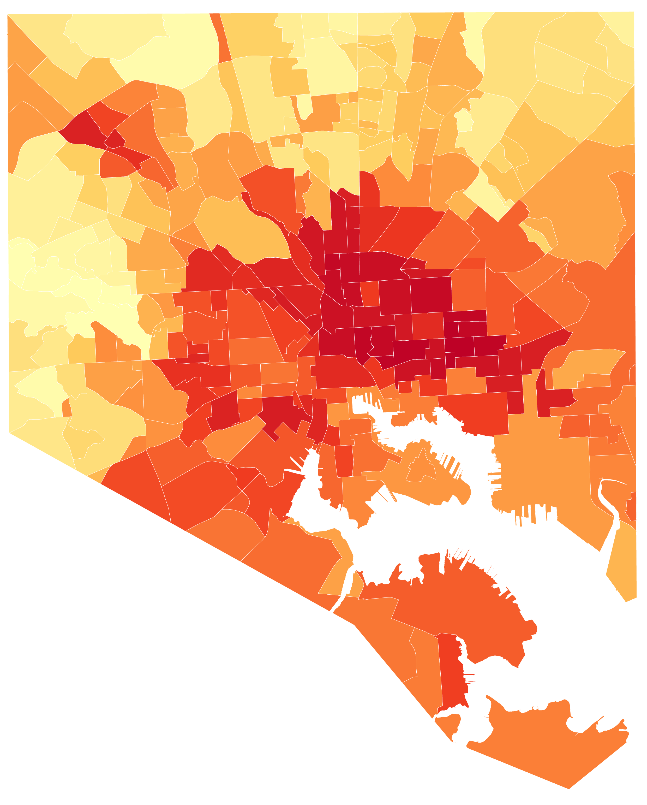
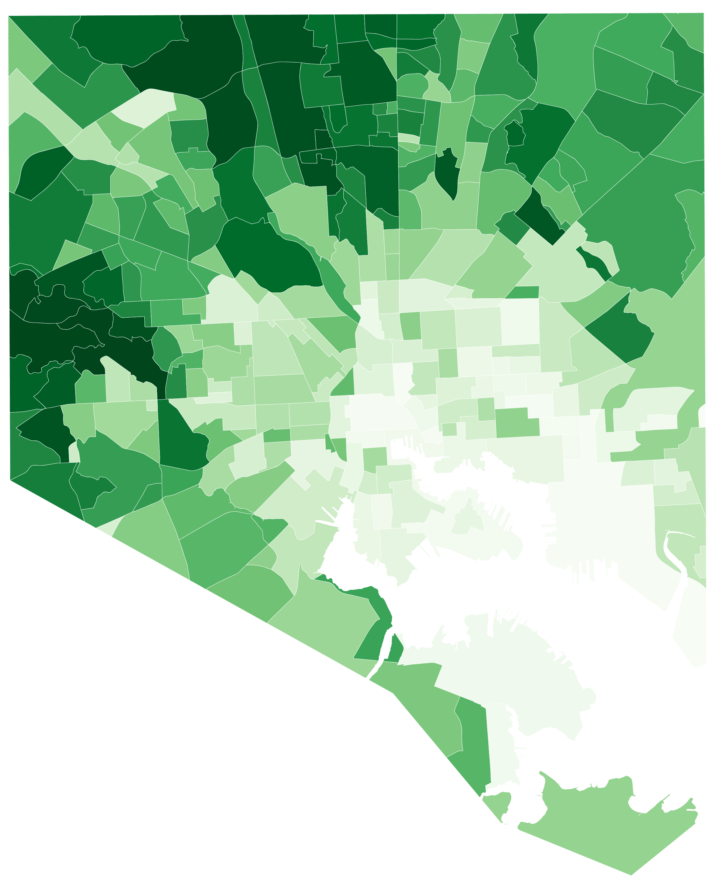
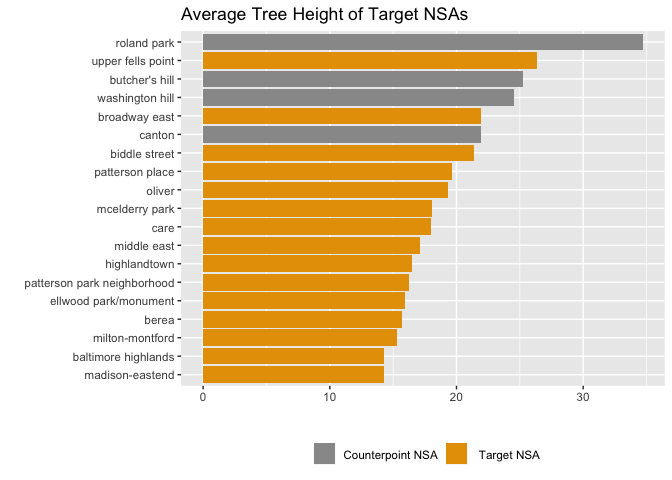

-   [Introduction](#introduction)
-   [Setup](#setup)
    -   [Load packages](#load-packages)
    -   [Load variables and data](#load-variables-and-data)
-   [Temperature Analysis](#temperature-analysis)
    -   [Blocks by temperature](#blocks-by-temperature)
    -   [Neighborhood Statistical Areas by temperature](#neighborhood-statistical-areas-by-temperature)
-   [Demographics Analysis](#demographics-analysis)
-   [Tree Canopy Analysis](#tree-canopy-analysis)
    -   [Poverty compared to tree canopy](#poverty-compared-to-tree-canopy)
    -   [Temperature compared to tree canopy](#temperature-compared-to-tree-canopy)
    -   [Tree canopy change over time](#tree-canopy-change-over-time)
    -   [Tree cover in redlined areas](#tree-cover-in-redlined-areas)
-   [Street Trees Analysis](#street-trees-analysis)
    -   [Height](#height)
    -   [Difficulty of planting](#difficulty-of-planting)
    -   [Condition of trees](#condition-of-trees)
    -   [Individual street trees](#individual-street-trees)

Introduction
------------

This R markdown document describes the methodology and results of a portion of the data analysis we conducted in support of a reporting project examining the effects of tree canopy inequity across the city of Baltimore, especially as it relates to climate change.

In general, this document is arranged into analyses of the following categories, though there are some cases where one statistic depends on multiple categories (e.g. the canopy cover in a hot neighborhood):

-   Temperature
-   Demographics
-   Tree Canopy
-   Street Trees (individual tree tracking)

Setup
-----

Before running this file, **please view and run the [Code Red Data Cleaning document](https://github.com/smussenden/2019-baltimore-climate-health-project-data-repo/blob/master/documentation/code-red-data-cleaning.md)** for this project. As well as outputting necessary cleaned data for the following ananlysis, that document also includes the following items necessary to understand this analysis:

-   definitions
-   source data citation and information
-   cleaning methodology
-   software tools used

### Load packages

``` r
#######################
#### Load Packages ####
#######################

library(tidyverse)
library(DescTools) # For %like% operator
library(corrr) # For correlation matrices
library(colorspace) # For improved color palettes
library(ggplot2) # For graphing
library(ggrepel) # For graph labeling
require(scales) # For percent labeling on distribution tables
#library(here) # For cleaner file path writing

# Turn off scientific notation in RStudio (prevents coersion to character type)
options(scipen = 999)
```

### Load variables and data

``` r
#########################
#### Store Variables ####
#########################

#### Common path to data ####
path_to_data <- "../data/output-data/cleaned/"

#### NSAs of interest ####
target_nsas <- c("Berea", "Broadway East", "Oliver", "Middle East", 
                 "Biddle Street","Milton-Montford", "Madison-Eastend", 
                 "CARE", "McElderry Park", "Ellwood Park/Monument", 
                 "Patterson Place", "Patterson Park Neighborhood", 
                 "Baltimore Highlands", "Highlandtown", 
                 "Upper Fells Point") %>%
  lapply(tolower)

counterpoint_nsas <- c("Butcher's Hill", "Canton", "Washington Hill", "Roland Park") %>%
  lapply(tolower)

#### CSAs of interest ####
target_csas <- c("Greater Roland Park/Poplar Hill", "Canton", "Patterson Park North & East", "Greenmount East", "Clifton-Berea") %>%
  lapply(tolower)

###################
#### Load Data ####
###################

blocks_tree_temp_demographics <- 
  read_csv(paste0(path_to_data, "blocks_tree_temp_demographics.csv")) %>%
  mutate_at(vars(matches("geoid10")), as.character) # Recast non-calculable variables as characters

csa_tree_temp_demographics <- 
  read_csv(paste0(path_to_data, "csa_tree_temp_demographics.csv"))

nsa_tree_temp <- 
  read_csv(paste0(path_to_data, "nsa_tree_temp.csv"))

zcta_tree_temp_demographics <- 
  read_csv(paste0(path_to_data, "zcta_tree_temp_demographics.csv")) %>%
  mutate_at(vars(matches("zcta")), as.character) # Recast non-calculable variables as characters

redlining_tree <- read_csv(paste0(path_to_data, "redlining_tree.csv"))

street_trees_nsa_categorized <- 
  read_csv(paste0(path_to_data, "street_trees_nsa_categorized.csv"))

street_trees_nsa_summarized <- 
  read_csv(paste0(path_to_data, "street_trees_nsa_summarized.csv"))
```

Temperature Analysis
--------------------

### Blocks by temperature

The following arranges and ranks blocks across the city by temperature in the afternoon of August 29, 2018, as explained in the [Code Red Data Cleaning document](https://github.com/smussenden/2019-baltimore-climate-health-project-data-repo/blob/master/documentation/code-red-data-cleaning.md#load-and-clean-temperature-data).

``` r
blocks_tree_temp_demographics %>%
  select(geoid10, temp_mean_aft) %>%
  mutate(rank = rank(-temp_mean_aft)) %>%
  arrange(rank) %>%
  slice(1:100)
```

    ## # A tibble: 100 x 3
    ##    geoid10         temp_mean_aft  rank
    ##    <chr>                   <dbl> <dbl>
    ##  1 245100602005002          101.     1
    ##  2 245100602004000          101.     2
    ##  3 245100602005001          100.     3
    ##  4 245100602004001          100.     4
    ##  5 245100702004006          100.     5
    ##  6 245100702004005          100.     6
    ##  7 245100702004002          100.     7
    ##  8 245100603001013          100.     8
    ##  9 245100401002000          100.     9
    ## 10 245100702004007          100.    10
    ## # … with 90 more rows

Below, we see the block on N. Milton Avenue between Oliver and Federal is one of the city's hottest, ranking at 236 out of 13,598 blocks. The block GEOID for this block was pulled from QGIS and breaks down into the following codes:

-   State: 24
-   County: 510
-   Tract: 080301
-   Block: 1000

``` r
blocks_tree_temp_demographics %>%
  select(geoid10, temp_mean_aft) %>%
  mutate(rank = rank(-temp_mean_aft)) %>%
  filter(geoid10 == "245100803011000")
```

    ## # A tibble: 1 x 3
    ##   geoid10         temp_mean_aft  rank
    ##   <chr>                   <dbl> <dbl>
    ## 1 245100803011000          98.3   236

### Neighborhood Statistical Areas by temperature

The following arranges and ranks NSAs across the city by temperature in the afternoon of August 29, 2018.

First, we can see that all of the top 10 hottest NSAs are located in the south of the city, and many are in the south-east.

``` r
# Top 10 hottest neighborhoods
nsa_tree_temp %>%
  select(nsa_name, temp_mean_aft) %>%
  mutate(rank = rank(-temp_mean_aft)) %>%
  arrange(rank) %>%
  slice(1:10)
```

    ## # A tibble: 10 x 3
    ##    nsa_name              temp_mean_aft  rank
    ##    <chr>                         <dbl> <dbl>
    ##  1 mcelderry park                 99.4     1
    ##  2 milton-montford                99.3     2
    ##  3 patterson place                98.6     3
    ##  4 dunbar-broadway                98.3     4
    ##  5 ellwood park/monument          98.3     5
    ##  6 penn-fallsway                  98.3     6
    ##  7 pleasant view gardens          98.3     7
    ##  8 madison-eastend                97.9     8
    ##  9 old goucher                    97.9     9
    ## 10 biddle street                  97.9    10

Looking at the 10 coolest NSAs, we see it is generally true that they are located far to the west and north, on the outskirts of Baltimore.

``` r
# Top 10 coolest neighborhoods
nsa_tree_temp %>%
  select(nsa_name, temp_mean_aft) %>%
  mutate(rank = rank(-temp_mean_aft)) %>%
  arrange(desc(rank)) %>%
  slice(1:10)
```

    ## # A tibble: 10 x 3
    ##    nsa_name                 temp_mean_aft  rank
    ##    <chr>                            <dbl> <dbl>
    ##  1 gwynns falls/leakin park          90.7   278
    ##  2 dickeyville                       91.0   277
    ##  3 fairmont                          91.1   276
    ##  4 purnell                           91.2   275
    ##  5 wakefield                         91.4   274
    ##  6 mount washington                  92.4   273
    ##  7 ten hills                         92.4   272
    ##  8 franklintown                      92.4   271
    ##  9 west forest park                  92.6   270
    ## 10 windsor hills                     92.7   269

Below we see:

-   McElderry Park was the hottest, at 99.4 degrees Fahrenheit.
-   Gwynns Falls/Leakin Park was the coolest, at 90.8 degrees Fahrenheit.

``` r
nsa_tree_temp %>%
  select(nsa_name, temp_mean_aft) %>%
  filter((temp_mean_aft == min(temp_mean_aft)) | (temp_mean_aft == max(temp_mean_aft))) %>%
  arrange(desc(temp_mean_aft))
```

    ## # A tibble: 2 x 2
    ##   nsa_name                 temp_mean_aft
    ##   <chr>                            <dbl>
    ## 1 mcelderry park                    99.4
    ## 2 gwynns falls/leakin park          90.7

The difference in temperatures between the city's hottest and coolest neighborhoods is -8.65 degrees Fahrenheit.

Below, we see the relative ranks of the Broadway East and Roland Park neighborhoods, placing Roland Park at 263 out of 278 neighborhoods, while Roland Park is ranked at 16.

``` r
nsa_tree_temp %>%
  select(nsa_name, temp_mean_aft) %>%
  mutate(rank = rank(-temp_mean_aft)) %>%
  arrange(rank) %>%
  filter((nsa_name %like% "roland park") | nsa_name %like% ("broadway east"))
```

    ## # A tibble: 2 x 3
    ##   nsa_name      temp_mean_aft  rank
    ##   <chr>                 <dbl> <dbl>
    ## 1 broadway east          97.4    16
    ## 2 roland park            93.3   263

These data are visualized in the following choropleth map, which was exported from QGIS and prettified slightly in Illustrator:



Demographics Analysis
---------------------

For the demographic anaylsis, we used CSA rather than NSA geographic segments, for reasons explained in the [Code Red Data Cleaning document](https://github.com/smussenden/2019-baltimore-climate-health-project-data-repo/blob/master/documentation/code-red-data-cleaning.md). The CSAs and NSAs do not allign completely. The demographic information is primarily from the Baltimore Neighborhood Indicators Alliance. Further explanations about the source data are in the [Code Red Data Cleaning document](https://github.com/smussenden/2019-baltimore-climate-health-project-data-repo/blob/master/documentation/code-red-data-cleaning.md#load-and-clean-demographic-data).

First, the top 10 CSAs ranked by percent of families living below the poverty line:

``` r
csa_tree_temp_demographics %>%
  select(csa2010, 
         avg_household_income = median_household_income, 
         perc_below_poverty = percent_of_family_households_living_below_the_poverty_line) %>%
  mutate(rank = rank(-perc_below_poverty)) %>%
  arrange(rank)
```

    ## # A tibble: 55 x 4
    ##    csa2010                      avg_household_inco… perc_below_pover…  rank
    ##    <chr>                                      <dbl>             <dbl> <dbl>
    ##  1 poppleton/the terraces/holl…              20409.              45.0     1
    ##  2 upton/druid heights                       20468.              43.0     2
    ##  3 oldtown/middle east                       19127.              40.1     3
    ##  4 cherry hill                               24251.              39.3     4
    ##  5 southwest baltimore                       25428.              35.8     5
    ##  6 sandtown-winchester/harlem …              25209.              35.0     6
    ##  7 madison/east end                          29976.              33.7     7
    ##  8 southern park heights                     24941.              31.6     8
    ##  9 southeastern                              33777.              30.3     9
    ## 10 clifton-berea                             32289.              27.6    10
    ## # … with 45 more rows

Next, we see only the CSAs containing the NSAs mentioned in the story, ranked by percent of families living below the poverty line (out of 55 ranks).

-   The **Broadway East** NSA is split vertically down the middle between the **Clifton-Berea** and **Greenmount East** CSAs, which also include large portions of the surrounding NSAs. It also includes an insignificant sliver of Oldtown/Middle East, which was disregarded in this analysis.
-   The **McElderry Park** NSA is split horizontally across the middle between **Madison/East End** and **Patterson Park North & East**, both of which contain large portions of surrounding NSAs.
-   The **Roland Park** NSA is almost completely contained within the **Greater Roland Park/Poplar Hill** CSA. A small southern slice extends into the Medfield/Hampden/Woodberry/Remington CSA, but that CSA extends so far south as to be non-representative of most of Roland Park and was disregarded in this analysis.

``` r
csa_tree_temp_demographics %>%
  mutate(rank = rank(-percent_of_family_households_living_below_the_poverty_line)) %>%
  arrange(rank) %>%
  mutate(associated_nsa = case_when(
    (csa2010 %like% "%clifton%") | (csa2010 %like% "%greenmount%") ~ "broadway east",
    (csa2010 %like% "%madison%") | (csa2010 %like% "%park north%") ~ "mcelderry park",
    (csa2010 %like% "%poplar%") ~ "roland park",
    T ~ NA_character_
  )) %>%
  select(csa2010, associated_nsa, 
         avg_household_income = median_household_income, 
         perc_below_poverty = percent_of_family_households_living_below_the_poverty_line, 
         rank) %>%
  filter((csa2010 %like% "%clifton%") | 
           (csa2010 %like% "%greenmount%") |
           (csa2010 %like% "%madison%") |
           (csa2010 %like% "%park north%") |
           (csa2010 %like% "%poplar%"))
```

    ## # A tibble: 5 x 5
    ##   csa2010          associated_nsa avg_household_inc… perc_below_pove…  rank
    ##   <chr>            <chr>                       <dbl>            <dbl> <dbl>
    ## 1 madison/east end mcelderry park             29976.            33.7      7
    ## 2 clifton-berea    broadway east              32289.            27.6     10
    ## 3 greenmount east  broadway east              26563.            24.2     14
    ## 4 patterson park … mcelderry park             69760.            21.7     20
    ## 5 greater roland … roland park               113496.             2.15    53

Broadway East, as a combination of Clifton-Berea and Greenmount East, has a total percent of family households living below the poverty line of 25.93 according to:

``` r
(csa_tree_temp_demographics$percent_of_family_households_living_below_the_poverty_line[csa_tree_temp_demographics$csa2010 %like% "%greenmount%"] +
csa_tree_temp_demographics$percent_of_family_households_living_below_the_poverty_line[csa_tree_temp_demographics$csa2010 %like% "%clifton%"]) / 2
```

    ## [1] 25.92508

Tree Canopy Analysis
--------------------

The following tree canopy data is based on LIDAR data from 2015, as explained in the [Code Red Data Cleaning document](https://github.com/smussenden/2019-baltimore-climate-health-project-data-repo/blob/master/documentation/code-red-data-cleaning.md#load-and-clean-tree-canopy-lidar-data).

### Poverty compared to tree canopy

A correlation matrix of poverty and canopy cover shows a weak negative correlation of -.34. In other words, places with a high poverty rate will have fewer trees, in general.

``` r
#### Build correlation matrix ####
csa_tree_temp_demographics %>%
  select(perc_below_poverty = percent_of_family_households_living_below_the_poverty_line,
         avg_canopy_2015 = `15_lid_mean`) %>%
  as.matrix() %>%
  correlate() %>%
  mutate(variable=rowname) %>%
  select(variable, everything(), -rowname)
```

    ## # A tibble: 2 x 3
    ##   variable           perc_below_poverty avg_canopy_2015
    ##   <chr>                           <dbl>           <dbl>
    ## 1 perc_below_poverty             NA              -0.340
    ## 2 avg_canopy_2015                -0.340          NA

Here are the data related to poverty, income and canopy at the top and bottom five CSAs when ranked for poverty:

``` r
csa_tree_temp_demographics %>%
  select(csa2010, 
         avg_household_income = median_household_income, 
         perc_below_poverty = percent_of_family_households_living_below_the_poverty_line,
         avg_canopy_2015 = `15_lid_mean`) %>%
  mutate(rank_poverty = rank(-perc_below_poverty),
         rank_canopy = rank(-avg_canopy_2015)) %>%
  filter(between(rank_poverty, 1L, 5L) |
           between(rank_poverty, 51L, 55L)) %>%
  arrange(rank_poverty)
```

    ## # A tibble: 10 x 6
    ##    csa2010 avg_household_i… perc_below_pove… avg_canopy_2015 rank_poverty
    ##    <chr>              <dbl>            <dbl>           <dbl>        <dbl>
    ##  1 popple…           20409.           45.0            0.158             1
    ##  2 upton/…           20468.           43.0            0.160             2
    ##  3 oldtow…           19127.           40.1            0.105             3
    ##  4 cherry…           24251.           39.3            0.212             4
    ##  5 southw…           25428.           35.8            0.154             5
    ##  6 fells …           91207.            3.26           0.0911           51
    ##  7 inner …           98763.            2.34           0.104            52
    ##  8 greate…          113496.            2.15           0.603            53
    ##  9 mount …           79993.            2.00           0.670            54
    ## 10 south …          109295.            0.826          0.0604           55
    ## # … with 1 more variable: rank_canopy <dbl>

Looking again at only the NSAs of interest in the story:

``` r
csa_tree_temp_demographics %>%
  mutate(rank_perc_poverty = rank(-percent_of_family_households_living_below_the_poverty_line),
         rank_perc_canopy = rank(-`15_lid_mean`)) %>%
  arrange(rank_perc_canopy) %>%
  mutate(associated_nsa = case_when(
    (csa2010 %like% "%clifton%") | (csa2010 %like% "%greenmount%") ~ "broadway east",
    (csa2010 %like% "%madison%") | (csa2010 %like% "%park north%") ~ "mcelderry park",
    (csa2010 %like% "%poplar%") ~ "roland park",
    T ~ NA_character_
  )) %>%
  select(csa2010, associated_nsa, 
         avg_household_income = median_household_income, 
         perc_below_poverty = percent_of_family_households_living_below_the_poverty_line, 
         perc_canopy = `15_lid_mean`,
         rank_perc_poverty,
         rank_perc_canopy) %>%
  filter((csa2010 %like% "%clifton%") | 
           (csa2010 %like% "%greenmount%") |
           (csa2010 %like% "%madison%") |
           (csa2010 %like% "%park north%") |
           (csa2010 %like% "%poplar%"))
```

    ## # A tibble: 5 x 7
    ##   csa2010 associated_nsa avg_household_i… perc_below_pove… perc_canopy
    ##   <chr>   <chr>                     <dbl>            <dbl>       <dbl>
    ## 1 greate… roland park             113496.             2.15      0.603 
    ## 2 greenm… broadway east            26563.            24.2       0.142 
    ## 3 clifto… broadway east            32289.            27.6       0.0899
    ## 4 patter… mcelderry park           69760.            21.7       0.0675
    ## 5 madiso… mcelderry park           29976.            33.7       0.0660
    ## # … with 2 more variables: rank_perc_poverty <dbl>, rank_perc_canopy <dbl>

If we build a correlation matrix only looking at certain neighborhoods of interest, the pattern is even more pronounced:

``` r
#### Build correlation matrix ####
csa_tree_temp_demographics %>%
  filter(csa2010 %in% target_csas) %>%
  select(perc_below_poverty = percent_of_family_households_living_below_the_poverty_line,
         avg_canopy_2015 = `15_lid_mean`) %>%
  as.matrix() %>%
  correlate() %>%
  mutate(variable=rowname) %>%
  select(variable, everything(), -rowname)
```

    ## # A tibble: 2 x 3
    ##   variable           perc_below_poverty avg_canopy_2015
    ##   <chr>                           <dbl>           <dbl>
    ## 1 perc_below_poverty             NA              -0.671
    ## 2 avg_canopy_2015                -0.671          NA

Below is the trend viewed graphically:

``` r
# CSAs to call out
callout_ls <- c("Canton", "Clifton-Berea", "Greater Roland Park/Poplar Hill", "Greenmount East")

## POVERTY TO TREE COVER
csa_tree_temp_demographics %>%
  mutate_at(vars("csa2010"), str_to_title) %>%
  # Start ggplot and set x and y for entire plot
  ggplot(aes(
    x = percent_of_family_households_living_below_the_poverty_line/100, 
    y = `07_lid_mean`
    )) +
  # This section for the basic scatterplot
  geom_point(aes(color = `07_lid_mean`),
             size=4) +
  # This section for circling all sample neighborhood points
  geom_point(data = csa_tree_temp_demographics %>%
               mutate_at(vars("csa2010"), str_to_title) %>%
               filter((csa2010 %in% callout_ls) 
                      # Patterson Park must be included seperately because of its unique label positioning
                      | (csa2010 == "Patterson Park North & East") 
                      ),
             aes(color = `07_lid_mean`),
             size=6, shape = 1) +
  # This section shows the trend line
  geom_smooth(se = FALSE, # Removes gray banding
              method = glm, 
              color = "black") +
  # This section for labeling Canton, etc.
  ggrepel::geom_label_repel(data = csa_tree_temp_demographics %>%
                              mutate_at(vars("csa2010"), str_to_title) %>%
                              filter(csa2010 %in% callout_ls) %>%
                              mutate(csa2010 = case_when(
                                csa2010 == "Greenmount East" ~ "Greenmount East \n(includes part of Broadway East)", 
                                csa2010 == "Clifton-Berea" ~ "Clifton-Berea \n(includes part of Broadway East)",
                                T ~ csa2010)),
            aes(label = csa2010),
            min.segment.length = .1,
            segment.alpha = .5,
            alpha = .85,
            nudge_x = .05,
            nudge_y = .06) +
  # This section for labeling Patterson Park (so its label can be nudged)
  ggrepel::geom_label_repel(data = csa_tree_temp_demographics %>%
                              mutate_at(vars("csa2010"), str_to_title) %>%
                              filter(csa2010 == "Patterson Park North & East") %>%
                              mutate(csa2010 = case_when(
                                csa2010 == "Patterson Park North & East" ~ "Patterson Park North & East \n(includes most of McElderry Park)",
                                T ~ csa2010)),
                            aes(label = csa2010),
                            min.segment.length = .1,
                            segment.alpha = .5,
                            alpha = .85,
                            nudge_x = -.06,
                            nudge_y = .03) +
  # Colors and label formatting follow
  #coord_flip() +
  scale_colour_gradient(low = "#E0FEA9", high = "#144A11") +
  labs(title = "Poverty to Tree Canopy",
       subtitle = "Percent of households living below the poverty line \ncompared to the percent of tree cover in the area",
       x = "Percent of households living below the poverty line",
       y = "Percent of land covered by trees") +
  scale_x_continuous(label = scales::percent_format(accuracy = 1.0),
                     breaks = seq(0, 1, .1)) + 
  scale_y_continuous(label = scales::percent_format(accuracy = 1.0),
                     breaks = seq(0, 1, .1)) + 
  theme_bw() +
  theme(legend.position = "none",
        plot.title = element_text(size = 20),
        plot.subtitle = element_text(size = 12))
```


There are some exceptions to this trend, such as Penn North/Reservoir Hill and Greater Rosemont, which both have relatively high rates of both poverty and tree canopy:

``` r
csa_tree_temp_demographics %>%
  select(csa2010, 
         perc_below_poverty = percent_of_family_households_living_below_the_poverty_line,
         avg_canopy_2015 = `15_lid_mean`) %>%
  mutate(rank_perc_poverty = rank(-perc_below_poverty),
         rank_perc_canopy = rank(-avg_canopy_2015)) %>%
  arrange(rank_perc_canopy) %>%
  filter((csa2010 %like% "%penn north%") | (csa2010 %like% "%rosemont%"))
```

    ## # A tibble: 2 x 5
    ##   csa2010 perc_below_pove… avg_canopy_2015 rank_perc_pover…
    ##   <chr>              <dbl>           <dbl>            <dbl>
    ## 1 penn n…             26.0           0.408               12
    ## 2 greate…             23.6           0.269               16
    ## # … with 1 more variable: rank_perc_canopy <dbl>

Average canopy cover by NSA is visualized in the following choropleth map, which was exported from QGIS and prettified slightly in Illustrator:



### Temperature compared to tree canopy

When comparing temperature to tree canopy, we see a strong correllation of -.89. In other words, places with high temperatures tend to have fewer trees.

``` r
#### Build correlation matrix ####
csa_tree_temp_demographics %>%
  select(temp_mean_aft,
         avg_canopy_2015 = `15_lid_mean`) %>%
  as.matrix() %>%
  correlate() %>%
  mutate(variable=rowname) %>%
  select(variable, everything(), -rowname)
```

    ## # A tibble: 2 x 3
    ##   variable        temp_mean_aft avg_canopy_2015
    ##   <chr>                   <dbl>           <dbl>
    ## 1 temp_mean_aft          NA              -0.891
    ## 2 avg_canopy_2015        -0.891          NA

We can also view the data ranked by temperature:

``` r
csa_tree_temp_demographics %>%
  select(csa2010, 
         temp_mean_aft,
         avg_canopy_2015 = `15_lid_mean`) %>%
  mutate(rank_temp = rank(-temp_mean_aft),
         rank_canopy = rank(-avg_canopy_2015)) %>%
  arrange(temp_mean_aft)
```

    ## # A tibble: 55 x 5
    ##    csa2010              temp_mean_aft avg_canopy_2015 rank_temp rank_canopy
    ##    <chr>                        <dbl>           <dbl>     <dbl>       <dbl>
    ##  1 dickeyville/frankli…          90.5           0.732        55           1
    ##  2 mount washington/co…          92.0           0.670        54           2
    ##  3 forest park/walbrook          92.1           0.536        53           5
    ##  4 edmondson village             92.1           0.551        52           4
    ##  5 beechfield/ten hill…          92.6           0.492        51           7
    ##  6 greater roland park…          92.8           0.603        50           3
    ##  7 north baltimore/gui…          93.4           0.512        49           6
    ##  8 howard park/west ar…          93.4           0.386        48          12
    ##  9 cross-country/chesw…          93.5           0.479        47           8
    ## 10 lauraville                    93.7           0.410        46           9
    ## # … with 45 more rows

The coolest CSA has 11 times as much canopy cover as the hottest:

``` r
(csa_tree_temp_demographics$`15_lid_mean`[(csa_tree_temp_demographics$temp_mean_aft == min(csa_tree_temp_demographics$temp_mean_aft))]) / 
  (csa_tree_temp_demographics$`15_lid_mean`[(csa_tree_temp_demographics$temp_mean_aft == max(csa_tree_temp_demographics$temp_mean_aft))])
```

    ## [1] 11.09265

This order of magnitude jump holds true for the second-hottest CSA, but ends at the third.

``` r
csa_tree_temp_demographics %>%
  select(csa2010, 
         temp_mean_aft,
         avg_canopy_2015 = `15_lid_mean`) %>%
  mutate(rank_temp = rank(-temp_mean_aft),
         rank_canopy = rank(-avg_canopy_2015)) %>%
  filter(between(rank_temp, 1L, 5L) |
           between(rank_temp, 51L, 55L)) %>%
  arrange(rank_temp)
```

    ## # A tibble: 10 x 5
    ##    csa2010              temp_mean_aft avg_canopy_2015 rank_temp rank_canopy
    ##    <chr>                        <dbl>           <dbl>     <dbl>       <dbl>
    ##  1 madison/east end              98.3          0.0660         1          52
    ##  2 patterson park nort…          97.4          0.0675         2          51
    ##  3 oldtown/middle east           97.3          0.105          3          45
    ##  4 midtown                       96.9          0.143          4          39
    ##  5 greenmount east               96.9          0.142          5          40
    ##  6 beechfield/ten hill…          92.6          0.492         51           7
    ##  7 edmondson village             92.1          0.551         52           4
    ##  8 forest park/walbrook          92.1          0.536         53           5
    ##  9 mount washington/co…          92.0          0.670         54           2
    ## 10 dickeyville/frankli…          90.5          0.732         55           1

### Tree canopy change over time

All relevant data:

``` r
nsa_tree_temp %>%
  select(nsa_name,
         avg_canopy_2007 = `07_lid_mean`,
         avg_canopy_2015 = `15_lid_mean`,
         lid_change_percent,
         lid_change_percent_point) %>%
  mutate(is_target_nsa = case_when(
    nsa_name %in% target_nsas ~ T,
    TRUE ~ F 
  )) %>%
  mutate(rank_canopy = rank(-avg_canopy_2015))
```

    ## # A tibble: 278 x 7
    ##    nsa_name avg_canopy_2007 avg_canopy_2015 lid_change_perc…
    ##    <chr>              <dbl>           <dbl>            <dbl>
    ##  1 abell             0.191           0.191          0.000147
    ##  2 allenda…          0.190           0.188         -0.0101  
    ##  3 arcadia           0.256           0.260          0.0177  
    ##  4 arlingt…          0.250           0.255          0.0199  
    ##  5 armiste…          0.381           0.404          0.0612  
    ##  6 ashburt…          0.340           0.334         -0.0182  
    ##  7 baltimo…          0.0610          0.0786         0.288   
    ##  8 barclay           0.128           0.125         -0.0233  
    ##  9 barre c…          0.228           0.263          0.153   
    ## 10 bayview           0.0446          0.0483         0.0847  
    ## # … with 268 more rows, and 3 more variables:
    ## #   lid_change_percent_point <dbl>, is_target_nsa <lgl>, rank_canopy <dbl>

``` r
  # filter(between(rank_canopy, 1L, 5L) |
  #          between(rank_canopy, 51L, 55L)) %>%
  # arrange(rank_canopy)
```

What were the citywide gains and losses?

``` r
#### INCOMPLETE: WILL USE QGIS TO DO THIS CONFIRMATION ####
```

How many geographies gained and lost tree cover?

``` r
#### NSAs ####
as.data.frame(table(sign(nsa_tree_temp$lid_change_percent))) %>%
  mutate(total = sum(Freq),
         perc = round(100*(Freq/total), 2))
```

    ##   Var1 Freq total  perc
    ## 1   -1  112   277 40.43
    ## 2    1  165   277 59.57

``` r
#### Blocks ####
as.data.frame(table(sign(blocks_tree_temp_demographics$lid_change_percent))) %>%
  mutate(total = sum(Freq),
         perc = round(100*(Freq/total), 2))
```

    ##   Var1 Freq total  perc
    ## 1   -1 4627 12300 37.62
    ## 2    0  112 12300  0.91
    ## 3    1 7561 12300 61.47

By how many percentage points did each NSA of interest gain or lose?

``` r
nsa_tree_temp %>%
  select(nsa_name, `07_lid_mean`, `15_lid_mean`, lid_change_percent_point) %>%
  filter((nsa_name %in% target_nsas) | (nsa_name %like% "%roland%")) %>%
  mutate(lid_change_percent_point = round(lid_change_percent_point*100, 2),
         `07_lid_mean` = round(`07_lid_mean`*100, 2),
         `15_lid_mean` = round(`15_lid_mean`*100, 2))
```

    ## # A tibble: 17 x 4
    ##    nsa_name               `07_lid_mean` `15_lid_mean` lid_change_percent_p…
    ##    <chr>                          <dbl>         <dbl>                 <dbl>
    ##  1 baltimore highlands             6.1           7.86                  1.76
    ##  2 berea                           5.55          5.97                  0.43
    ##  3 biddle street                  12.0          12.7                   0.64
    ##  4 broadway east                   9.03         10.6                   1.59
    ##  5 care                            8.64          7.49                 -1.14
    ##  6 ellwood park/monument           5.43          6.45                  1.02
    ##  7 highlandtown                    2.98          4.26                  1.28
    ##  8 madison-eastend                 6.79          7.71                  0.92
    ##  9 mcelderry park                  4.51          6.14                  1.63
    ## 10 middle east                     7.37          6.76                 -0.62
    ## 11 milton-montford                 5.36          6.41                  1.05
    ## 12 north roland park/pop…         65.1          64.5                  -0.59
    ## 13 oliver                         14.4          13.9                  -0.43
    ## 14 patterson park neighb…          2.91          4.19                  1.28
    ## 15 patterson place                 5.93          7.46                  1.53
    ## 16 roland park                    62.4          64.5                   2.09
    ## 17 upper fells point               8.49         11.2                   2.68

### Tree cover in redlined areas

``` r
redlining_tree %>%
  group_by(holc_grade, grade_descr) %>%
  summarise(total_area_pixels = sum(`count_all_pix_15`),
            total_canopy_pixels = sum(`sum_canopy_pix_15`)) %>%
  mutate(avg_canopy_perc = round(100*(total_canopy_pixels/total_area_pixels), 2))
```

    ## # A tibble: 4 x 5
    ## # Groups:   holc_grade [4]
    ##   holc_grade grade_descr  total_area_pixe… total_canopy_pi… avg_canopy_perc
    ##   <chr>      <chr>                   <dbl>            <dbl>           <dbl>
    ## 1 A          best                105616661         47482092            45.0
    ## 2 B          still desir…        478996371        176083758            36.8
    ## 3 C          definitely …        305953084         62659386            20.5
    ## 4 D          hazardous           220227837         25042255            11.4

Street Trees Analysis
---------------------

The following data is originally sourced from the Baltimore City Department of Recreation and Parks, as explained in the [Code Red Data Cleaning document](https://github.com/smussenden/2019-baltimore-climate-health-project-data-repo/blob/master/documentation/code-red-data-cleaning.md#load-and-clean-individual-tree-data).

``` r
# Colorblind-friendly palette
cbPalette <- c("#999999", # Dark Gray
               "#E69F00", # Mustard Yellow
               "#56B4E9", # Sky Blue
               "#009E73", # Strong Green
               "#F0E442", # Lemon Yellow
               "#0072B2", # Denim Blue
               "#D55E00", # Rust Orange
               "#CC79A7") # Lavender
```

### Height

``` r
############################################
### Tree HEIGHT by neighborhood ############
############################################

# Plot HEIGHT by nsa for TARGET nsas using controled averages
street_trees_nsa_summarized %>%
  filter((nbrdesc %in% target_nsas) | (nbrdesc %in% counterpoint_nsas)) %>%
  ggplot(aes(x = reorder(nbrdesc, avg_ht_controled), 
           y = avg_ht_controled, 
           fill = factor(is_target_nsa, 
                         # Rename fill levels in legend
                         labels=c("Counterpoint NSA"," Target NSA"))
           )) +
  geom_col() +
  coord_flip() +
  labs(title = "Average Tree Height of Target NSAs",
       x = "",
       y = "",
       fill = "") +
  scale_fill_manual(values=cbPalette) +
  theme(legend.position = "bottom")
```



``` r
# Plot HEIGHT by nsa for ALL nsas using controled averages
ggplot(filter(street_trees_nsa_summarized, !is.na(avg_ht_controled)), 
       aes(x = reorder(nbrdesc, avg_ht_controled), 
           y = avg_ht_controled, 
           fill = factor(is_target_nsa, 
                         # Rename fill levels in legend
                         labels=c("Not Target NSA", "Target NSA"))
           )) +
  geom_col() +
  labs(title = "Average Tree Height of NSAs",
       x = "",
       y = "",
       fill = "") +
  scale_fill_manual(values=cbPalette) +
  theme(legend.position = "top", 
        axis.text.x = element_text(angle = 90, hjust = 1, size = 5))
```


It is clear that taller trees are more common in wealthier NSAs compared to poorer ones such as Broadway East.

``` r
street_trees_nsa_categorized %>%
  select(nbrdesc, tree_ht) %>%
  filter((nbrdesc %in% target_nsas) | (nbrdesc %in% counterpoint_nsas)) %>%
  group_by(nbrdesc) %>%
  summarize(avg_ht = mean(tree_ht),
            total_trees = n()) %>%
  left_join(
    street_trees_nsa_categorized %>%
    select(nbrdesc, tree_ht) %>%
    filter((nbrdesc %in% target_nsas) | (nbrdesc %in% counterpoint_nsas)) %>%
    group_by(nbrdesc) %>%
    filter(tree_ht >= 35) %>%
    summarize(count_35_or_taller = n())
  ) %>%
  mutate(perc_35_or_taller = round(100*(count_35_or_taller/total_trees), 2))
```

    ## # A tibble: 19 x 5
    ##    nbrdesc            avg_ht total_trees count_35_or_tall… perc_35_or_tall…
    ##    <chr>               <dbl>       <int>             <int>            <dbl>
    ##  1 baltimore highlan…  10.1          597                17             2.85
    ##  2 berea               10.7          937                89             9.5 
    ##  3 biddle street       16.1          368                80            21.7 
    ##  4 broadway east        5.75        1526                80             5.24
    ##  5 butcher's hill      23.8          628               142            22.6 
    ##  6 canton              15.0         4132               560            13.6 
    ##  7 care                13.4          544                30             5.51
    ##  8 ellwood park/monu…  13.1         1067                51             4.78
    ##  9 highlandtown        11.6          955                43             4.5 
    ## 10 madison-eastend     11.6          559                47             8.41
    ## 11 mcelderry park      14.6          942                46             4.88
    ## 12 middle east         10.9          990                52             5.25
    ## 13 milton-montford     11.4          391                22             5.63
    ## 14 oliver              12.1         1526               162            10.6 
    ## 15 patterson park ne…  13.7         1319                39             2.96
    ## 16 patterson place     17.4          274                20             7.3 
    ## 17 roland park         30.9         3382              1449            42.8 
    ## 18 upper fells point   20.7          908               200            22.0 
    ## 19 washington hill     15.8         1020               157            15.4

### Difficulty of planting

In addition to tracking each tree, the City of Baltimore also tracks spaces where trees could potentiall by planted. This, along with methodology for determining ease-of-planting classifications, is further explained in the [Code Red Data Cleaning document](https://github.com/smussenden/2019-baltimore-climate-health-project-data-repo/blob/master/documentation/code-red-data-cleaning.md#load-and-clean-individual-tree-data).

``` r
#### Relevant info from table ####
street_trees_nsa_summarized %>%
  select(1:33) %>%
  filter((nbrdesc %in% target_nsas) | (nbrdesc %in% counterpoint_nsas))
```

    ## # A tibble: 19 x 33
    ##    nbrdesc all_tracked_spa… rank_all_tracke… spaces_with_liv…
    ##    <chr>              <dbl>            <dbl>            <dbl>
    ##  1 baltim…              597              117              411
    ##  2 berea                937               68              623
    ##  3 biddle…              368              181              272
    ##  4 broadw…             1526               28              386
    ##  5 butche…              628              106              586
    ##  6 canton              4132                1             2809
    ##  7 care                 544              132              398
    ##  8 ellwoo…             1067               47              860
    ##  9 highla…              955               64              656
    ## 10 madiso…              559              127              451
    ## 11 mcelde…              942               66              751
    ## 12 middle…              990               59              615
    ## 13 milton…              391              177              289
    ## 14 oliver              1526               29              945
    ## 15 patter…             1319               36             1099
    ## 16 patter…              274              212              240
    ## 17 roland…             3382                4             2910
    ## 18 upper …              908               69              710
    ## 19 washin…             1020               56              643
    ## # … with 29 more variables: rank_spaces_with_live_trees <dbl>,
    ## #   unsuitable_without_tree <dbl>, suitable_without_tree <dbl>,
    ## #   spaces_without_live_trees <dbl>, rank_unsuitable_without_tree <dbl>,
    ## #   rank_suitable_without_tree <dbl>,
    ## #   rank_spaces_without_live_trees <dbl>, perc_spaces_treed <dbl>,
    ## #   perc_spaces_nontreed <dbl>, perc_of_nontreed_are_suitable <dbl>,
    ## #   rank_perc_spaces_treed <dbl>, rank_perc_spaces_nontreed <dbl>,
    ## #   rank_perc_of_nontreed_are_suitable <dbl>,
    ## #   num_spaces_with_live_trees <dbl>, num_spaces_without_live_trees <dbl>,
    ## #   num_easy <dbl>, num_moderate <dbl>, num_hard <dbl>,
    ## #   num_not_suitable <dbl>, perc_of_nontreed_easy <dbl>,
    ## #   perc_of_nontreed_moderate <dbl>, perc_of_nontreed_hard <dbl>,
    ## #   perc_of_nontreed_unsuitable <dbl>, poor_count <dbl>, fair_count <dbl>,
    ## #   good_count <dbl>, poor_perc_of_live <dbl>, fair_perc_of_live <dbl>,
    ## #   good_perc_of_live <dbl>

Not only are there more trees in Roland Park than Broadway East, but the untreed spaces are considerably easier to plant.

``` r
#### Summarize planting difficulty in Broadway East and Roland Park ####
street_trees_nsa_categorized %>%
  select(nbrdesc, difficulty_level_num, difficulty_level) %>%
  filter((nbrdesc %like% "broadway%") | (nbrdesc %like% "roland%")) %>%
  group_by(nbrdesc, difficulty_level_num, difficulty_level) %>%
  summarize(count_spaces = n())
```

    ## # A tibble: 11 x 4
    ## # Groups:   nbrdesc, difficulty_level_num [11]
    ##    nbrdesc       difficulty_level_num difficulty_level count_spaces
    ##    <chr>                        <dbl> <chr>                   <int>
    ##  1 broadway east                    1 easy                        6
    ##  2 broadway east                    2 moderate                   35
    ##  3 broadway east                    3 hard                      984
    ##  4 broadway east                    4 unsuitable                115
    ##  5 broadway east                   NA has live tree             386
    ##  6 roland park                      0 <NA>                        2
    ##  7 roland park                      1 easy                      234
    ##  8 roland park                      2 moderate                  221
    ##  9 roland park                      3 hard                       13
    ## 10 roland park                      4 unsuitable                  2
    ## 11 roland park                     NA has live tree            2910

Broadway East has 1140 spaces that are available for planting, 1025 of which are not considered "unsuitable." 96 percent of these are hard to plant (require breaking concrete).

``` r
#### Find percent of suitable spaces at each difficulty level for... ####

# ...Broadway East
street_trees_nsa_categorized %>%
  # Count the spaces at each level
  select(nbrdesc, difficulty_level_num, difficulty_level) %>%
  filter((nbrdesc %like% "broadway%") & (difficulty_level != "has live tree")) %>%
  group_by(nbrdesc, difficulty_level_num, difficulty_level) %>%
  summarize(count_spaces = n()) %>%
  ungroup() %>%
  mutate(total_vacant_spaces = sum(count_spaces)) %>%
  # Count the suitable spaces in Broadway East
  left_join(
    street_trees_nsa_categorized %>%
      select(nbrdesc, difficulty_level_num, difficulty_level) %>%
      filter((nbrdesc %like% "broadway%") & (difficulty_level != "has live tree") & (difficulty_level != "unsuitable")) %>%
      group_by(nbrdesc, difficulty_level_num, difficulty_level) %>%
      summarize(count_suitable = n()) %>%
      ungroup() %>%
      mutate(total_suitable = sum(count_suitable)) %>%
      select(-count_suitable)
  ) %>%
  # Calculate the percent of suitable spaces at each difficulty
  mutate(perc_at_difficulty = round(100*(count_spaces/total_suitable), 2))
```

    ## # A tibble: 4 x 7
    ##   nbrdesc difficulty_leve… difficulty_level count_spaces total_vacant_sp…
    ##   <chr>              <dbl> <chr>                   <int>            <int>
    ## 1 broadw…                1 easy                        6             1140
    ## 2 broadw…                2 moderate                   35             1140
    ## 3 broadw…                3 hard                      984             1140
    ## 4 broadw…                4 unsuitable                115             1140
    ## # … with 2 more variables: total_suitable <int>, perc_at_difficulty <dbl>

``` r
# ...Roland Park
street_trees_nsa_categorized %>%
  # Count the spaces at each level
  select(nbrdesc, difficulty_level_num, difficulty_level) %>%
  filter((nbrdesc %like% "roland%") & (difficulty_level != "has live tree")) %>%
  group_by(nbrdesc, difficulty_level_num, difficulty_level) %>%
  summarize(count_spaces = n()) %>%
  ungroup() %>%
  mutate(total_vacant_spaces = sum(count_spaces)) %>%
  # Count the suitable spaces in Roland Park
  left_join(
    street_trees_nsa_categorized %>%
      select(nbrdesc, difficulty_level_num, difficulty_level) %>%
      filter((nbrdesc %like% "roland%") & (difficulty_level != "has live tree") & (difficulty_level != "unsuitable")) %>%
      group_by(nbrdesc, difficulty_level_num, difficulty_level) %>%
      summarize(count_suitable = n()) %>%
      ungroup() %>%
      mutate(total_suitable = sum(count_suitable)) %>%
      select(-count_suitable)
  ) %>%
  # Calculate the percent of suitable spaces at each difficulty
  mutate(perc_at_difficulty = round(100*(count_spaces/total_suitable), 2))
```

    ## # A tibble: 4 x 7
    ##   nbrdesc difficulty_leve… difficulty_level count_spaces total_vacant_sp…
    ##   <chr>              <dbl> <chr>                   <int>            <int>
    ## 1 roland…                1 easy                      234              470
    ## 2 roland…                2 moderate                  221              470
    ## 3 roland…                3 hard                       13              470
    ## 4 roland…                4 unsuitable                  2              470
    ## # … with 2 more variables: total_suitable <int>, perc_at_difficulty <dbl>

### Condition of trees

Larger (and therefore older) trees in the south-eastern neighborhoods tend to be less healthy than those in the northwest.

``` r
#### Relevant info from table ####
street_trees_nsa_categorized %>%
  select(nbrdesc, diameter = dbh, condition, is_target_nsa) %>%
  slice(1:100)
```

    ## # A tibble: 100 x 4
    ##    nbrdesc diameter condition is_target_nsa
    ##    <chr>      <dbl> <chr>     <lgl>        
    ##  1 abell       20.4 poor      FALSE        
    ##  2 abell       16   fair      FALSE        
    ##  3 abell        5.9 good      FALSE        
    ##  4 abell        0   absent    FALSE        
    ##  5 abell        9.2 fair      FALSE        
    ##  6 abell        1.4 fair      FALSE        
    ##  7 abell       16.9 fair      FALSE        
    ##  8 abell        3.3 fair      FALSE        
    ##  9 abell        4.5 stump     FALSE        
    ## 10 abell       14.5 good      FALSE        
    ## # … with 90 more rows

When looking at larger trees, Roland Park is ranked 28th in for percent in good condition. Broadway East, by contrast, is ranked 227th of 277 NSAs.

``` r
#### Find counts of each tree condition in NSAs of interest, and calculate the percentage that are in good condition ####
street_trees_nsa_categorized %>%
  select(nbrdesc, diameter = dbh, condition) %>%
  # Filter for only trees with diameter larger than 6 inches
  filter(diameter > 6) %>%
  group_by(nbrdesc, condition) %>%
  summarize(count_at_condition = n()) %>%
  spread(condition, count_at_condition) %>%
  # Drop non-live trees
  select(-absent, -unknown, -dead, -stump) %>%
  # Arrange in sensible order
  select(poor, fair, good) %>%
  ungroup() %>%
  # Find percent
  mutate(total_live_trees = rowSums(.[2:4]),
         perc_good = round(100*(good/total_live_trees), 2)) %>%
  arrange(desc(perc_good)) %>%
  # Rank by percent
  mutate(rank_by_perc_good = rank(-perc_good)) %>%
  # Filter for NSAs of interest
  filter((nbrdesc %in% target_nsas) | (nbrdesc %in% counterpoint_nsas))
```

    ## # A tibble: 19 x 7
    ##    nbrdesc     poor  fair  good total_live_trees perc_good rank_by_perc_go…
    ##    <chr>      <int> <int> <int>            <dbl>     <dbl>            <dbl>
    ##  1 upper fel…    22   101   355              478      74.3               26
    ##  2 roland pa…   120   481  1666             2267      73.5               28
    ##  3 butcher's…    17    90   256              363      70.5               45
    ##  4 patterson…    20   111   255              386      66.1               62
    ##  5 highlandt…    18    76   125              219      57.1              124
    ##  6 biddle st…     5    42    59              106      55.7              133
    ##  7 middle ea…    12    53    81              146      55.5              135
    ##  8 washingto…    28   166   237              431      55.0              137
    ##  9 patterson…    12    39    61              112      54.5              140
    ## 10 canton       156   673   955             1784      53.5              147
    ## 11 milton-mo…     3    24    29               56      51.8              165
    ## 12 mcelderry…    25    84   111              220      50.4              170
    ## 13 madison-e…    14    30    41               85      48.2              182
    ## 14 berea         14    72    75              161      46.6              190
    ## 15 care          19    40    47              106      44.3              205
    ## 16 oliver        63   181   178              422      42.2              213
    ## 17 baltimore…    19    43    43              105      41.0              217
    ## 18 ellwood p…    33    78    70              181      38.7              224
    ## 19 broadway …    45   103    91              239      38.1              227

### Individual street trees
