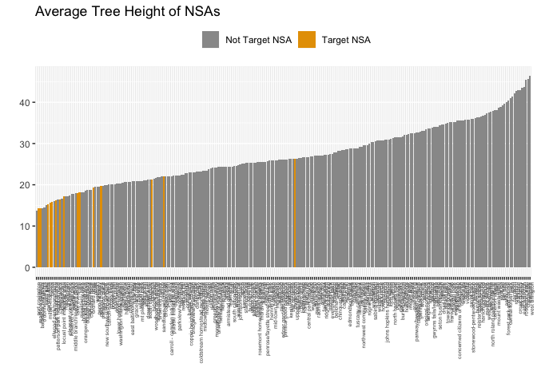

-   [Introduction](#introduction)
-   [Setup](#setup)
    -   [Load packages](#load-packages)
    -   [Load variables and data](#load-variables-and-data)
-   [Temperature Analysis](#temperature-analysis)
    -   [Blocks by temperature](#blocks-by-temperature)
    -   [Neighborhood Statistical Areas by temperature](#neighborhood-statistical-areas-by-temperature)
-   [Demographics Analysis](#demographics-analysis)
-   [Tree Canopy Analysis](#tree-canopy-analysis)
    -   [Poverty compared to tree canopy](#poverty-compared-to-tree-canopy)
    -   [Temperature compared to tree canopy](#temperature-compared-to-tree-canopy)
    -   [Tree canopy change over time](#tree-canopy-change-over-time)
    -   [Tree cover in redlined areas](#tree-cover-in-redlined-areas)
-   [Street Trees Analysis](#street-trees-analysis)
    -   [Height](#height)
    -   [Difficulty of planting](#difficulty-of-planting)
    -   [Condition of trees](#condition-of-trees)
    -   [Individual street trees](#individual-street-trees)

Introduction
------------

This R markdown document describes the methodology and results of a portion of the data analysis we conducted in support of a reporting project examining the effects of tree canopy inequity across the city of Baltimore, especially as it relates to climate change.

In general, this document is arranged into analyses of the following categories, though there are some cases where one statistic depends on multiple categories (e.g. the canopy cover in a hot neighborhood):

-   Temperature
-   Demographics
-   Tree Canopy
-   Street Trees (individual tree tracking)

Setup
-----

Before running this file, **please view and run the [Code Red Data Cleaning document](https://github.com/smussenden/2019-baltimore-climate-health-project-data-repo/blob/master/documentation/code-red-data-cleaning.md)** for this project. As well as outputting necessary cleaned data for the following ananlysis, that document also includes the following items necessary to understand this analysis:

-   definitions
-   source data citation and information
-   cleaning methodology
-   software tools used

### Load packages

``` r
#######################
#### Load Packages ####
#######################

library(tidyverse)
library(DescTools) # For %like% operator
library(corrr) # For correlation matrices
library(colorspace) # For improved color palettes
library(ggplot2) # For graphing
library(ggrepel) # For graph labeling
require(scales) # For percent labeling on distribution tables
#library(here) # For cleaner file path writing

# Turn off scientific notation in RStudio (prevents coersion to character type)
options(scipen = 999)
```

### Load variables and data

``` r
#########################
#### Store Variables ####
#########################

#### Common path to data ####
path_to_data <- "../data/output-data/cleaned/"

#### NSAs of interest ####
target_nsas <- c("Berea", "Broadway East", "Oliver", "Middle East", 
                 "Biddle Street","Milton-Montford", "Madison-Eastend", 
                 "CARE", "McElderry Park", "Ellwood Park/Monument", 
                 "Patterson Place", "Patterson Park Neighborhood", 
                 "Baltimore Highlands", "Highlandtown", 
                 "Upper Fells Point") %>%
  lapply(tolower)

counterpoint_nsas <- c("Butcher's Hill", "Canton", "Washington Hill", "Roland Park") %>%
  lapply(tolower)

#### CSAs of interest ####
target_csas <- c("Greater Roland Park/Poplar Hill", "Canton", "Patterson Park North & East", "Greenmount East", "Clifton-Berea") %>%
  lapply(tolower)

###################
#### Load Data ####
###################

blocks_tree_temp_demographics <- 
  read_csv(paste0(path_to_data, "blocks_tree_temp_demographics.csv")) %>%
  mutate_at(vars(matches("geoid10")), as.character) # Recast non-calculable variables as characters

csa_tree_temp_demographics <- 
  read_csv(paste0(path_to_data, "csa_tree_temp_demographics.csv"))

nsa_tree_temp <- 
  read_csv(paste0(path_to_data, "nsa_tree_temp.csv"))

zcta_tree_temp_demographics <- 
  read_csv(paste0(path_to_data, "zcta_tree_temp_demographics.csv")) %>%
  mutate_at(vars(matches("zcta")), as.character) # Recast non-calculable variables as characters

redlining_tree <- read_csv(paste0(path_to_data, "redlining_tree.csv"))

street_trees_nsa_categorized <- 
  read_csv(paste0(path_to_data, "street_trees_nsa_categorized.csv"))

street_trees_nsa_summarized <- 
  read_csv(paste0(path_to_data, "street_trees_nsa_summarized.csv"))
```

Temperature Analysis
--------------------

### Blocks by temperature

The following arranges and ranks blocks across the city by temperature in the afternoon of August 29, 2018, as explained in the [Code Red Data Cleaning document](https://github.com/smussenden/2019-baltimore-climate-health-project-data-repo/blob/master/documentation/code-red-data-cleaning.md#load-and-clean-temperature-data).

``` r
blocks_tree_temp_demographics %>%
  select(geoid10, temp_mean_aft) %>%
  mutate(rank = rank(-temp_mean_aft)) %>%
  arrange(rank) %>%
  slice(1:100)
```

<script data-pagedtable-source type="application/json">
{"columns":[{"label":["geoid10"],"name":[1],"type":["chr"],"align":["left"]},{"label":["temp_mean_aft"],"name":[2],"type":["dbl"],"align":["right"]},{"label":["rank"],"name":[3],"type":["dbl"],"align":["right"]}],"data":[{"1":"245100602005002","2":"100.62794","3":"1"},{"1":"245100602004000","2":"100.55731","3":"2"},{"1":"245100602005001","2":"100.43892","3":"3"},{"1":"245100602004001","2":"100.39561","3":"4"},{"1":"245100702004006","2":"100.29242","3":"5"},{"1":"245100702004005","2":"100.27316","3":"6"},{"1":"245100702004002","2":"100.25005","3":"7"},{"1":"245100603001013","2":"100.19990","3":"8"},{"1":"245100401002000","2":"100.14680","3":"9"},{"1":"245100702004007","2":"100.12408","3":"10"},{"1":"245100602004002","2":"100.09601","3":"11"},{"1":"245100602005000","2":"100.08958","3":"12"},{"1":"245100603001011","2":"100.05238","3":"13"},{"1":"245100602004003","2":"100.03090","3":"14"},{"1":"245100603001012","2":"100.00193","3":"15"},{"1":"245100702004001","2":"99.96894","3":"16"},{"1":"245100702005002","2":"99.96654","3":"17"},{"1":"245100602001004","2":"99.93134","3":"18"},{"1":"245100301002000","2":"99.92675","3":"19"},{"1":"245100602005003","2":"99.92125","3":"20"},{"1":"245100702005005","2":"99.90905","3":"21"},{"1":"245100604001005","2":"99.88710","3":"22"},{"1":"245100702005001","2":"99.82415","3":"23"},{"1":"245100602005004","2":"99.80205","3":"24"},{"1":"245100702003004","2":"99.78815","3":"25"},{"1":"245100603002002","2":"99.78458","3":"26"},{"1":"245100702001006","2":"99.77856","3":"27"},{"1":"245100702004004","2":"99.74346","3":"28"},{"1":"245100702005004","2":"99.72013","3":"29"},{"1":"245100603001010","2":"99.71085","3":"30"},{"1":"245102805001014","2":"99.70312","3":"31"},{"1":"245100703001012","2":"99.65727","3":"32"},{"1":"245100602005005","2":"99.64971","3":"33"},{"1":"245100702004003","2":"99.63403","3":"34"},{"1":"245100701002008","2":"99.61995","3":"35"},{"1":"245102610002002","2":"99.60700","3":"36"},{"1":"245100401002018","2":"99.59193","3":"37"},{"1":"245102610002003","2":"99.57302","3":"38"},{"1":"245100602001005","2":"99.55868","3":"39"},{"1":"245102805001008","2":"99.55720","3":"40"},{"1":"245101102002021","2":"99.55003","3":"41"},{"1":"245102805002054","2":"99.54676","3":"42"},{"1":"245100702005003","2":"99.53381","3":"43"},{"1":"245100702003007","2":"99.52791","3":"44"},{"1":"245100702001005","2":"99.52125","3":"45"},{"1":"245100603001000","2":"99.51614","3":"46"},{"1":"245102610002004","2":"99.50973","3":"47"},{"1":"245100602001003","2":"99.50302","3":"48"},{"1":"245100702004000","2":"99.50085","3":"49"},{"1":"245102805001007","2":"99.49613","3":"50"},{"1":"245102805001013","2":"99.48442","3":"51"},{"1":"245102610002001","2":"99.47996","3":"52"},{"1":"245100702003006","2":"99.46755","3":"53"},{"1":"245100603002005","2":"99.46148","3":"54"},{"1":"245100602001006","2":"99.44947","3":"55"},{"1":"245100702001007","2":"99.43757","3":"56"},{"1":"245100702005006","2":"99.40298","3":"57"},{"1":"245100703001000","2":"99.39585","3":"58"},{"1":"245100702003005","2":"99.39398","3":"59"},{"1":"245100603001007","2":"99.37845","3":"60"},{"1":"245100603002004","2":"99.34419","3":"61"},{"1":"245100701002009","2":"99.34094","3":"62"},{"1":"245100603001006","2":"99.33619","3":"63"},{"1":"245100603002003","2":"99.33365","3":"64"},{"1":"245100703001011","2":"99.30226","3":"65"},{"1":"245100604002012","2":"99.29868","3":"66"},{"1":"245100703001020","2":"99.28711","3":"67"},{"1":"245100604002011","2":"99.27305","3":"68"},{"1":"245100702001013","2":"99.25278","3":"69"},{"1":"245100703002012","2":"99.24601","3":"70"},{"1":"245100702001004","2":"99.24032","3":"71"},{"1":"245100301002015","2":"99.22859","3":"72"},{"1":"245100604002010","2":"99.21822","3":"73"},{"1":"245100703001021","2":"99.21061","3":"74"},{"1":"245100604001007","2":"99.20061","3":"75"},{"1":"245100602001002","2":"99.19997","3":"76"},{"1":"245100602001000","2":"99.18559","3":"77"},{"1":"245100803013005","2":"99.14466","3":"78"},{"1":"245100702003003","2":"99.13653","3":"79"},{"1":"245100602001007","2":"99.12170","3":"80"},{"1":"245100601004002","2":"99.09578","3":"81"},{"1":"245100702001002","2":"99.09378","3":"82"},{"1":"245100603001008","2":"99.07039","3":"83"},{"1":"245102805004002","2":"99.06501","3":"84"},{"1":"245100701002010","2":"99.06311","3":"85"},{"1":"245100703002000","2":"99.05889","3":"86"},{"1":"245100301002001","2":"99.05833","3":"87"},{"1":"245100604001004","2":"99.03368","3":"88"},{"1":"245102805002033","2":"99.03356","3":"89"},{"1":"245100604001006","2":"99.02168","3":"90"},{"1":"245102610002000","2":"99.01344","3":"91"},{"1":"245100702003002","2":"99.00782","3":"92"},{"1":"245100702005007","2":"99.00111","3":"93"},{"1":"245102805001005","2":"99.00082","3":"94"},{"1":"245100401001012","2":"99.00072","3":"95"},{"1":"245100702003001","2":"98.99042","3":"96"},{"1":"245100603001009","2":"98.98892","3":"97"},{"1":"245100703002011","2":"98.97690","3":"98"},{"1":"245100803013009","2":"98.96580","3":"99"},{"1":"245102805001004","2":"98.96565","3":"100"}],"options":{"columns":{"min":{},"max":[10]},"rows":{"min":[10],"max":[10]},"pages":{}}}
  </script>

Below, we see the block on N. Milton Avenue between Oliver and Federal is one of the city's hottest, ranking at 236 out of 13,598 blocks. The block GEOID for this block was pulled from QGIS and breaks down into the following codes:

-   State: 24
-   County: 510
-   Tract: 080301
-   Block: 1000

``` r
blocks_tree_temp_demographics %>%
  select(geoid10, temp_mean_aft) %>%
  mutate(rank = rank(-temp_mean_aft)) %>%
  filter(geoid10 == "245100803011000")
```

<script data-pagedtable-source type="application/json">
{"columns":[{"label":["geoid10"],"name":[1],"type":["chr"],"align":["left"]},{"label":["temp_mean_aft"],"name":[2],"type":["dbl"],"align":["right"]},{"label":["rank"],"name":[3],"type":["dbl"],"align":["right"]}],"data":[{"1":"245100803011000","2":"98.25347","3":"236"}],"options":{"columns":{"min":{},"max":[10]},"rows":{"min":[10],"max":[10]},"pages":{}}}
  </script>

### Neighborhood Statistical Areas by temperature

The following arranges and ranks NSAs across the city by temperature in the afternoon of August 29, 2018.

First, we can see that all of the top 10 hottest NSAs are located in the south of the city, and many are in the south-east.

``` r
# Top 10 hottest neighborhoods
nsa_tree_temp %>%
  select(nsa_name, temp_mean_aft) %>%
  mutate(rank = rank(-temp_mean_aft)) %>%
  arrange(rank) %>%
  slice(1:10)
```

<script data-pagedtable-source type="application/json">
{"columns":[{"label":["nsa_name"],"name":[1],"type":["chr"],"align":["left"]},{"label":["temp_mean_aft"],"name":[2],"type":["dbl"],"align":["right"]},{"label":["rank"],"name":[3],"type":["dbl"],"align":["right"]}],"data":[{"1":"mcelderry park","2":"99.39405","3":"1"},{"1":"milton-montford","2":"99.31382","3":"2"},{"1":"patterson place","2":"98.60064","3":"3"},{"1":"dunbar-broadway","2":"98.34405","3":"4"},{"1":"ellwood park/monument","2":"98.33038","3":"5"},{"1":"penn-fallsway","2":"98.29181","3":"6"},{"1":"pleasant view gardens","2":"98.28737","3":"7"},{"1":"madison-eastend","2":"97.94130","3":"8"},{"1":"old goucher","2":"97.92339","3":"9"},{"1":"biddle street","2":"97.90607","3":"10"}],"options":{"columns":{"min":{},"max":[10]},"rows":{"min":[10],"max":[10]},"pages":{}}}
  </script>

Looking at the 10 coolest NSAs, we see it is generally true that they are located far to the west and north, on the outskirts of Baltimore.

``` r
# Top 10 coolest neighborhoods
nsa_tree_temp %>%
  select(nsa_name, temp_mean_aft) %>%
  mutate(rank = rank(-temp_mean_aft)) %>%
  arrange(desc(rank)) %>%
  slice(1:10)
```

<script data-pagedtable-source type="application/json">
{"columns":[{"label":["nsa_name"],"name":[1],"type":["chr"],"align":["left"]},{"label":["temp_mean_aft"],"name":[2],"type":["dbl"],"align":["right"]},{"label":["rank"],"name":[3],"type":["dbl"],"align":["right"]}],"data":[{"1":"gwynns falls/leakin park","2":"90.74511","3":"278"},{"1":"dickeyville","2":"91.00792","3":"277"},{"1":"fairmont","2":"91.07776","3":"276"},{"1":"purnell","2":"91.22222","3":"275"},{"1":"wakefield","2":"91.38112","3":"274"},{"1":"mount washington","2":"92.38475","3":"273"},{"1":"ten hills","2":"92.41316","3":"272"},{"1":"franklintown","2":"92.41648","3":"271"},{"1":"west forest park","2":"92.57829","3":"270"},{"1":"windsor hills","2":"92.70976","3":"269"}],"options":{"columns":{"min":{},"max":[10]},"rows":{"min":[10],"max":[10]},"pages":{}}}
  </script>

Below we see:

-   McElderry Park was the hottest, at 99.4 degrees Fahrenheit.
-   Gwynns Falls/Leakin Park was the coolest, at 90.8 degrees Fahrenheit.

``` r
nsa_tree_temp %>%
  select(nsa_name, temp_mean_aft) %>%
  filter((temp_mean_aft == min(temp_mean_aft)) | (temp_mean_aft == max(temp_mean_aft))) %>%
  arrange(desc(temp_mean_aft))
```

<script data-pagedtable-source type="application/json">
{"columns":[{"label":["nsa_name"],"name":[1],"type":["chr"],"align":["left"]},{"label":["temp_mean_aft"],"name":[2],"type":["dbl"],"align":["right"]}],"data":[{"1":"mcelderry park","2":"99.39405"},{"1":"gwynns falls/leakin park","2":"90.74511"}],"options":{"columns":{"min":{},"max":[10]},"rows":{"min":[10],"max":[10]},"pages":{}}}
  </script>

The difference in temperatures between the city's hottest and coolest neighborhoods is -8.65 degrees Fahrenheit.

Below, we see the relative ranks of the Broadway East and Roland Park neighborhoods, placing Roland Park at 263 out of 278 neighborhoods, while Roland Park is ranked at 16.

``` r
nsa_tree_temp %>%
  select(nsa_name, temp_mean_aft) %>%
  mutate(rank = rank(-temp_mean_aft)) %>%
  arrange(rank) %>%
  filter((nsa_name %like% "roland park") | nsa_name %like% ("broadway east"))
```

<script data-pagedtable-source type="application/json">
{"columns":[{"label":["nsa_name"],"name":[1],"type":["chr"],"align":["left"]},{"label":["temp_mean_aft"],"name":[2],"type":["dbl"],"align":["right"]},{"label":["rank"],"name":[3],"type":["dbl"],"align":["right"]}],"data":[{"1":"broadway east","2":"97.39701","3":"16"},{"1":"roland park","2":"93.26335","3":"263"}],"options":{"columns":{"min":{},"max":[10]},"rows":{"min":[10],"max":[10]},"pages":{}}}
  </script>

These data are visualized in the following choropleth map, which was exported from QGIS and prettified slightly in Illustrator:


Demographics Analysis
---------------------

For the demographic anaylsis, we used CSA rather than NSA geographic segments, for reasons explained in the [Code Red Data Cleaning document](https://github.com/smussenden/2019-baltimore-climate-health-project-data-repo/blob/master/documentation/code-red-data-cleaning.md). The CSAs and NSAs do not allign completely. The demographic information is primarily from the Baltimore Neighborhood Indicators Alliance. Further explanations about the source data are in the [Code Red Data Cleaning document](https://github.com/smussenden/2019-baltimore-climate-health-project-data-repo/blob/master/documentation/code-red-data-cleaning.md#load-and-clean-demographic-data).

First, the top 10 CSAs ranked by percent of families living below the poverty line:

``` r
csa_tree_temp_demographics %>%
  select(csa2010, 
         avg_household_income = median_household_income, 
         perc_below_poverty = percent_of_family_households_living_below_the_poverty_line) %>%
  mutate(rank = rank(-perc_below_poverty)) %>%
  arrange(rank)
```

<script data-pagedtable-source type="application/json">
{"columns":[{"label":["csa2010"],"name":[1],"type":["chr"],"align":["left"]},{"label":["avg_household_income"],"name":[2],"type":["dbl"],"align":["right"]},{"label":["perc_below_poverty"],"name":[3],"type":["dbl"],"align":["right"]},{"label":["rank"],"name":[4],"type":["dbl"],"align":["right"]}],"data":[{"1":"poppleton/the terraces/hollins market","2":"20409.01","3":"44.9723757","4":"1"},{"1":"upton/druid heights","2":"20467.70","3":"42.9824561","4":"2"},{"1":"oldtown/middle east","2":"19127.38","3":"40.1262916","4":"3"},{"1":"cherry hill","2":"24250.97","3":"39.3370166","4":"4"},{"1":"southwest baltimore","2":"25427.84","3":"35.7832451","4":"5"},{"1":"sandtown-winchester/harlem park","2":"25208.91","3":"35.0450804","4":"6"},{"1":"madison/east end","2":"29975.86","3":"33.7423313","4":"7"},{"1":"southern park heights","2":"24941.37","3":"31.6257560","4":"8"},{"1":"southeastern","2":"33777.02","3":"30.2816901","4":"9"},{"1":"clifton-berea","2":"32288.70","3":"27.6495278","4":"10"},{"1":"harbor east/little italy","2":"46666.33","3":"26.8582755","4":"11"},{"1":"penn north/reservoir hill","2":"34873.33","3":"25.9645464","4":"12"},{"1":"brooklyn/curtis bay/hawkins point","2":"40275.28","3":"24.2136064","4":"13"},{"1":"greenmount east","2":"26563.26","3":"24.2006270","4":"14"},{"1":"claremont/armistead","2":"34792.62","3":"24.0000000","4":"15"},{"1":"greater rosemont","2":"35055.41","3":"23.6338798","4":"16"},{"1":"midway/coldstream","2":"35273.38","3":"22.6038781","4":"17"},{"1":"washington village/pigtown","2":"38851.69","3":"22.5742574","4":"18"},{"1":"westport/mount winans/lakeland","2":"36645.24","3":"21.8228498","4":"19"},{"1":"patterson park north & east","2":"69760.04","3":"21.6876671","4":"20"},{"1":"allendale/irvington/s. hilton","2":"39495.63","3":"20.6950614","4":"21"},{"1":"the waverlies","2":"39098.02","3":"20.5143541","4":"22"},{"1":"belair-edison","2":"39624.48","3":"20.2745771","4":"23"},{"1":"greater govans","2":"41249.75","3":"19.5322650","4":"24"},{"1":"forest park/walbrook","2":"42499.50","3":"19.2626728","4":"25"},{"1":"pimlico/arlington/hilltop","2":"30582.41","3":"19.1190253","4":"26"},{"1":"greater charles village/barclay","2":"39097.22","3":"18.9914163","4":"27"},{"1":"greater mondawmin","2":"37254.45","3":"18.7683284","4":"28"},{"1":"glen-fallstaff","2":"40869.83","3":"17.7639383","4":"29"},{"1":"dorchester/ashburton","2":"43640.58","3":"17.4451098","4":"30"},{"1":"dickeyville/franklintown","2":"41463.12","3":"17.4089069","4":"31"},{"1":"howard park/west arlington","2":"53318.25","3":"15.4718693","4":"32"},{"1":"orangeville/east highlandtown","2":"51915.30","3":"13.2367150","4":"33"},{"1":"morrell park/violetville","2":"40950.90","3":"12.8085390","4":"34"},{"1":"cedonia/frankford","2":"41625.59","3":"12.1821408","4":"35"},{"1":"beechfield/ten hills/west hills","2":"57572.50","3":"10.4749074","4":"36"},{"1":"harford/echodale","2":"55808.70","3":"10.1570964","4":"37"},{"1":"chinquapin park/belvedere","2":"54249.57","3":"10.1259182","4":"38"},{"1":"cross-country/cheswolde","2":"56167.05","3":"9.8941219","4":"39"},{"1":"hamilton","2":"65130.50","3":"8.9976553","4":"40"},{"1":"edmondson village","2":"41642.11","3":"8.8877339","4":"41"},{"1":"lauraville","2":"67320.37","3":"7.4886799","4":"42"},{"1":"downtown/seton hill","2":"53762.87","3":"6.8181818","4":"43"},{"1":"highlandtown","2":"82652.13","3":"6.6525124","4":"44"},{"1":"northwood","2":"55416.12","3":"6.6090179","4":"45"},{"1":"medfield/hampden/woodberry/remington","2":"65098.55","3":"5.9804847","4":"46"},{"1":"midtown","2":"47406.40","3":"5.4194893","4":"47"},{"1":"loch raven","2":"52079.98","3":"5.3850296","4":"48"},{"1":"canton","2":"111891.25","3":"3.6617843","4":"49"},{"1":"north baltimore/guilford/homeland","2":"90704.50","3":"3.4828993","4":"50"},{"1":"fells point","2":"91207.17","3":"3.2635468","4":"51"},{"1":"inner harbor/federal hill","2":"98763.46","3":"2.3357086","4":"52"},{"1":"greater roland park/poplar hill","2":"113496.14","3":"2.1468927","4":"53"},{"1":"mount washington/coldspring","2":"79992.62","3":"1.9963702","4":"54"},{"1":"south baltimore","2":"109295.24","3":"0.8264463","4":"55"}],"options":{"columns":{"min":{},"max":[10]},"rows":{"min":[10],"max":[10]},"pages":{}}}
  </script>

Next, we see only the CSAs containing the NSAs mentioned in the story, ranked by percent of families living below the poverty line (out of 55 ranks).

-   The **Broadway East** NSA is split vertically down the middle between the **Clifton-Berea** and **Greenmount East** CSAs, which also include large portions of the surrounding NSAs. It also includes an insignificant sliver of Oldtown/Middle East, which was disregarded in this analysis.
-   The **McElderry Park** NSA is split horizontally across the middle between **Madison/East End** and **Patterson Park North & East**, both of which contain large portions of surrounding NSAs.
-   The **Roland Park** NSA is almost completely contained within the **Greater Roland Park/Poplar Hill** CSA. A small southern slice extends into the Medfield/Hampden/Woodberry/Remington CSA, but that CSA extends so far south as to be non-representative of most of Roland Park and was disregarded in this analysis.

``` r
csa_tree_temp_demographics %>%
  mutate(rank = rank(-percent_of_family_households_living_below_the_poverty_line)) %>%
  arrange(rank) %>%
  mutate(associated_nsa = case_when(
    (csa2010 %like% "%clifton%") | (csa2010 %like% "%greenmount%") ~ "broadway east",
    (csa2010 %like% "%madison%") | (csa2010 %like% "%park north%") ~ "mcelderry park",
    (csa2010 %like% "%poplar%") ~ "roland park",
    T ~ NA_character_
  )) %>%
  select(csa2010, associated_nsa, 
         avg_household_income = median_household_income, 
         perc_below_poverty = percent_of_family_households_living_below_the_poverty_line, 
         rank) %>%
  filter((csa2010 %like% "%clifton%") | 
           (csa2010 %like% "%greenmount%") |
           (csa2010 %like% "%madison%") |
           (csa2010 %like% "%park north%") |
           (csa2010 %like% "%poplar%"))
```

<script data-pagedtable-source type="application/json">
{"columns":[{"label":["csa2010"],"name":[1],"type":["chr"],"align":["left"]},{"label":["associated_nsa"],"name":[2],"type":["chr"],"align":["left"]},{"label":["avg_household_income"],"name":[3],"type":["dbl"],"align":["right"]},{"label":["perc_below_poverty"],"name":[4],"type":["dbl"],"align":["right"]},{"label":["rank"],"name":[5],"type":["dbl"],"align":["right"]}],"data":[{"1":"madison/east end","2":"mcelderry park","3":"29975.86","4":"33.742331","5":"7"},{"1":"clifton-berea","2":"broadway east","3":"32288.70","4":"27.649528","5":"10"},{"1":"greenmount east","2":"broadway east","3":"26563.26","4":"24.200627","5":"14"},{"1":"patterson park north & east","2":"mcelderry park","3":"69760.04","4":"21.687667","5":"20"},{"1":"greater roland park/poplar hill","2":"roland park","3":"113496.14","4":"2.146893","5":"53"}],"options":{"columns":{"min":{},"max":[10]},"rows":{"min":[10],"max":[10]},"pages":{}}}
  </script>

Broadway East, as a combination of Clifton-Berea and Greenmount East, has a total percent of family households living below the poverty line of 25.93 according to:

``` r
(csa_tree_temp_demographics$percent_of_family_households_living_below_the_poverty_line[csa_tree_temp_demographics$csa2010 %like% "%greenmount%"] +
csa_tree_temp_demographics$percent_of_family_households_living_below_the_poverty_line[csa_tree_temp_demographics$csa2010 %like% "%clifton%"]) / 2
```

    ## [1] 25.92508

Tree Canopy Analysis
--------------------

The following tree canopy data is based on LIDAR data from 2015, as explained in the [Code Red Data Cleaning document](https://github.com/smussenden/2019-baltimore-climate-health-project-data-repo/blob/master/documentation/code-red-data-cleaning.md#load-and-clean-tree-canopy-lidar-data).

### Poverty compared to tree canopy

A correlation matrix of poverty and canopy cover shows a weak negative correlation of -.34. In other words, places with a high poverty rate will have fewer trees, in general.

``` r
#### Build correlation matrix ####
csa_tree_temp_demographics %>%
  select(perc_below_poverty = percent_of_family_households_living_below_the_poverty_line,
         avg_canopy_2015 = `15_lid_mean`) %>%
  as.matrix() %>%
  correlate() %>%
  mutate(variable=rowname) %>%
  select(variable, everything(), -rowname)
```

<script data-pagedtable-source type="application/json">
{"columns":[{"label":["variable"],"name":[1],"type":["chr"],"align":["left"]},{"label":["perc_below_poverty"],"name":[2],"type":["dbl"],"align":["right"]},{"label":["avg_canopy_2015"],"name":[3],"type":["dbl"],"align":["right"]}],"data":[{"1":"perc_below_poverty","2":"NA","3":"-0.3401997"},{"1":"avg_canopy_2015","2":"-0.3401997","3":"NA"}],"options":{"columns":{"min":{},"max":[10]},"rows":{"min":[10],"max":[10]},"pages":{}}}
  </script>

Here are the data related to poverty, income and canopy at the top and bottom five CSAs when ranked for poverty:

``` r
csa_tree_temp_demographics %>%
  select(csa2010, 
         avg_household_income = median_household_income, 
         perc_below_poverty = percent_of_family_households_living_below_the_poverty_line,
         avg_canopy_2015 = `15_lid_mean`) %>%
  mutate(rank_poverty = rank(-perc_below_poverty),
         rank_canopy = rank(-avg_canopy_2015)) %>%
  filter(between(rank_poverty, 1L, 5L) |
           between(rank_poverty, 51L, 55L)) %>%
  arrange(rank_poverty)
```

<script data-pagedtable-source type="application/json">
{"columns":[{"label":["csa2010"],"name":[1],"type":["chr"],"align":["left"]},{"label":["avg_household_income"],"name":[2],"type":["dbl"],"align":["right"]},{"label":["perc_below_poverty"],"name":[3],"type":["dbl"],"align":["right"]},{"label":["avg_canopy_2015"],"name":[4],"type":["dbl"],"align":["right"]},{"label":["rank_poverty"],"name":[5],"type":["dbl"],"align":["right"]},{"label":["rank_canopy"],"name":[6],"type":["dbl"],"align":["right"]}],"data":[{"1":"poppleton/the terraces/hollins market","2":"20409.01","3":"44.9723757","4":"0.15791189","5":"1","6":"36"},{"1":"upton/druid heights","2":"20467.70","3":"42.9824561","4":"0.16021536","5":"2","6":"35"},{"1":"oldtown/middle east","2":"19127.38","3":"40.1262916","4":"0.10528862","5":"3","6":"45"},{"1":"cherry hill","2":"24250.97","3":"39.3370166","4":"0.21239595","5":"4","6":"32"},{"1":"southwest baltimore","2":"25427.84","3":"35.7832451","4":"0.15432806","5":"5","6":"37"},{"1":"fells point","2":"91207.17","3":"3.2635468","4":"0.09111037","5":"51","6":"47"},{"1":"inner harbor/federal hill","2":"98763.46","3":"2.3357086","4":"0.10373435","5":"52","6":"46"},{"1":"greater roland park/poplar hill","2":"113496.14","3":"2.1468927","4":"0.60270896","5":"53","6":"3"},{"1":"mount washington/coldspring","2":"79992.62","3":"1.9963702","4":"0.66954255","5":"54","6":"2"},{"1":"south baltimore","2":"109295.24","3":"0.8264463","4":"0.06044903","5":"55","6":"53"}],"options":{"columns":{"min":{},"max":[10]},"rows":{"min":[10],"max":[10]},"pages":{}}}
  </script>

Looking again at only the NSAs of interest in the story:

``` r
csa_tree_temp_demographics %>%
  mutate(rank_perc_poverty = rank(-percent_of_family_households_living_below_the_poverty_line),
         rank_perc_canopy = rank(-`15_lid_mean`)) %>%
  arrange(rank_perc_canopy) %>%
  mutate(associated_nsa = case_when(
    (csa2010 %like% "%clifton%") | (csa2010 %like% "%greenmount%") ~ "broadway east",
    (csa2010 %like% "%madison%") | (csa2010 %like% "%park north%") ~ "mcelderry park",
    (csa2010 %like% "%poplar%") ~ "roland park",
    T ~ NA_character_
  )) %>%
  select(csa2010, associated_nsa, 
         avg_household_income = median_household_income, 
         perc_below_poverty = percent_of_family_households_living_below_the_poverty_line, 
         perc_canopy = `15_lid_mean`,
         rank_perc_poverty,
         rank_perc_canopy) %>%
  filter((csa2010 %like% "%clifton%") | 
           (csa2010 %like% "%greenmount%") |
           (csa2010 %like% "%madison%") |
           (csa2010 %like% "%park north%") |
           (csa2010 %like% "%poplar%"))
```

<script data-pagedtable-source type="application/json">
{"columns":[{"label":["csa2010"],"name":[1],"type":["chr"],"align":["left"]},{"label":["associated_nsa"],"name":[2],"type":["chr"],"align":["left"]},{"label":["avg_household_income"],"name":[3],"type":["dbl"],"align":["right"]},{"label":["perc_below_poverty"],"name":[4],"type":["dbl"],"align":["right"]},{"label":["perc_canopy"],"name":[5],"type":["dbl"],"align":["right"]},{"label":["rank_perc_poverty"],"name":[6],"type":["dbl"],"align":["right"]},{"label":["rank_perc_canopy"],"name":[7],"type":["dbl"],"align":["right"]}],"data":[{"1":"greater roland park/poplar hill","2":"roland park","3":"113496.14","4":"2.146893","5":"0.60270896","6":"53","7":"3"},{"1":"greenmount east","2":"broadway east","3":"26563.26","4":"24.200627","5":"0.14217150","6":"14","7":"40"},{"1":"clifton-berea","2":"broadway east","3":"32288.70","4":"27.649528","5":"0.08989759","6":"10","7":"48"},{"1":"patterson park north & east","2":"mcelderry park","3":"69760.04","4":"21.687667","5":"0.06754039","6":"20","7":"51"},{"1":"madison/east end","2":"mcelderry park","3":"29975.86","4":"33.742331","5":"0.06602146","6":"7","7":"52"}],"options":{"columns":{"min":{},"max":[10]},"rows":{"min":[10],"max":[10]},"pages":{}}}
  </script>

If we build a correlation matrix only looking at certain neighborhoods of interest, the pattern is even more pronounced:

``` r
#### Build correlation matrix ####
csa_tree_temp_demographics %>%
  filter(csa2010 %in% target_csas) %>%
  select(perc_below_poverty = percent_of_family_households_living_below_the_poverty_line,
         avg_canopy_2015 = `15_lid_mean`) %>%
  as.matrix() %>%
  correlate() %>%
  mutate(variable=rowname) %>%
  select(variable, everything(), -rowname)
```

<script data-pagedtable-source type="application/json">
{"columns":[{"label":["variable"],"name":[1],"type":["chr"],"align":["left"]},{"label":["perc_below_poverty"],"name":[2],"type":["dbl"],"align":["right"]},{"label":["avg_canopy_2015"],"name":[3],"type":["dbl"],"align":["right"]}],"data":[{"1":"perc_below_poverty","2":"NA","3":"-0.6710323"},{"1":"avg_canopy_2015","2":"-0.6710323","3":"NA"}],"options":{"columns":{"min":{},"max":[10]},"rows":{"min":[10],"max":[10]},"pages":{}}}
  </script>

Below is the trend viewed graphically:

``` r
# CSAs to call out
callout_ls <- c("Canton", "Clifton-Berea", "Greater Roland Park/Poplar Hill", "Greenmount East")

## POVERTY TO TREE COVER
csa_tree_temp_demographics %>%
  mutate_at(vars("csa2010"), str_to_title) %>%
  # Start ggplot and set x and y for entire plot
  ggplot(aes(
    x = percent_of_family_households_living_below_the_poverty_line/100, 
    y = `07_lid_mean`
    )) +
  # This section for the basic scatterplot
  geom_point(aes(color = `07_lid_mean`),
             size=4) +
  # This section for circling all sample neighborhood points
  geom_point(data = csa_tree_temp_demographics %>%
               mutate_at(vars("csa2010"), str_to_title) %>%
               filter((csa2010 %in% callout_ls) 
                      # Patterson Park must be included seperately because of its unique label positioning
                      | (csa2010 == "Patterson Park North & East") 
                      ),
             aes(color = `07_lid_mean`),
             size=6, shape = 1) +
  # This section shows the trend line
  geom_smooth(se = FALSE, # Removes gray banding
              method = glm, 
              color = "black") +
  # This section for labeling Canton, etc.
  ggrepel::geom_label_repel(data = csa_tree_temp_demographics %>%
                              mutate_at(vars("csa2010"), str_to_title) %>%
                              filter(csa2010 %in% callout_ls) %>%
                              mutate(csa2010 = case_when(
                                csa2010 == "Greenmount East" ~ "Greenmount East \n(includes part of Broadway East)", 
                                csa2010 == "Clifton-Berea" ~ "Clifton-Berea \n(includes part of Broadway East)",
                                T ~ csa2010)),
            aes(label = csa2010),
            min.segment.length = .1,
            segment.alpha = .5,
            alpha = .85,
            nudge_x = .05,
            nudge_y = .06) +
  # This section for labeling Patterson Park (so its label can be nudged)
  ggrepel::geom_label_repel(data = csa_tree_temp_demographics %>%
                              mutate_at(vars("csa2010"), str_to_title) %>%
                              filter(csa2010 == "Patterson Park North & East") %>%
                              mutate(csa2010 = case_when(
                                csa2010 == "Patterson Park North & East" ~ "Patterson Park North & East \n(includes most of McElderry Park)",
                                T ~ csa2010)),
                            aes(label = csa2010),
                            min.segment.length = .1,
                            segment.alpha = .5,
                            alpha = .85,
                            nudge_x = -.06,
                            nudge_y = .03) +
  # Colors and label formatting follow
  #coord_flip() +
  scale_colour_gradient(low = "#E0FEA9", high = "#144A11") +
  labs(title = "Poverty to Tree Canopy",
       subtitle = "Percent of households living below the poverty line \ncompared to the percent of tree cover in the area",
       x = "Percent of households living below the poverty line",
       y = "Percent of land covered by trees") +
  scale_x_continuous(label = scales::percent_format(accuracy = 1.0),
                     breaks = seq(0, 1, .1)) + 
  scale_y_continuous(label = scales::percent_format(accuracy = 1.0),
                     breaks = seq(0, 1, .1)) + 
  theme_bw() +
  theme(legend.position = "none",
        plot.title = element_text(size = 20),
        plot.subtitle = element_text(size = 12))
```


There are some exceptions to this trend, such as Penn North/Reservoir Hill and Greater Rosemont, which both have relatively high rates of both poverty and tree canopy:

``` r
csa_tree_temp_demographics %>%
  select(csa2010, 
         perc_below_poverty = percent_of_family_households_living_below_the_poverty_line,
         avg_canopy_2015 = `15_lid_mean`) %>%
  mutate(rank_perc_poverty = rank(-perc_below_poverty),
         rank_perc_canopy = rank(-avg_canopy_2015)) %>%
  arrange(rank_perc_canopy) %>%
  filter((csa2010 %like% "%penn north%") | (csa2010 %like% "%rosemont%"))
```

<script data-pagedtable-source type="application/json">
{"columns":[{"label":["csa2010"],"name":[1],"type":["chr"],"align":["left"]},{"label":["perc_below_poverty"],"name":[2],"type":["dbl"],"align":["right"]},{"label":["avg_canopy_2015"],"name":[3],"type":["dbl"],"align":["right"]},{"label":["rank_perc_poverty"],"name":[4],"type":["dbl"],"align":["right"]},{"label":["rank_perc_canopy"],"name":[5],"type":["dbl"],"align":["right"]}],"data":[{"1":"penn north/reservoir hill","2":"25.96455","3":"0.4077439","4":"12","5":"10"},{"1":"greater rosemont","2":"23.63388","3":"0.2687014","4":"16","5":"25"}],"options":{"columns":{"min":{},"max":[10]},"rows":{"min":[10],"max":[10]},"pages":{}}}
  </script>

Average canopy cover by NSA is visualized in the following choropleth map, which was exported from QGIS and prettified slightly in Illustrator:


### Temperature compared to tree canopy

When comparing temperature to tree canopy, we see a strong correllation of -.89. In other words, places with high temperatures tend to have fewer trees.

``` r
#### Build correlation matrix ####
csa_tree_temp_demographics %>%
  select(temp_mean_aft,
         avg_canopy_2015 = `15_lid_mean`) %>%
  as.matrix() %>%
  correlate() %>%
  mutate(variable=rowname) %>%
  select(variable, everything(), -rowname)
```

<script data-pagedtable-source type="application/json">
{"columns":[{"label":["variable"],"name":[1],"type":["chr"],"align":["left"]},{"label":["temp_mean_aft"],"name":[2],"type":["dbl"],"align":["right"]},{"label":["avg_canopy_2015"],"name":[3],"type":["dbl"],"align":["right"]}],"data":[{"1":"temp_mean_aft","2":"NA","3":"-0.8909809"},{"1":"avg_canopy_2015","2":"-0.8909809","3":"NA"}],"options":{"columns":{"min":{},"max":[10]},"rows":{"min":[10],"max":[10]},"pages":{}}}
  </script>

We can also view the data ranked by temperature:

``` r
csa_tree_temp_demographics %>%
  select(csa2010, 
         temp_mean_aft,
         avg_canopy_2015 = `15_lid_mean`) %>%
  mutate(rank_temp = rank(-temp_mean_aft),
         rank_canopy = rank(-avg_canopy_2015)) %>%
  arrange(temp_mean_aft)
```

<script data-pagedtable-source type="application/json">
{"columns":[{"label":["csa2010"],"name":[1],"type":["chr"],"align":["left"]},{"label":["temp_mean_aft"],"name":[2],"type":["dbl"],"align":["right"]},{"label":["avg_canopy_2015"],"name":[3],"type":["dbl"],"align":["right"]},{"label":["rank_temp"],"name":[4],"type":["dbl"],"align":["right"]},{"label":["rank_canopy"],"name":[5],"type":["dbl"],"align":["right"]}],"data":[{"1":"dickeyville/franklintown","2":"90.45105","3":"0.73235306","4":"55","5":"1"},{"1":"mount washington/coldspring","2":"91.97847","3":"0.66954255","4":"54","5":"2"},{"1":"forest park/walbrook","2":"92.05060","3":"0.53585555","4":"53","5":"5"},{"1":"edmondson village","2":"92.09732","3":"0.55130567","4":"52","5":"4"},{"1":"beechfield/ten hills/west hills","2":"92.62254","3":"0.49246760","4":"51","5":"7"},{"1":"greater roland park/poplar hill","2":"92.75989","3":"0.60270896","4":"50","5":"3"},{"1":"north baltimore/guilford/homeland","2":"93.40357","3":"0.51180928","4":"49","5":"6"},{"1":"howard park/west arlington","2":"93.44867","3":"0.38615636","4":"48","5":"12"},{"1":"cross-country/cheswolde","2":"93.46098","3":"0.47920976","4":"47","5":"8"},{"1":"lauraville","2":"93.65944","3":"0.41017664","4":"46","5":"9"},{"1":"harford/echodale","2":"93.79088","3":"0.30215631","4":"45","5":"19"},{"1":"loch raven","2":"93.82450","3":"0.32744755","4":"44","5":"15"},{"1":"chinquapin park/belvedere","2":"93.82799","3":"0.40254989","4":"43","5":"11"},{"1":"hamilton","2":"93.95486","3":"0.35513450","4":"42","5":"13"},{"1":"allendale/irvington/s. hilton","2":"94.04508","3":"0.32675762","4":"41","5":"16"},{"1":"penn north/reservoir hill","2":"94.13649","3":"0.40774394","4":"40","5":"10"},{"1":"greater govans","2":"94.14591","3":"0.32304205","4":"39","5":"17"},{"1":"northwood","2":"94.22587","3":"0.28419573","4":"38","5":"23"},{"1":"dorchester/ashburton","2":"94.32553","3":"0.29941040","4":"37","5":"20"},{"1":"cedonia/frankford","2":"94.44321","3":"0.30521389","4":"36","5":"18"},{"1":"greater rosemont","2":"94.59693","3":"0.26870138","4":"35","5":"25"},{"1":"glen-fallstaff","2":"94.64085","3":"0.28258703","4":"34","5":"24"},{"1":"claremont/armistead","2":"94.64674","3":"0.29751900","4":"33","5":"21"},{"1":"southern park heights","2":"94.71721","3":"0.29603074","4":"32","5":"22"},{"1":"southeastern","2":"94.76872","3":"0.05248171","4":"31","5":"54"},{"1":"south baltimore","2":"94.87938","3":"0.06044903","4":"30","5":"53"},{"1":"medfield/hampden/woodberry/remington","2":"94.88974","3":"0.32777705","4":"29","5":"14"},{"1":"cherry hill","2":"94.95607","3":"0.21239595","4":"28","5":"32"},{"1":"greater mondawmin","2":"94.98477","3":"0.21700260","4":"27","5":"29"},{"1":"brooklyn/curtis bay/hawkins point","2":"95.01289","3":"0.14903729","4":"26","5":"38"},{"1":"pimlico/arlington/hilltop","2":"95.11028","3":"0.22769280","4":"25","5":"28"},{"1":"belair-edison","2":"95.11035","3":"0.21269346","4":"24","5":"31"},{"1":"morrell park/violetville","2":"95.13831","3":"0.26074152","4":"23","5":"26"},{"1":"westport/mount winans/lakeland","2":"95.19034","3":"0.21273206","4":"22","5":"30"},{"1":"canton","2":"95.28471","3":"0.12999691","4":"21","5":"42"},{"1":"inner harbor/federal hill","2":"95.34440","3":"0.10373435","4":"20","5":"46"},{"1":"fells point","2":"95.37620","3":"0.09111037","4":"19","5":"47"},{"1":"sandtown-winchester/harlem park","2":"95.42552","3":"0.16581271","4":"18","5":"34"},{"1":"poppleton/the terraces/hollins market","2":"95.42939","3":"0.15791189","4":"17","5":"36"},{"1":"washington village/pigtown","2":"95.54956","3":"0.12698753","4":"16","5":"43"},{"1":"orangeville/east highlandtown","2":"95.55820","3":"0.12437916","4":"15","5":"44"},{"1":"southwest baltimore","2":"95.59642","3":"0.15432806","4":"14","5":"37"},{"1":"harbor east/little italy","2":"95.76446","3":"0.07674056","4":"13","5":"49"},{"1":"the waverlies","2":"95.78999","3":"0.21066116","4":"12","5":"33"},{"1":"downtown/seton hill","2":"95.83328","3":"0.07634867","4":"11","5":"50"},{"1":"upton/druid heights","2":"95.90773","3":"0.16021536","4":"10","5":"35"},{"1":"highlandtown","2":"96.28781","3":"0.04438093","4":"9","5":"55"},{"1":"greater charles village/barclay","2":"96.30529","3":"0.23911490","4":"8","5":"27"},{"1":"midway/coldstream","2":"96.39985","3":"0.13074134","4":"7","5":"41"},{"1":"clifton-berea","2":"96.65768","3":"0.08989759","4":"6","5":"48"},{"1":"greenmount east","2":"96.88523","3":"0.14217150","4":"5","5":"40"},{"1":"midtown","2":"96.89885","3":"0.14340648","4":"4","5":"39"},{"1":"oldtown/middle east","2":"97.29889","3":"0.10528862","4":"3","5":"45"},{"1":"patterson park north & east","2":"97.40065","3":"0.06754039","4":"2","5":"51"},{"1":"madison/east end","2":"98.34545","3":"0.06602146","4":"1","5":"52"}],"options":{"columns":{"min":{},"max":[10]},"rows":{"min":[10],"max":[10]},"pages":{}}}
  </script>

The coolest CSA has 11 times as much canopy cover as the hottest:

``` r
(csa_tree_temp_demographics$`15_lid_mean`[(csa_tree_temp_demographics$temp_mean_aft == min(csa_tree_temp_demographics$temp_mean_aft))]) / 
  (csa_tree_temp_demographics$`15_lid_mean`[(csa_tree_temp_demographics$temp_mean_aft == max(csa_tree_temp_demographics$temp_mean_aft))])
```

    ## [1] 11.09265

This order of magnitude jump holds true for the second-hottest CSA, but ends at the third.

``` r
csa_tree_temp_demographics %>%
  select(csa2010, 
         temp_mean_aft,
         avg_canopy_2015 = `15_lid_mean`) %>%
  mutate(rank_temp = rank(-temp_mean_aft),
         rank_canopy = rank(-avg_canopy_2015)) %>%
  filter(between(rank_temp, 1L, 5L) |
           between(rank_temp, 51L, 55L)) %>%
  arrange(rank_temp)
```

<script data-pagedtable-source type="application/json">
{"columns":[{"label":["csa2010"],"name":[1],"type":["chr"],"align":["left"]},{"label":["temp_mean_aft"],"name":[2],"type":["dbl"],"align":["right"]},{"label":["avg_canopy_2015"],"name":[3],"type":["dbl"],"align":["right"]},{"label":["rank_temp"],"name":[4],"type":["dbl"],"align":["right"]},{"label":["rank_canopy"],"name":[5],"type":["dbl"],"align":["right"]}],"data":[{"1":"madison/east end","2":"98.34545","3":"0.06602146","4":"1","5":"52"},{"1":"patterson park north & east","2":"97.40065","3":"0.06754039","4":"2","5":"51"},{"1":"oldtown/middle east","2":"97.29889","3":"0.10528862","4":"3","5":"45"},{"1":"midtown","2":"96.89885","3":"0.14340648","4":"4","5":"39"},{"1":"greenmount east","2":"96.88523","3":"0.14217150","4":"5","5":"40"},{"1":"beechfield/ten hills/west hills","2":"92.62254","3":"0.49246760","4":"51","5":"7"},{"1":"edmondson village","2":"92.09732","3":"0.55130567","4":"52","5":"4"},{"1":"forest park/walbrook","2":"92.05060","3":"0.53585555","4":"53","5":"5"},{"1":"mount washington/coldspring","2":"91.97847","3":"0.66954255","4":"54","5":"2"},{"1":"dickeyville/franklintown","2":"90.45105","3":"0.73235306","4":"55","5":"1"}],"options":{"columns":{"min":{},"max":[10]},"rows":{"min":[10],"max":[10]},"pages":{}}}
  </script>

### Tree canopy change over time

All relevant data:

``` r
nsa_tree_temp %>%
  select(nsa_name,
         avg_canopy_2007 = `07_lid_mean`,
         avg_canopy_2015 = `15_lid_mean`,
         lid_change_percent,
         lid_change_percent_point) %>%
  mutate(is_target_nsa = case_when(
    nsa_name %in% target_nsas ~ T,
    TRUE ~ F 
  )) %>%
  mutate(rank_canopy = rank(-avg_canopy_2015))
```

<script data-pagedtable-source type="application/json">
{"columns":[{"label":["nsa_name"],"name":[1],"type":["chr"],"align":["left"]},{"label":["avg_canopy_2007"],"name":[2],"type":["dbl"],"align":["right"]},{"label":["avg_canopy_2015"],"name":[3],"type":["dbl"],"align":["right"]},{"label":["lid_change_percent"],"name":[4],"type":["dbl"],"align":["right"]},{"label":["lid_change_percent_point"],"name":[5],"type":["dbl"],"align":["right"]},{"label":["is_target_nsa"],"name":[6],"type":["lgl"],"align":["right"]},{"label":["rank_canopy"],"name":[7],"type":["dbl"],"align":["right"]}],"data":[{"1":"abell","2":"0.19057797","3":"0.19060599","4":"0.00014699625","5":"0.00002801425","6":"FALSE","7":"168"},{"1":"allendale","2":"0.18988206","3":"0.18796022","4":"-0.01012120525","5":"-0.00192183530","6":"FALSE","7":"171"},{"1":"arcadia","2":"0.25588300","3":"0.26041588","4":"0.01771463971","5":"0.00453287521","6":"FALSE","7":"126"},{"1":"arlington","2":"0.24987323","3":"0.25483823","4":"0.01987005534","5":"0.00496499498","6":"FALSE","7":"132"},{"1":"armistead gardens","2":"0.38105114","3":"0.40437894","4":"0.06121960160","5":"0.02332779922","6":"FALSE","7":"50"},{"1":"ashburton","2":"0.34005350","3":"0.33386075","4":"-0.01821109546","5":"-0.00619274674","6":"FALSE","7":"77"},{"1":"baltimore highlands","2":"0.06099452","3":"0.07856628","4":"0.28808750296","5":"0.01757175829","6":"TRUE","7":"247"},{"1":"barclay","2":"0.12840841","3":"0.12542244","4":"-0.02325373401","5":"-0.00298597510","6":"FALSE","7":"210"},{"1":"barre circle","2":"0.22812444","3":"0.26313882","4":"0.15348806671","5":"0.03501437901","6":"FALSE","7":"122"},{"1":"bayview","2":"0.04455320","3":"0.04832468","4":"0.08465125098","5":"0.00377148387","6":"FALSE","7":"268"},{"1":"beechfield","2":"0.43348615","3":"0.41881905","4":"-0.03383522337","5":"-0.01466710072","6":"FALSE","7":"47"},{"1":"belair-edison","2":"0.12891575","3":"0.13822468","4":"0.07220941100","5":"0.00930893030","6":"FALSE","7":"203"},{"1":"belair-parkside","2":"0.33367816","3":"0.32935873","4":"-0.01294488662","5":"-0.00431942595","6":"FALSE","7":"80"},{"1":"bellona-gittings","2":"0.53545894","3":"0.53408821","4":"-0.00255992563","5":"-0.00137073507","6":"FALSE","7":"26"},{"1":"belvedere","2":"0.41390677","3":"0.42208895","4":"0.01976817692","5":"0.00818218222","6":"FALSE","7":"45"},{"1":"berea","2":"0.05545180","3":"0.05970736","4":"0.07674351799","5":"0.00425556605","6":"TRUE","7":"262"},{"1":"better waverly","2":"0.19899359","3":"0.20994193","4":"0.05501855787","5":"0.01094834017","6":"FALSE","7":"158"},{"1":"beverly hills","2":"0.31927500","3":"0.30699968","4":"-0.03844747529","5":"-0.01227531754","6":"FALSE","7":"97"},{"1":"biddle street","2":"0.12035358","3":"0.12676982","4":"0.05331157135","5":"0.00641623862","6":"TRUE","7":"209"},{"1":"blythewood","2":"0.47429945","3":"0.49679236","4":"0.04742344475","5":"0.02249291380","6":"FALSE","7":"29"},{"1":"bolton hill","2":"0.25160236","3":"0.25711114","4":"0.02189477137","5":"0.00550877619","6":"FALSE","7":"128"},{"1":"boyd-booth","2":"0.17581419","3":"0.18870105","4":"0.07329818111","5":"0.01288686050","6":"FALSE","7":"169"},{"1":"brewers hill","2":"0.03333793","3":"0.04312302","4":"0.29351210446","5":"0.00978508697","6":"FALSE","7":"269"},{"1":"bridgeview/greenlawn","2":"0.20588387","3":"0.19298845","4":"-0.06263444993","5":"-0.01289542309","6":"FALSE","7":"166"},{"1":"broadway east","2":"0.09033538","3":"0.10623986","4":"0.17606027809","5":"0.01590447291","6":"TRUE","7":"227"},{"1":"broening manor","2":"0.12175635","3":"0.11548543","4":"-0.05150385681","5":"-0.00627092173","6":"FALSE","7":"218"},{"1":"brooklyn","2":"0.22259648","3":"0.23969638","4":"0.07682014203","5":"0.01709989353","6":"FALSE","7":"141"},{"1":"burleith-leighton","2":"0.30013575","3":"0.30195197","4":"0.00605131743","5":"0.00181621669","6":"FALSE","7":"99"},{"1":"butcher's hill","2":"0.14990971","3":"0.16247656","4":"0.08382949349","5":"0.01256685468","6":"FALSE","7":"183"},{"1":"callaway-garrison","2":"0.32093591","3":"0.31879563","4":"-0.00666887494","5":"-0.00214028145","6":"FALSE","7":"85"},{"1":"cameron village","2":"0.21219014","3":"0.20682217","4":"-0.02529795093","5":"-0.00536797578","6":"FALSE","7":"162"},{"1":"canton","2":"0.05570905","3":"0.07656135","4":"0.37430726896","5":"0.02085230285","6":"FALSE","7":"249"},{"1":"canton industrial area","2":"0.02301936","3":"0.02498746","4":"0.08549792699","5":"0.00196810722","6":"FALSE","7":"276"},{"1":"care","2":"0.08636731","3":"0.07491999","4":"-0.13254228483","5":"-0.01144732002","6":"TRUE","7":"252"},{"1":"carroll - camden industrial area","2":"0.11747608","3":"0.12012321","4":"0.02253331613","5":"0.00264712566","6":"FALSE","7":"216"},{"1":"carroll park","2":"0.21039290","3":"0.22940786","4":"0.09037831943","5":"0.01901495690","6":"FALSE","7":"148"},{"1":"carroll-south hilton","2":"0.44410747","3":"0.45565837","4":"0.02600923546","5":"0.01155089582","6":"FALSE","7":"37"},{"1":"carrollton ridge","2":"0.09563675","3":"0.10861157","4":"0.13566777903","5":"0.01297482529","6":"FALSE","7":"225"},{"1":"cedarcroft","2":"0.55863664","3":"0.57365221","4":"0.02687895801","5":"0.01501557086","6":"FALSE","7":"18"},{"1":"cedmont","2":"0.29240372","3":"0.29969133","4":"0.02492309821","5":"0.00728760659","6":"FALSE","7":"100"},{"1":"cedonia","2":"0.30890017","3":"0.28135256","4":"-0.08917965384","5":"-0.02754760989","6":"FALSE","7":"110"},{"1":"central forest park","2":"0.34488209","3":"0.32372631","4":"-0.06134206219","5":"-0.02115577833","6":"FALSE","7":"82"},{"1":"central park heights","2":"0.26384645","3":"0.25114558","4":"-0.04813738628","5":"-0.01270087868","6":"FALSE","7":"135"},{"1":"charles north","2":"0.07344223","3":"0.06881752","4":"-0.06297065240","5":"-0.00462470500","6":"FALSE","7":"256"},{"1":"charles village","2":"0.17600306","3":"0.17375947","4":"-0.01274744018","5":"-0.00224358843","6":"FALSE","7":"180"},{"1":"cherry hill","2":"0.19168379","3":"0.20111018","4":"0.04917677086","5":"0.00942638995","6":"FALSE","7":"165"},{"1":"cheswolde","2":"0.54705174","3":"0.55008437","4":"0.00554358301","5":"0.00303262675","6":"FALSE","7":"22"},{"1":"chinquapin park","2":"0.37883188","3":"0.37518548","4":"-0.00962537540","5":"-0.00364639903","6":"FALSE","7":"58"},{"1":"clifton park","2":"0.20399083","3":"0.20957208","4":"0.02736031736","5":"0.00558125379","6":"FALSE","7":"159"},{"1":"coldspring","2":"0.66732625","3":"0.67187023","4":"0.00680922829","5":"0.00454397681","6":"FALSE","7":"6"},{"1":"coldstream homestead montebello","2":"0.14951385","3":"0.15966802","4":"0.06791455241","5":"0.01015416613","6":"FALSE","7":"188"},{"1":"concerned citizens of forest park","2":"0.33227142","3":"0.31377129","4":"-0.05567777646","5":"-0.01850013403","6":"FALSE","7":"87"},{"1":"coppin heights/ash-co-east","2":"0.26085111","3":"0.22586736","4":"-0.13411386978","5":"-0.03498375243","6":"FALSE","7":"150"},{"1":"cross country","2":"0.45078435","3":"0.44151064","4":"-0.02057239169","5":"-0.00927371220","6":"FALSE","7":"41"},{"1":"cross keys","2":"0.37505960","3":"0.39312332","4":"0.04816227555","5":"0.01806372374","6":"FALSE","7":"52"},{"1":"curtis bay","2":"0.24850340","3":"0.27969322","4":"0.12551063836","5":"0.03118982010","6":"FALSE","7":"112"},{"1":"curtis bay industrial area","2":"0.05210805","3":"0.05377548","4":"0.03199940824","5":"0.00166742685","6":"FALSE","7":"266"},{"1":"cylburn","2":"0.37339626","3":"0.35721454","4":"-0.04333659144","5":"-0.01618172104","6":"FALSE","7":"65"},{"1":"darley park","2":"0.13734280","3":"0.10885773","4":"-0.20740122734","5":"-0.02848506477","6":"FALSE","7":"223"},{"1":"dickeyville","2":"0.67630669","3":"0.69750960","4":"0.03135101963","5":"0.02120290436","6":"FALSE","7":"4"},{"1":"dolfield","2":"0.25610959","3":"0.24290379","4":"-0.05156308423","5":"-0.01320580044","6":"FALSE","7":"139"},{"1":"dorchester","2":"0.27139236","3":"0.26715443","4":"-0.01561550732","5":"-0.00423792935","6":"FALSE","7":"118"},{"1":"downtown","2":"0.02849718","3":"0.03625493","4":"0.27222893446","5":"0.00775775591","6":"FALSE","7":"273"},{"1":"downtown west","2":"0.05441523","3":"0.05275967","4":"-0.03042448862","5":"-0.00165555551","6":"FALSE","7":"267"},{"1":"druid heights","2":"0.14849931","3":"0.13696276","4":"-0.07768754720","5":"-0.01153654713","6":"FALSE","7":"204"},{"1":"druid hill park","2":"0.53695548","3":"0.52613690","4":"-0.02014801124","5":"-0.01081858510","6":"FALSE","7":"27"},{"1":"dunbar-broadway","2":"0.09133950","3":"0.10104853","4":"0.10629609453","5":"0.00970903219","6":"FALSE","7":"233"},{"1":"dundalk marine terminal","2":"0.00000000","3":"0.00000000","4":"NA","5":"0.00000000000","6":"FALSE","7":"278"},{"1":"east arlington","2":"0.28427007","3":"0.26629651","4":"-0.06322707527","5":"-0.01797356530","6":"FALSE","7":"120"},{"1":"east baltimore midway","2":"0.08849066","3":"0.09559704","4":"0.08030657619","5":"0.00710638206","6":"FALSE","7":"237"},{"1":"easterwood","2":"0.11199577","3":"0.10392983","4":"-0.07202003574","5":"-0.00806593925","6":"FALSE","7":"231"},{"1":"eastwood","2":"0.01292845","3":"0.01181720","4":"-0.08595450049","5":"-0.00111125888","6":"FALSE","7":"277"},{"1":"edgewood","2":"0.17976448","3":"0.17623229","4":"-0.01964898527","5":"-0.00353218970","6":"FALSE","7":"179"},{"1":"edmondson village","2":"0.16010064","3":"0.14656560","4":"-0.08454080070","5":"-0.01353503600","6":"FALSE","7":"198"},{"1":"ednor gardens-lakeside","2":"0.21435693","3":"0.21339739","4":"-0.00447633940","5":"-0.00095953436","6":"FALSE","7":"156"},{"1":"ellwood park/monument","2":"0.05429194","3":"0.06448697","4":"0.18778161557","5":"0.01019502851","6":"TRUE","7":"258"},{"1":"evergreen","2":"0.63809024","3":"0.66610056","4":"0.04389710752","5":"0.02801031588","6":"FALSE","7":"7"},{"1":"evergreen lawn","2":"0.13038023","3":"0.12519009","4":"-0.03980773590","5":"-0.00519014175","6":"FALSE","7":"211"},{"1":"evesham park","2":"0.51283056","3":"0.53455133","4":"0.04235466927","5":"0.02172076871","6":"FALSE","7":"24"},{"1":"fairfield area","2":"0.06831087","3":"0.05686355","4":"-0.16757681835","5":"-0.01144731829","6":"FALSE","7":"264"},{"1":"fairmont","2":"0.64140515","3":"0.64900268","4":"0.01184513419","5":"0.00759753011","6":"FALSE","7":"8"},{"1":"fallstaff","2":"0.24364714","3":"0.23991771","4":"-0.01530671221","5":"-0.00372943672","6":"FALSE","7":"140"},{"1":"federal hill","2":"0.09839147","3":"0.11749614","4":"0.19416997983","5":"0.01910467017","6":"FALSE","7":"217"},{"1":"fells point","2":"0.06095898","3":"0.07099944","4":"0.16470835768","5":"0.01004045395","6":"FALSE","7":"254"},{"1":"forest park","2":"0.31381392","3":"0.31008095","4":"-0.01189547841","5":"-0.00373296671","6":"FALSE","7":"93"},{"1":"forest park golf course","2":"0.24960841","3":"0.24654817","4":"-0.01226019858","5":"-0.00306024873","6":"FALSE","7":"136"},{"1":"four by four","2":"0.30061665","3":"0.29482498","4":"-0.01926599475","5":"-0.00579167889","6":"FALSE","7":"103"},{"1":"frankford","2":"0.31108571","3":"0.31921703","4":"0.02613849970","5":"0.00813131379","6":"FALSE","7":"84"},{"1":"franklin square","2":"0.14190594","3":"0.16084688","4":"0.13347530125","5":"0.01894093805","6":"FALSE","7":"186"},{"1":"franklintown","2":"0.72956294","3":"0.74523333","4":"0.02147914754","5":"0.01567038998","6":"FALSE","7":"2"},{"1":"franklintown road","2":"0.37363488","3":"0.36422491","4":"-0.02518492248","5":"-0.00940996540","6":"FALSE","7":"62"},{"1":"garwyn oaks","2":"0.34991641","3":"0.34187933","4":"-0.02296857429","5":"-0.00803708111","6":"FALSE","7":"73"},{"1":"gay street","2":"0.18529748","3":"0.18029877","4":"-0.02697666038","5":"-0.00499870712","6":"FALSE","7":"176"},{"1":"glen","2":"0.35371397","3":"0.34205167","4":"-0.03297099099","5":"-0.01166230021","6":"FALSE","7":"72"},{"1":"glen oaks","2":"0.35659138","3":"0.34983445","4":"-0.01894867718","5":"-0.00675693498","6":"FALSE","7":"68"},{"1":"glenham-belhar","2":"0.36628162","3":"0.37081223","4":"0.01236919820","5":"0.00453061001","6":"FALSE","7":"59"},{"1":"graceland park","2":"0.15976426","3":"0.15690945","4":"-0.01786891912","5":"-0.00285481464","6":"FALSE","7":"191"},{"1":"greektown","2":"0.07053002","3":"0.06939004","4":"-0.01616305813","5":"-0.00113998079","6":"FALSE","7":"255"},{"1":"greenmount cemetery","2":"0.24292021","3":"0.22268780","4":"-0.08328832369","5":"-0.02023241744","6":"FALSE","7":"153"},{"1":"greenmount west","2":"0.11615644","3":"0.11253995","4":"-0.03113463300","5":"-0.00361648818","6":"FALSE","7":"220"},{"1":"greenspring","2":"0.26631939","3":"0.25622687","4":"-0.03789630093","5":"-0.01009251975","6":"FALSE","7":"129"},{"1":"grove park","2":"0.55410868","3":"0.55510840","4":"0.00180417873","5":"0.00099971110","6":"FALSE","7":"20"},{"1":"guilford","2":"0.55890383","3":"0.56789208","4":"0.01608192550","5":"0.00898824968","6":"FALSE","7":"19"},{"1":"gwynns falls","2":"0.30913016","3":"0.31275175","4":"0.01171540784","5":"0.00362158591","6":"FALSE","7":"89"},{"1":"gwynns falls/leakin park","2":"0.85392014","3":"0.86312440","4":"0.01077882984","5":"0.00920425993","6":"FALSE","7":"1"},{"1":"hamilton hills","2":"0.28912581","3":"0.29235102","4":"0.01115505532","5":"0.00322521439","6":"FALSE","7":"104"},{"1":"hampden","2":"0.21426695","3":"0.22289880","4":"0.04028549648","5":"0.00863185030","6":"FALSE","7":"152"},{"1":"hanlon-longwood","2":"0.30640943","3":"0.30838484","4":"0.00644698081","5":"0.00197541569","6":"FALSE","7":"94"},{"1":"harlem park","2":"0.17073138","3":"0.18431294","4":"0.07954927083","5":"0.01358155696","6":"FALSE","7":"175"},{"1":"harwood","2":"0.20129707","3":"0.20548747","4":"0.02081700332","5":"0.00419040183","6":"FALSE","7":"163"},{"1":"hawkins point","2":"0.20490941","3":"0.20914841","4":"0.02068718263","5":"0.00423899839","6":"FALSE","7":"160"},{"1":"heritage crossing","2":"0.08233919","3":"0.12905653","4":"0.56737668448","5":"0.04671733867","6":"FALSE","7":"208"},{"1":"herring run park","2":"0.59087866","3":"0.60416781","4":"0.02249049545","5":"0.01328915384","6":"FALSE","7":"13"},{"1":"highlandtown","2":"0.02982389","3":"0.04263083","4":"0.42941898354","5":"0.01280694399","6":"TRUE","7":"271"},{"1":"hillen","2":"0.22907135","3":"0.21567402","4":"-0.05848540510","5":"-0.01339733061","6":"FALSE","7":"155"},{"1":"hoes heights","2":"0.35593250","3":"0.35665289","4":"0.00202393363","5":"0.00072038376","6":"FALSE","7":"66"},{"1":"holabird industrial park","2":"0.13238070","3":"0.13992724","4":"0.05700636606","5":"0.00754654261","6":"FALSE","7":"200"},{"1":"hollins market","2":"0.16368773","3":"0.17643948","4":"0.07790291946","5":"0.01275175168","6":"FALSE","7":"178"},{"1":"homeland","2":"0.57709508","3":"0.58862910","4":"0.01998634191","5":"0.01153401953","6":"FALSE","7":"15"},{"1":"hopkins bayview","2":"0.07999731","3":"0.08480192","4":"0.06005966449","5":"0.00480461151","6":"FALSE","7":"241"},{"1":"howard park","2":"0.43667662","3":"0.42313856","4":"-0.03100250592","5":"-0.01353806965","6":"FALSE","7":"44"},{"1":"hunting ridge","2":"0.58561040","3":"0.58286070","4":"-0.00469545074","5":"-0.00274970480","6":"FALSE","7":"17"},{"1":"idlewood","2":"0.27157700","3":"0.26179919","4":"-0.03600379469","5":"-0.00977780246","6":"FALSE","7":"123"},{"1":"inner harbor","2":"0.04300026","3":"0.05757910","4":"0.33904074087","5":"0.01457884067","6":"FALSE","7":"263"},{"1":"irvington","2":"0.31428334","3":"0.32154092","4":"0.02309249763","5":"0.00725758718","6":"FALSE","7":"83"},{"1":"johns hopkins homewood","2":"0.41479167","3":"0.42185399","4":"0.01702618170","5":"0.00706231834","6":"FALSE","7":"46"},{"1":"johnston square","2":"0.09369866","3":"0.10566324","4":"0.12769203541","5":"0.01196457292","6":"FALSE","7":"228"},{"1":"jones falls area","2":"0.30267145","3":"0.30827554","4":"0.01851539910","5":"0.00560408277","6":"FALSE","7":"95"},{"1":"jonestown","2":"0.04930091","3":"0.06003749","4":"0.21777667150","5":"0.01073658707","6":"FALSE","7":"261"},{"1":"kenilworth park","2":"0.33779627","3":"0.33537593","4":"-0.00716509968","5":"-0.00242034395","6":"FALSE","7":"75"},{"1":"kernewood","2":"0.43683329","3":"0.44778725","4":"0.02507583002","5":"0.01095395739","6":"FALSE","7":"38"},{"1":"keswick","2":"0.56173556","3":"0.58343549","4":"0.03863013917","5":"0.02169992299","6":"FALSE","7":"16"},{"1":"kresson","2":"0.13773270","3":"0.12334244","4":"-0.10447964293","5":"-0.01439026327","6":"FALSE","7":"213"},{"1":"lake evesham","2":"0.49628317","3":"0.50391310","4":"0.01537415146","5":"0.00762993263","6":"FALSE","7":"28"},{"1":"lake walker","2":"0.51368668","3":"0.49257664","4":"-0.04109515044","5":"-0.02111003123","6":"FALSE","7":"31"},{"1":"lakeland","2":"0.25001067","3":"0.25548909","4":"0.02191274847","5":"0.00547842088","6":"FALSE","7":"131"},{"1":"langston hughes","2":"0.18006486","3":"0.16117628","4":"-0.10489872154","5":"-0.01888857320","6":"FALSE","7":"185"},{"1":"lauraville","2":"0.46893979","3":"0.47739805","4":"0.01803697222","5":"0.00845825402","6":"FALSE","7":"32"},{"1":"levindale","2":"0.27948286","3":"0.25461879","4":"-0.08896456039","5":"-0.02486406974","6":"FALSE","7":"133"},{"1":"liberty square","2":"0.22368365","3":"0.23201023","4":"0.03722477797","5":"0.00832657435","6":"FALSE","7":"146"},{"1":"little italy","2":"0.02344004","3":"0.03354763","4":"0.43121061969","5":"0.01010759303","6":"FALSE","7":"274"},{"1":"loch raven","2":"0.34614050","3":"0.34612692","4":"-0.00003923901","5":"-0.00001358221","6":"FALSE","7":"71"},{"1":"locust point","2":"0.06091249","3":"0.07927286","4":"0.30142200045","5":"0.01836036605","6":"FALSE","7":"246"},{"1":"locust point industrial area","2":"0.04289766","3":"0.04295464","4":"0.00132841638","5":"0.00005698595","6":"FALSE","7":"270"},{"1":"lower edmondson village","2":"0.14459050","3":"0.13690859","4":"-0.05312874136","5":"-0.00768191138","6":"FALSE","7":"205"},{"1":"lower herring run park","2":"0.43371134","3":"0.44577252","4":"0.02780924122","5":"0.01206118325","6":"FALSE","7":"39"},{"1":"loyola/notre dame","2":"0.45158916","3":"0.46697511","4":"0.03407067073","5":"0.01538594556","6":"FALSE","7":"34"},{"1":"lucille park","2":"0.16092414","3":"0.15709301","4":"-0.02380704258","5":"-0.00383112783","6":"FALSE","7":"190"},{"1":"madison park","2":"0.14395132","3":"0.14969762","4":"0.03991836198","5":"0.00574630098","6":"FALSE","7":"196"},{"1":"madison-eastend","2":"0.06785082","3":"0.07706695","4":"0.13582931614","5":"0.00921613022","6":"TRUE","7":"248"},{"1":"mayfield","2":"0.36858390","3":"0.36794665","4":"-0.00172891768","5":"-0.00063725122","6":"FALSE","7":"60"},{"1":"mcelderry park","2":"0.04512045","3":"0.06138254","4":"0.36041489863","5":"0.01626208353","6":"TRUE","7":"260"},{"1":"medfield","2":"0.30883468","3":"0.31407497","4":"0.01696793849","5":"0.00524028785","6":"FALSE","7":"86"},{"1":"medford","2":"0.08482517","3":"0.10409597","4":"0.22718261595","5":"0.01927080301","6":"FALSE","7":"230"},{"1":"mid-govans","2":"0.28424462","3":"0.28807169","4":"0.01346402297","5":"0.00382707608","6":"FALSE","7":"106"},{"1":"mid-town belvedere","2":"0.10071306","3":"0.10870050","4":"0.07930890488","5":"0.00798744223","6":"FALSE","7":"224"},{"1":"middle branch/reedbird parks","2":"0.28646739","3":"0.31333069","4":"0.09377439437","5":"0.02686330575","6":"FALSE","7":"88"},{"1":"middle east","2":"0.07374575","3":"0.06756781","4":"-0.08377344030","5":"-0.00617793518","6":"TRUE","7":"257"},{"1":"midtown-edmondson","2":"0.16674521","3":"0.17305419","4":"0.03783604190","5":"0.00630897879","6":"FALSE","7":"181"},{"1":"millhill","2":"0.16114056","3":"0.17698128","4":"0.09830370719","5":"0.01584071471","6":"FALSE","7":"177"},{"1":"milton-montford","2":"0.05360854","3":"0.06406709","4":"0.19509120045","5":"0.01045855426","6":"TRUE","7":"259"},{"1":"mondawmin","2":"0.11668894","3":"0.10505842","4":"-0.09967113321","5":"-0.01163051893","6":"FALSE","7":"229"},{"1":"montebello","2":"0.25468278","3":"0.26143454","4":"0.02651049080","5":"0.00675176543","6":"FALSE","7":"124"},{"1":"moravia-walther","2":"0.30332486","3":"0.31123405","4":"0.02607500264","5":"0.00790919647","6":"FALSE","7":"92"},{"1":"morgan park","2":"0.53886119","3":"0.53416569","4":"-0.00871373213","5":"-0.00469549203","6":"FALSE","7":"25"},{"1":"morgan state university","2":"0.33586388","3":"0.34896349","4":"0.03900272298","5":"0.01309960588","6":"FALSE","7":"69"},{"1":"morrell park","2":"0.27298239","3":"0.27739868","4":"0.01617790541","5":"0.00441628335","6":"FALSE","7":"113"},{"1":"mosher","2":"0.23378604","3":"0.22442822","4":"-0.04002726167","5":"-0.00935781490","6":"FALSE","7":"151"},{"1":"mount holly","2":"0.38932944","3":"0.38134162","4":"-0.02051687721","5":"-0.00798782433","6":"FALSE","7":"55"},{"1":"mount vernon","2":"0.09114164","3":"0.09646770","4":"0.05843713862","5":"0.00532605658","6":"FALSE","7":"236"},{"1":"mount washington","2":"0.68177919","3":"0.69313723","4":"0.01665939823","5":"0.01135803110","6":"FALSE","7":"5"},{"1":"mount winans","2":"0.22112408","3":"0.21932797","4":"-0.00812262322","5":"-0.00179610759","6":"FALSE","7":"154"},{"1":"mt pleasant park","2":"0.43764706","3":"0.44402739","4":"0.01457871876","5":"0.00638033337","6":"FALSE","7":"40"},{"1":"new northwood","2":"0.26837588","3":"0.25605578","4":"-0.04590613509","5":"-0.01232009946","6":"FALSE","7":"130"},{"1":"new southwest/mount clare","2":"0.14292245","3":"0.16922507","4":"0.18403418245","5":"0.02630261691","6":"FALSE","7":"182"},{"1":"north harford road","2":"0.30813361","3":"0.30754205","4":"-0.00191981524","5":"-0.00059155960","6":"FALSE","7":"96"},{"1":"north roland park/poplar hill","2":"0.65070493","3":"0.64477454","4":"-0.00911379968","5":"-0.00593039439","6":"FALSE","7":"10"},{"1":"northwest community action","2":"0.20610537","3":"0.20407701","4":"-0.00984137038","5":"-0.00202835929","6":"FALSE","7":"164"},{"1":"o'donnell heights","2":"0.09290537","3":"0.08644946","4":"-0.06948903467","5":"-0.00645590419","6":"FALSE","7":"240"},{"1":"oakenshawe","2":"0.40014589","3":"0.41232079","4":"0.03042615841","5":"0.01217490216","6":"FALSE","7":"49"},{"1":"oaklee","2":"0.10990875","3":"0.10851956","4":"-0.01263947071","5":"-0.00138918845","6":"FALSE","7":"226"},{"1":"old goucher","2":"0.08985838","3":"0.08975806","4":"-0.00111641754","5":"-0.00010031947","6":"FALSE","7":"239"},{"1":"oldtown","2":"0.15166487","3":"0.13911898","4":"-0.08272115188","5":"-0.01254589281","6":"FALSE","7":"202"},{"1":"oliver","2":"0.14350471","3":"0.13920228","4":"-0.02998112930","5":"-0.00430243336","6":"TRUE","7":"201"},{"1":"orangeville","2":"0.16056309","3":"0.15041332","4":"-0.06321363061","5":"-0.01014977613","6":"FALSE","7":"194"},{"1":"orangeville industrial area","2":"0.12734309","3":"0.13174878","4":"0.03459706018","5":"0.00440569649","6":"FALSE","7":"207"},{"1":"orchard ridge","2":"0.24818377","3":"0.23486503","4":"-0.05366484309","5":"-0.01331874321","6":"FALSE","7":"145"},{"1":"original northwood","2":"0.58733884","3":"0.59215557","4":"0.00820092805","5":"0.00481672360","6":"FALSE","7":"14"},{"1":"otterbein","2":"0.16536681","3":"0.18715478","4":"0.13175545578","5":"0.02178797886","6":"FALSE","7":"173"},{"1":"overlea","2":"0.37401090","3":"0.35982261","4":"-0.03793551096","5":"-0.01418829460","6":"FALSE","7":"63"},{"1":"panway/braddish avenue","2":"0.23822837","3":"0.23813643","4":"-0.00038594278","5":"-0.00009194252","6":"FALSE","7":"143"},{"1":"park circle","2":"0.34838871","3":"0.35287219","4":"0.01286920601","5":"0.00448348605","6":"FALSE","7":"67"},{"1":"parklane","2":"0.30388925","3":"0.31142268","4":"0.02479005691","5":"0.00753343172","6":"FALSE","7":"91"},{"1":"parkside","2":"0.14920069","3":"0.14989459","4":"0.00465079164","5":"0.00069390130","6":"FALSE","7":"195"},{"1":"parkview/woodbrook","2":"0.20045018","3":"0.18864173","4":"-0.05890962180","5":"-0.01180844419","6":"FALSE","7":"170"},{"1":"patterson park","2":"0.18750725","3":"0.21286229","4":"0.13522163045","5":"0.02535503673","6":"FALSE","7":"157"},{"1":"patterson park neighborhood","2":"0.02913249","3":"0.04192177","4":"0.43900376830","5":"0.01278927425","6":"TRUE","7":"272"},{"1":"patterson place","2":"0.05928448","3":"0.07460650","4":"0.25844914593","5":"0.01532202200","6":"TRUE","7":"253"},{"1":"pen lucy","2":"0.33191199","3":"0.33348936","4":"0.00475238769","5":"0.00157737445","6":"FALSE","7":"79"},{"1":"penn north","2":"0.11434332","3":"0.12088209","4":"0.05718541756","5":"0.00653877072","6":"FALSE","7":"215"},{"1":"penn-fallsway","2":"0.02694706","3":"0.02963046","4":"0.09958025620","5":"0.00268339536","6":"FALSE","7":"275"},{"1":"penrose/fayette street outreach","2":"0.13560107","3":"0.13334923","4":"-0.01660635533","5":"-0.00225183953","6":"FALSE","7":"206"},{"1":"perkins homes","2":"0.16756092","3":"0.15534231","4":"-0.07292039692","5":"-0.01221860906","6":"FALSE","7":"192"},{"1":"perring loch","2":"0.30620347","3":"0.29589497","4":"-0.03366552484","5":"-0.01030850054","6":"FALSE","7":"102"},{"1":"pimlico good neighbors","2":"0.09315779","3":"0.10279339","4":"0.10343309916","5":"0.00963559935","6":"FALSE","7":"232"},{"1":"pleasant view gardens","2":"0.03908354","3":"0.08456676","4":"1.16374374015","5":"0.04548322023","6":"FALSE","7":"242"},{"1":"poppleton","2":"0.14986596","3":"0.16023609","4":"0.06919601793","5":"0.01037012764","6":"FALSE","7":"187"},{"1":"port covington","2":"0.05313241","3":"0.08080346","4":"0.52079426612","5":"0.02767105228","6":"FALSE","7":"244"},{"1":"pulaski industrial area","2":"0.20481270","3":"0.20799737","4":"0.01554921621","5":"0.00318467692","6":"FALSE","7":"161"},{"1":"purnell","2":"0.43755536","3":"0.45995489","4":"0.05119245291","5":"0.02239953206","6":"FALSE","7":"35"},{"1":"radnor-winston","2":"0.38131296","3":"0.38880666","4":"0.01965234337","5":"0.00749369326","6":"FALSE","7":"53"},{"1":"ramblewood","2":"0.27627045","3":"0.23584439","4":"-0.14632784976","5":"-0.04042606078","6":"FALSE","7":"144"},{"1":"reisterstown station","2":"0.15384906","3":"0.16164816","4":"0.05069314997","5":"0.00779909365","6":"FALSE","7":"184"},{"1":"remington","2":"0.18954020","3":"0.19109068","4":"0.00818026188","5":"0.00155048844","6":"FALSE","7":"167"},{"1":"reservoir hill","2":"0.18807545","3":"0.18766070","4":"-0.00220522078","5":"-0.00041474788","6":"FALSE","7":"172"},{"1":"richnor springs","2":"0.18083425","3":"0.15490581","4":"-0.14338230927","5":"-0.02592843181","6":"FALSE","7":"193"},{"1":"ridgely's delight","2":"0.23265234","3":"0.24573864","4":"0.05624829086","5":"0.01308629643","6":"FALSE","7":"137"},{"1":"riverside","2":"0.08597902","3":"0.09730963","4":"0.13178341681","5":"0.01133060867","6":"FALSE","7":"234"},{"1":"rognel heights","2":"0.29190359","3":"0.27288757","4":"-0.06514485312","5":"-0.01901601651","6":"FALSE","7":"114"},{"1":"roland park","2":"0.62419046","3":"0.64508486","4":"0.03347439495","5":"0.02089439795","6":"FALSE","7":"9"},{"1":"rosebank","2":"0.25332973","3":"0.25335848","4":"0.00011346145","5":"0.00002874316","6":"FALSE","7":"134"},{"1":"rosemont","2":"0.34184670","3":"0.34115122","4":"-0.00203447094","5":"-0.00069547717","6":"FALSE","7":"74"},{"1":"rosemont east","2":"0.37319102","3":"0.37815475","4":"0.01330079182","5":"0.00496373601","6":"FALSE","7":"57"},{"1":"rosemont homeowners/tenants","2":"0.09544343","3":"0.09716684","4":"0.01805691387","5":"0.00172341373","6":"FALSE","7":"235"},{"1":"sabina-mattfeldt","2":"0.43720612","3":"0.43602081","4":"-0.00271109793","5":"-0.00118530861","6":"FALSE","7":"42"},{"1":"saint agnes","2":"0.36112027","3":"0.33365989","4":"-0.07604221321","5":"-0.02746038486","6":"FALSE","7":"78"},{"1":"saint helena","2":"0.11152080","3":"0.11164035","4":"0.00107203022","5":"0.00011955367","6":"FALSE","7":"222"},{"1":"saint josephs","2":"0.23869590","3":"0.23915921","4":"0.00194097918","5":"0.00046330377","6":"FALSE","7":"142"},{"1":"saint paul","2":"0.29797913","3":"0.28231357","4":"-0.05257267187","5":"-0.01566555878","6":"FALSE","7":"109"},{"1":"sandtown-winchester","2":"0.13184659","3":"0.14754861","4":"0.11909312731","5":"0.01570202255","6":"FALSE","7":"197"},{"1":"seton business park","2":"0.29791524","3":"0.28004988","4":"-0.05996791595","5":"-0.01786535602","6":"FALSE","7":"111"},{"1":"seton hill","2":"0.26132057","3":"0.26451814","4":"0.01223621079","5":"0.00319757358","6":"FALSE","7":"121"},{"1":"sharp-leadenhall","2":"0.10375837","3":"0.11316612","4":"0.09066973671","5":"0.00940774422","6":"FALSE","7":"219"},{"1":"shipley hill","2":"0.24784765","3":"0.26020476","4":"0.04985765500","5":"0.01235710274","6":"FALSE","7":"127"},{"1":"south baltimore","2":"0.04422600","3":"0.05628470","4":"0.27266081415","5":"0.01205869682","6":"FALSE","7":"265"},{"1":"south clifton park","2":"0.08806388","3":"0.08078106","4":"-0.08269923822","5":"-0.00728281543","6":"FALSE","7":"245"},{"1":"spring garden industrial area","2":"0.06768187","3":"0.07581940","4":"0.12023213669","5":"0.00813753541","6":"FALSE","7":"251"},{"1":"stadium area","2":"0.06936516","3":"0.07605281","4":"0.09641214641","5":"0.00668764417","6":"FALSE","7":"250"},{"1":"stonewood-pentwood-winston","2":"0.34413642","3":"0.33500882","4":"-0.02652320697","5":"-0.00912760144","6":"FALSE","7":"76"},{"1":"taylor heights","2":"0.28057107","3":"0.27033992","4":"-0.03646546093","5":"-0.01023115335","6":"FALSE","7":"115"},{"1":"ten hills","2":"0.62955472","3":"0.63860890","4":"0.01438187914","5":"0.00905417985","6":"FALSE","7":"11"},{"1":"the orchards","2":"0.50720143","3":"0.49415170","4":"-0.02572888458","5":"-0.01304972708","6":"FALSE","7":"30"},{"1":"towanda-grantley","2":"0.30432369","3":"0.30416566","4":"-0.00051927689","5":"-0.00015802826","6":"FALSE","7":"98"},{"1":"tremont","2":"0.12117357","3":"0.12360994","4":"0.02010641606","5":"0.00243636623","6":"FALSE","7":"212"},{"1":"tuscany-canterbury","2":"0.37652631","3":"0.38451423","4":"0.02121476753","5":"0.00798791817","6":"FALSE","7":"54"},{"1":"union square","2":"0.23225930","3":"0.26051676","4":"0.12166338663","5":"0.02825745343","6":"FALSE","7":"125"},{"1":"university of maryland","2":"0.07797349","3":"0.09055206","4":"0.16131852732","5":"0.01257856854","6":"FALSE","7":"238"},{"1":"uplands","2":"0.33361363","3":"0.22910693","4":"-0.31325668524","5":"-0.10450669875","6":"FALSE","7":"149"},{"1":"upper fells point","2":"0.08493795","3":"0.11175252","4":"0.31569605807","5":"0.02681457482","6":"TRUE","7":"221"},{"1":"upton","2":"0.17462035","3":"0.18674000","4":"0.06940567113","5":"0.01211964290","6":"FALSE","7":"174"},{"1":"villages of homeland","2":"0.31778375","3":"0.36441324","4":"0.14673337824","5":"0.04662948388","6":"FALSE","7":"61"},{"1":"violetville","2":"0.21727295","3":"0.23100281","4":"0.06319177620","5":"0.01372986358","6":"FALSE","7":"147"},{"1":"wakefield","2":"0.70730561","3":"0.71876208","4":"0.01619734715","5":"0.01145647450","6":"FALSE","7":"3"},{"1":"walbrook","2":"0.31070016","3":"0.29742894","4":"-0.04271392565","5":"-0.01327122373","6":"FALSE","7":"101"},{"1":"waltherson","2":"0.30538659","3":"0.31263573","4":"0.02373759034","5":"0.00724914177","6":"FALSE","7":"90"},{"1":"washington hill","2":"0.11100186","3":"0.12216019","4":"0.10052379269","5":"0.01115832800","6":"FALSE","7":"214"},{"1":"washington village/pigtown","2":"0.06972501","3":"0.08348254","4":"0.19731127360","5":"0.01375753110","6":"FALSE","7":"243"},{"1":"waverly","2":"0.27132723","3":"0.26944111","4":"-0.00695145100","5":"-0.00188611792","6":"FALSE","7":"117"},{"1":"west arlington","2":"0.37653718","3":"0.35832103","4":"-0.04837809326","5":"-0.01821615071","6":"FALSE","7":"64"},{"1":"west forest park","2":"0.61086916","3":"0.62347624","4":"0.02063793448","5":"0.01260707766","6":"FALSE","7":"12"},{"1":"west hills","2":"0.54994994","3":"0.55054994","4":"0.00109101817","5":"0.00060000537","6":"FALSE","7":"21"},{"1":"westfield","2":"0.31771885","3":"0.32418127","4":"0.02034005465","5":"0.00646241883","6":"FALSE","7":"81"},{"1":"westgate","2":"0.36880780","3":"0.37877883","4":"0.02703583937","5":"0.00997102846","6":"FALSE","7":"56"},{"1":"westport","2":"0.17853397","3":"0.14300132","4":"-0.19902460369","5":"-0.03553265252","6":"FALSE","7":"199"},{"1":"wilhelm park","2":"0.25634545","3":"0.26636778","4":"0.03909698028","5":"0.01002233285","6":"FALSE","7":"119"},{"1":"wilson park","2":"0.28611905","3":"0.28461054","4":"-0.00527230901","5":"-0.00150850803","6":"FALSE","7":"108"},{"1":"winchester","2":"0.28309491","3":"0.28778098","4":"0.01655298556","5":"0.00468606594","6":"FALSE","7":"107"},{"1":"windsor hills","2":"0.53553559","3":"0.54111404","4":"0.01041657134","5":"0.00557844472","6":"FALSE","7":"23"},{"1":"winston-govans","2":"0.40203984","3":"0.39606315","4":"-0.01486591765","5":"-0.00597669116","6":"FALSE","7":"51"},{"1":"woodberry","2":"0.47193941","3":"0.47222377","4":"0.00060253646","5":"0.00028436070","6":"FALSE","7":"33"},{"1":"woodbourne heights","2":"0.29868046","3":"0.26948854","4":"-0.09773630138","5":"-0.02919192385","6":"FALSE","7":"116"},{"1":"woodbourne-mccabe","2":"0.35558368","3":"0.34628892","4":"-0.02613945697","5":"-0.00929476440","6":"FALSE","7":"70"},{"1":"woodmere","2":"0.15965583","3":"0.15921312","4":"-0.00277287952","5":"-0.00044270638","6":"FALSE","7":"189"},{"1":"wrenlane","2":"0.25966865","3":"0.24409313","4":"-0.05998228351","5":"-0.01557551832","6":"FALSE","7":"138"},{"1":"wyman park","2":"0.45968905","3":"0.45757707","4":"-0.00459436911","5":"-0.00211198115","6":"FALSE","7":"36"},{"1":"wyndhurst","2":"0.41744113","3":"0.43406391","4":"0.03982065459","5":"0.01662277906","6":"FALSE","7":"43"},{"1":"yale heights","2":"0.41213813","3":"0.41479826","4":"0.00645446247","5":"0.00266013011","6":"FALSE","7":"48"},{"1":"york-homeland","2":"0.27348025","3":"0.29161941","4":"0.06632710176","5":"0.01813915256","6":"FALSE","7":"105"}],"options":{"columns":{"min":{},"max":[10]},"rows":{"min":[10],"max":[10]},"pages":{}}}
  </script>

``` r
  # filter(between(rank_canopy, 1L, 5L) |
  #          between(rank_canopy, 51L, 55L)) %>%
  # arrange(rank_canopy)
```

What were the citywide gains and losses?

``` r
#### INCOMPLETE: WILL USE QGIS TO DO THIS CONFIRMATION ####
```

How many geographies gained and lost tree cover?

``` r
#### NSAs ####
as.data.frame(table(sign(nsa_tree_temp$lid_change_percent))) %>%
  mutate(total = sum(Freq),
         perc = round(100*(Freq/total), 2))
```

<script data-pagedtable-source type="application/json">
{"columns":[{"label":["Var1"],"name":[1],"type":["fctr"],"align":["left"]},{"label":["Freq"],"name":[2],"type":["int"],"align":["right"]},{"label":["total"],"name":[3],"type":["int"],"align":["right"]},{"label":["perc"],"name":[4],"type":["dbl"],"align":["right"]}],"data":[{"1":"-1","2":"112","3":"277","4":"40.43"},{"1":"1","2":"165","3":"277","4":"59.57"}],"options":{"columns":{"min":{},"max":[10]},"rows":{"min":[10],"max":[10]},"pages":{}}}
  </script>

``` r
#### Blocks ####
as.data.frame(table(sign(blocks_tree_temp_demographics$lid_change_percent))) %>%
  mutate(total = sum(Freq),
         perc = round(100*(Freq/total), 2))
```

<script data-pagedtable-source type="application/json">
{"columns":[{"label":["Var1"],"name":[1],"type":["fctr"],"align":["left"]},{"label":["Freq"],"name":[2],"type":["int"],"align":["right"]},{"label":["total"],"name":[3],"type":["int"],"align":["right"]},{"label":["perc"],"name":[4],"type":["dbl"],"align":["right"]}],"data":[{"1":"-1","2":"4627","3":"12300","4":"37.62"},{"1":"0","2":"112","3":"12300","4":"0.91"},{"1":"1","2":"7561","3":"12300","4":"61.47"}],"options":{"columns":{"min":{},"max":[10]},"rows":{"min":[10],"max":[10]},"pages":{}}}
  </script>

By how many percentage points did each NSA of interest gain or lose?

``` r
nsa_tree_temp %>%
  select(nsa_name, `07_lid_mean`, `15_lid_mean`, lid_change_percent_point) %>%
  filter((nsa_name %in% target_nsas) | (nsa_name %like% "%roland%")) %>%
  mutate(lid_change_percent_point = round(lid_change_percent_point*100, 2),
         `07_lid_mean` = round(`07_lid_mean`*100, 2),
         `15_lid_mean` = round(`15_lid_mean`*100, 2))
```

<script data-pagedtable-source type="application/json">
{"columns":[{"label":["nsa_name"],"name":[1],"type":["chr"],"align":["left"]},{"label":["07_lid_mean"],"name":[2],"type":["dbl"],"align":["right"]},{"label":["15_lid_mean"],"name":[3],"type":["dbl"],"align":["right"]},{"label":["lid_change_percent_point"],"name":[4],"type":["dbl"],"align":["right"]}],"data":[{"1":"baltimore highlands","2":"6.10","3":"7.86","4":"1.76"},{"1":"berea","2":"5.55","3":"5.97","4":"0.43"},{"1":"biddle street","2":"12.04","3":"12.68","4":"0.64"},{"1":"broadway east","2":"9.03","3":"10.62","4":"1.59"},{"1":"care","2":"8.64","3":"7.49","4":"-1.14"},{"1":"ellwood park/monument","2":"5.43","3":"6.45","4":"1.02"},{"1":"highlandtown","2":"2.98","3":"4.26","4":"1.28"},{"1":"madison-eastend","2":"6.79","3":"7.71","4":"0.92"},{"1":"mcelderry park","2":"4.51","3":"6.14","4":"1.63"},{"1":"middle east","2":"7.37","3":"6.76","4":"-0.62"},{"1":"milton-montford","2":"5.36","3":"6.41","4":"1.05"},{"1":"north roland park/poplar hill","2":"65.07","3":"64.48","4":"-0.59"},{"1":"oliver","2":"14.35","3":"13.92","4":"-0.43"},{"1":"patterson park neighborhood","2":"2.91","3":"4.19","4":"1.28"},{"1":"patterson place","2":"5.93","3":"7.46","4":"1.53"},{"1":"roland park","2":"62.42","3":"64.51","4":"2.09"},{"1":"upper fells point","2":"8.49","3":"11.18","4":"2.68"}],"options":{"columns":{"min":{},"max":[10]},"rows":{"min":[17],"max":[17]},"pages":{}}}
  </script>

### Tree cover in redlined areas

``` r
redlining_tree %>%
  group_by(holc_grade, grade_descr) %>%
  summarise(total_area_pixels = sum(`count_all_pix_15`),
            total_canopy_pixels = sum(`sum_canopy_pix_15`)) %>%
  mutate(avg_canopy_perc = round(100*(total_canopy_pixels/total_area_pixels), 2))
```

<script data-pagedtable-source type="application/json">
{"columns":[{"label":["holc_grade"],"name":[1],"type":["chr"],"align":["left"]},{"label":["grade_descr"],"name":[2],"type":["chr"],"align":["left"]},{"label":["total_area_pixels"],"name":[3],"type":["dbl"],"align":["right"]},{"label":["total_canopy_pixels"],"name":[4],"type":["dbl"],"align":["right"]},{"label":["avg_canopy_perc"],"name":[5],"type":["dbl"],"align":["right"]}],"data":[{"1":"A","2":"best","3":"105616661","4":"47482092","5":"44.96"},{"1":"B","2":"still desirable","3":"478996371","4":"176083758","5":"36.76"},{"1":"C","2":"definitely declining","3":"305953084","4":"62659386","5":"20.48"},{"1":"D","2":"hazardous","3":"220227837","4":"25042255","5":"11.37"}],"options":{"columns":{"min":{},"max":[10]},"rows":{"min":[10],"max":[10]},"pages":{}}}
  </script>

Street Trees Analysis
---------------------

The following data is originally sourced from the Baltimore City Department of Recreation and Parks, as explained in the [Code Red Data Cleaning document](https://github.com/smussenden/2019-baltimore-climate-health-project-data-repo/blob/master/documentation/code-red-data-cleaning.md#load-and-clean-individual-tree-data).

``` r
# Colorblind-friendly palette
cbPalette <- c("#999999", # Dark Gray
               "#E69F00", # Mustard Yellow
               "#56B4E9", # Sky Blue
               "#009E73", # Strong Green
               "#F0E442", # Lemon Yellow
               "#0072B2", # Denim Blue
               "#D55E00", # Rust Orange
               "#CC79A7") # Lavender
```

### Height

``` r
############################################
### Tree HEIGHT by neighborhood ############
############################################

# Plot HEIGHT by nsa for TARGET nsas using controled averages
street_trees_nsa_summarized %>%
  filter((nbrdesc %in% target_nsas) | (nbrdesc %in% counterpoint_nsas)) %>%
  ggplot(aes(x = reorder(nbrdesc, avg_ht_controled), 
           y = avg_ht_controled, 
           fill = factor(is_target_nsa, 
                         # Rename fill levels in legend
                         labels=c("Counterpoint NSA"," Target NSA"))
           )) +
  geom_col() +
  coord_flip() +
  labs(title = "Average Tree Height of Target NSAs",
       x = "",
       y = "",
       fill = "") +
  scale_fill_manual(values=cbPalette) +
  theme(legend.position = "bottom")
```


``` r
# Plot HEIGHT by nsa for ALL nsas using controled averages
ggplot(filter(street_trees_nsa_summarized, !is.na(avg_ht_controled)), 
       aes(x = reorder(nbrdesc, avg_ht_controled), 
           y = avg_ht_controled, 
           fill = factor(is_target_nsa, 
                         # Rename fill levels in legend
                         labels=c("Not Target NSA", "Target NSA"))
           )) +
  geom_col() +
  labs(title = "Average Tree Height of NSAs",
       x = "",
       y = "",
       fill = "") +
  scale_fill_manual(values=cbPalette) +
  theme(legend.position = "top", 
        axis.text.x = element_text(angle = 90, hjust = 1, size = 5))
```



It is clear that taller trees are more common in wealthier NSAs compared to poorer ones such as Broadway East.

``` r
street_trees_nsa_categorized %>%
  select(nbrdesc, tree_ht) %>%
  filter((nbrdesc %in% target_nsas) | (nbrdesc %in% counterpoint_nsas)) %>%
  group_by(nbrdesc) %>%
  summarize(avg_ht = mean(tree_ht),
            total_trees = n()) %>%
  left_join(
    street_trees_nsa_categorized %>%
    select(nbrdesc, tree_ht) %>%
    filter((nbrdesc %in% target_nsas) | (nbrdesc %in% counterpoint_nsas)) %>%
    group_by(nbrdesc) %>%
    filter(tree_ht >= 35) %>%
    summarize(count_35_or_taller = n())
  ) %>%
  mutate(perc_35_or_taller = round(100*(count_35_or_taller/total_trees), 2))
```

<script data-pagedtable-source type="application/json">
{"columns":[{"label":["nbrdesc"],"name":[1],"type":["chr"],"align":["left"]},{"label":["avg_ht"],"name":[2],"type":["dbl"],"align":["right"]},{"label":["total_trees"],"name":[3],"type":["int"],"align":["right"]},{"label":["count_35_or_taller"],"name":[4],"type":["int"],"align":["right"]},{"label":["perc_35_or_taller"],"name":[5],"type":["dbl"],"align":["right"]}],"data":[{"1":"baltimore highlands","2":"10.05360","3":"597","4":"17","5":"2.85"},{"1":"berea","2":"10.72999","3":"937","4":"89","5":"9.50"},{"1":"biddle street","2":"16.11685","3":"368","4":"80","5":"21.74"},{"1":"broadway east","2":"5.74574","3":"1526","4":"80","5":"5.24"},{"1":"butcher's hill","2":"23.83917","3":"628","4":"142","5":"22.61"},{"1":"canton","2":"15.04792","3":"4132","4":"560","5":"13.55"},{"1":"care","2":"13.37500","3":"544","4":"30","5":"5.51"},{"1":"ellwood park/monument","2":"13.07216","3":"1067","4":"51","5":"4.78"},{"1":"highlandtown","2":"11.62827","3":"955","4":"43","5":"4.50"},{"1":"madison-eastend","2":"11.58676","3":"559","4":"47","5":"8.41"},{"1":"mcelderry park","2":"14.64225","3":"942","4":"46","5":"4.88"},{"1":"middle east","2":"10.86869","3":"990","4":"52","5":"5.25"},{"1":"milton-montford","2":"11.36061","3":"391","4":"22","5":"5.63"},{"1":"oliver","2":"12.10157","3":"1526","4":"162","5":"10.62"},{"1":"patterson park neighborhood","2":"13.70281","3":"1319","4":"39","5":"2.96"},{"1":"patterson place","2":"17.35401","3":"274","4":"20","5":"7.30"},{"1":"roland park","2":"30.86103","3":"3382","4":"1449","5":"42.84"},{"1":"upper fells point","2":"20.73348","3":"908","4":"200","5":"22.03"},{"1":"washington hill","2":"15.79020","3":"1020","4":"157","5":"15.39"}],"options":{"columns":{"min":{},"max":[10]},"rows":{"min":[19],"max":[19]},"pages":{}}}
  </script>

### Difficulty of planting

In addition to tracking each tree, the City of Baltimore also tracks spaces where trees could potentiall by planted. This, along with methodology for determining ease-of-planting classifications, is further explained in the [Code Red Data Cleaning document](https://github.com/smussenden/2019-baltimore-climate-health-project-data-repo/blob/master/documentation/code-red-data-cleaning.md#load-and-clean-individual-tree-data).

``` r
#### Relevant info from table ####
street_trees_nsa_summarized %>%
  select(1:33) %>%
  filter((nbrdesc %in% target_nsas) | (nbrdesc %in% counterpoint_nsas))
```

<script data-pagedtable-source type="application/json">
{"columns":[{"label":["nbrdesc"],"name":[1],"type":["chr"],"align":["left"]},{"label":["all_tracked_spaces"],"name":[2],"type":["dbl"],"align":["right"]},{"label":["rank_all_tracked_spaces"],"name":[3],"type":["dbl"],"align":["right"]},{"label":["spaces_with_live_trees"],"name":[4],"type":["dbl"],"align":["right"]},{"label":["rank_spaces_with_live_trees"],"name":[5],"type":["dbl"],"align":["right"]},{"label":["unsuitable_without_tree"],"name":[6],"type":["dbl"],"align":["right"]},{"label":["suitable_without_tree"],"name":[7],"type":["dbl"],"align":["right"]},{"label":["spaces_without_live_trees"],"name":[8],"type":["dbl"],"align":["right"]},{"label":["rank_unsuitable_without_tree"],"name":[9],"type":["dbl"],"align":["right"]},{"label":["rank_suitable_without_tree"],"name":[10],"type":["dbl"],"align":["right"]},{"label":["rank_spaces_without_live_trees"],"name":[11],"type":["dbl"],"align":["right"]},{"label":["perc_spaces_treed"],"name":[12],"type":["dbl"],"align":["right"]},{"label":["perc_spaces_nontreed"],"name":[13],"type":["dbl"],"align":["right"]},{"label":["perc_of_nontreed_are_suitable"],"name":[14],"type":["dbl"],"align":["right"]},{"label":["rank_perc_spaces_treed"],"name":[15],"type":["dbl"],"align":["right"]},{"label":["rank_perc_spaces_nontreed"],"name":[16],"type":["dbl"],"align":["right"]},{"label":["rank_perc_of_nontreed_are_suitable"],"name":[17],"type":["dbl"],"align":["right"]},{"label":["num_spaces_with_live_trees"],"name":[18],"type":["dbl"],"align":["right"]},{"label":["num_spaces_without_live_trees"],"name":[19],"type":["dbl"],"align":["right"]},{"label":["num_easy"],"name":[20],"type":["dbl"],"align":["right"]},{"label":["num_moderate"],"name":[21],"type":["dbl"],"align":["right"]},{"label":["num_hard"],"name":[22],"type":["dbl"],"align":["right"]},{"label":["num_not_suitable"],"name":[23],"type":["dbl"],"align":["right"]},{"label":["perc_of_nontreed_easy"],"name":[24],"type":["dbl"],"align":["right"]},{"label":["perc_of_nontreed_moderate"],"name":[25],"type":["dbl"],"align":["right"]},{"label":["perc_of_nontreed_hard"],"name":[26],"type":["dbl"],"align":["right"]},{"label":["perc_of_nontreed_unsuitable"],"name":[27],"type":["dbl"],"align":["right"]},{"label":["poor_count"],"name":[28],"type":["dbl"],"align":["right"]},{"label":["fair_count"],"name":[29],"type":["dbl"],"align":["right"]},{"label":["good_count"],"name":[30],"type":["dbl"],"align":["right"]},{"label":["poor_perc_of_live"],"name":[31],"type":["dbl"],"align":["right"]},{"label":["fair_perc_of_live"],"name":[32],"type":["dbl"],"align":["right"]},{"label":["good_perc_of_live"],"name":[33],"type":["dbl"],"align":["right"]}],"data":[{"1":"baltimore highlands","2":"597","3":"117","4":"411","5":"95","6":"17","7":"169","8":"186","9":"1","10":"1","11":"1","12":"68.84","13":"31.16","14":"90.86","15":"103","16":"175","17":"213","18":"411","19":"186","20":"9","21":"20","22":"140","23":"17","24":"4.84","25":"10.75","26":"75.27","27":"9.14","28":"23","29":"79","30":"309","31":"5.60","32":"19.22","33":"75.18"},{"1":"berea","2":"937","3":"68","4":"623","5":"54","6":"46","7":"268","8":"314","9":"1","10":"1","11":"1","12":"66.49","13":"33.51","14":"85.35","15":"120","16":"158","17":"251","18":"623","19":"314","20":"186","21":"39","22":"43","23":"46","24":"59.24","25":"12.42","26":"13.69","27":"14.65","28":"22","29":"118","30":"483","31":"3.53","32":"18.94","33":"77.53"},{"1":"biddle street","2":"368","3":"181","4":"272","5":"149","6":"12","7":"84","8":"96","9":"1","10":"1","11":"1","12":"73.91","13":"26.09","14":"87.50","15":"82","16":"195","17":"237","18":"272","19":"96","20":"8","21":"10","22":"66","23":"12","24":"8.33","25":"10.42","26":"68.75","27":"12.50","28":"9","29":"60","30":"203","31":"3.31","32":"22.06","33":"74.63"},{"1":"broadway east","2":"1526","3":"28","4":"386","5":"106","6":"115","7":"1025","8":"1140","9":"1","10":"1","11":"1","12":"25.29","13":"74.71","14":"89.91","15":"266","16":"12","17":"224","18":"386","19":"1140","20":"6","21":"35","22":"984","23":"115","24":"0.53","25":"3.07","26":"86.32","27":"10.09","28":"57","29":"122","30":"207","31":"14.77","32":"31.61","33":"53.63"},{"1":"butcher's hill","2":"628","3":"106","4":"586","5":"59","6":"1","7":"41","8":"42","9":"1","10":"1","11":"1","12":"93.31","13":"6.69","14":"97.62","15":"12","16":"266","17":"158","18":"586","19":"42","20":"4","21":"18","22":"19","23":"1","24":"9.52","25":"42.86","26":"45.24","27":"2.38","28":"22","29":"120","30":"444","31":"3.75","32":"20.48","33":"75.77"},{"1":"canton","2":"4132","3":"1","4":"2809","5":"3","6":"122","7":"1201","8":"1323","9":"1","10":"1","11":"1","12":"67.98","13":"32.02","14":"90.78","15":"112","16":"166","17":"214","18":"2809","19":"1323","20":"84","21":"176","22":"941","23":"122","24":"6.35","25":"13.30","26":"71.13","27":"9.22","28":"192","29":"884","30":"1733","31":"6.84","32":"31.47","33":"61.69"},{"1":"care","2":"544","3":"132","4":"398","5":"100","6":"36","7":"110","8":"146","9":"1","10":"1","11":"1","12":"73.16","13":"26.84","14":"75.34","15":"85","16":"193","17":"269","18":"398","19":"146","20":"7","21":"19","22":"84","23":"36","24":"4.79","25":"13.01","26":"57.53","27":"24.66","28":"30","29":"127","30":"241","31":"7.54","32":"31.91","33":"60.55"},{"1":"ellwood park/monument","2":"1067","3":"47","4":"860","5":"34","6":"25","7":"182","8":"207","9":"1","10":"1","11":"1","12":"80.60","13":"19.40","14":"87.92","15":"59","16":"219","17":"235","18":"860","19":"207","20":"26","21":"50","22":"106","23":"25","24":"12.56","25":"24.15","26":"51.21","27":"12.08","28":"43","29":"167","30":"650","31":"5.00","32":"19.42","33":"75.58"},{"1":"highlandtown","2":"955","3":"64","4":"656","5":"48","6":"32","7":"267","8":"299","9":"1","10":"1","11":"1","12":"68.69","13":"31.31","14":"89.30","15":"106","16":"172","17":"228","18":"656","19":"299","20":"42","21":"40","22":"185","23":"32","24":"14.05","25":"13.38","26":"61.87","27":"10.70","28":"29","29":"130","30":"497","31":"4.42","32":"19.82","33":"75.76"},{"1":"madison-eastend","2":"559","3":"127","4":"451","5":"84","6":"7","7":"101","8":"108","9":"1","10":"1","11":"1","12":"80.68","13":"19.32","14":"93.52","15":"58","16":"220","17":"201","18":"451","19":"108","20":"28","21":"17","22":"56","23":"7","24":"25.93","25":"15.74","26":"51.85","27":"6.48","28":"22","29":"67","30":"362","31":"4.88","32":"14.86","33":"80.27"},{"1":"mcelderry park","2":"942","3":"66","4":"751","5":"38","6":"25","7":"166","8":"191","9":"1","10":"1","11":"1","12":"79.72","13":"20.28","14":"86.91","15":"61","16":"217","17":"240","18":"751","19":"191","20":"8","21":"40","22":"118","23":"25","24":"4.19","25":"20.94","26":"61.78","27":"13.09","28":"32","29":"158","30":"561","31":"4.26","32":"21.04","33":"74.70"},{"1":"middle east","2":"990","3":"59","4":"615","5":"56","6":"28","7":"347","8":"375","9":"1","10":"1","11":"1","12":"62.12","13":"37.88","14":"92.53","15":"135","16":"143","17":"209","18":"615","19":"375","20":"56","21":"37","22":"254","23":"28","24":"14.93","25":"9.87","26":"67.73","27":"7.47","28":"48","29":"117","30":"450","31":"7.80","32":"19.02","33":"73.17"},{"1":"milton-montford","2":"391","3":"177","4":"289","5":"139","6":"7","7":"95","8":"102","9":"1","10":"1","11":"1","12":"73.91","13":"26.09","14":"93.14","15":"83","16":"196","17":"205","18":"289","19":"102","20":"NA","21":"6","22":"89","23":"7","24":"NA","25":"5.88","26":"87.25","27":"6.86","28":"8","29":"51","30":"230","31":"2.77","32":"17.65","33":"79.58"},{"1":"oliver","2":"1526","3":"29","4":"945","5":"30","6":"120","7":"461","8":"581","9":"1","10":"1","11":"1","12":"61.93","13":"38.07","14":"79.35","15":"136","16":"142","17":"266","18":"945","19":"581","20":"43","21":"93","22":"325","23":"120","24":"7.40","25":"16.01","26":"55.94","27":"20.65","28":"98","29":"237","30":"610","31":"10.37","32":"25.08","33":"64.55"},{"1":"patterson park neighborhood","2":"1319","3":"36","4":"1099","5":"22","6":"43","7":"177","8":"220","9":"1","10":"1","11":"1","12":"83.32","13":"16.68","14":"80.45","15":"47","16":"231","17":"262","18":"1099","19":"220","20":"6","21":"27","22":"144","23":"43","24":"2.73","25":"12.27","26":"65.45","27":"19.55","28":"26","29":"177","30":"896","31":"2.37","32":"16.11","33":"81.53"},{"1":"patterson place","2":"274","3":"212","4":"240","5":"162","6":"9","7":"25","8":"34","9":"1","10":"1","11":"1","12":"87.59","13":"12.41","14":"73.53","15":"31","16":"247","17":"271","18":"240","19":"34","20":"3","21":"5","22":"17","23":"9","24":"8.82","25":"14.71","26":"50.00","27":"26.47","28":"13","29":"65","30":"162","31":"5.42","32":"27.08","33":"67.50"},{"1":"roland park","2":"3382","3":"4","4":"2910","5":"2","6":"2","7":"470","8":"472","9":"1","10":"1","11":"1","12":"86.04","13":"13.96","14":"99.58","15":"38","16":"240","17":"113","18":"2910","19":"472","20":"234","21":"221","22":"13","23":"2","24":"49.58","25":"46.82","26":"2.75","27":"0.42","28":"132","29":"534","30":"2244","31":"4.54","32":"18.35","33":"77.11"},{"1":"upper fells point","2":"908","3":"69","4":"710","5":"40","6":"30","7":"168","8":"198","9":"1","10":"1","11":"1","12":"78.19","13":"21.81","14":"84.85","15":"67","16":"211","17":"254","18":"710","19":"198","20":"3","21":"32","22":"133","23":"30","24":"1.52","25":"16.16","26":"67.17","27":"15.15","28":"30","29":"128","30":"552","31":"4.23","32":"18.03","33":"77.75"},{"1":"washington hill","2":"1020","3":"56","4":"643","5":"49","6":"25","7":"352","8":"377","9":"1","10":"1","11":"1","12":"63.04","13":"36.96","14":"93.37","15":"131","16":"147","17":"202","18":"643","19":"377","20":"19","21":"38","22":"295","23":"25","24":"5.04","25":"10.08","26":"78.25","27":"6.63","28":"45","29":"214","30":"384","31":"7.00","32":"33.28","33":"59.72"}],"options":{"columns":{"min":{},"max":[10]},"rows":{"min":[19],"max":[19]},"pages":{}}}
  </script>

Not only are there more trees in Roland Park than Broadway East, but the untreed spaces are considerably easier to plant.

``` r
#### Summarize planting difficulty in Broadway East and Roland Park ####
street_trees_nsa_categorized %>%
  select(nbrdesc, difficulty_level_num, difficulty_level) %>%
  filter((nbrdesc %like% "broadway%") | (nbrdesc %like% "roland%")) %>%
  group_by(nbrdesc, difficulty_level_num, difficulty_level) %>%
  summarize(count_spaces = n())
```

<script data-pagedtable-source type="application/json">
{"columns":[{"label":["nbrdesc"],"name":[1],"type":["chr"],"align":["left"]},{"label":["difficulty_level_num"],"name":[2],"type":["dbl"],"align":["right"]},{"label":["difficulty_level"],"name":[3],"type":["chr"],"align":["left"]},{"label":["count_spaces"],"name":[4],"type":["int"],"align":["right"]}],"data":[{"1":"broadway east","2":"1","3":"easy","4":"6"},{"1":"broadway east","2":"2","3":"moderate","4":"35"},{"1":"broadway east","2":"3","3":"hard","4":"984"},{"1":"broadway east","2":"4","3":"unsuitable","4":"115"},{"1":"broadway east","2":"NA","3":"has live tree","4":"386"},{"1":"roland park","2":"0","3":"NA","4":"2"},{"1":"roland park","2":"1","3":"easy","4":"234"},{"1":"roland park","2":"2","3":"moderate","4":"221"},{"1":"roland park","2":"3","3":"hard","4":"13"},{"1":"roland park","2":"4","3":"unsuitable","4":"2"},{"1":"roland park","2":"NA","3":"has live tree","4":"2910"}],"options":{"columns":{"min":{},"max":[10]},"rows":{"min":[11],"max":[11]},"pages":{}}}
  </script>

Broadway East has 1140 spaces that are available for planting, 1025 of which are not considered "unsuitable." 96 percent of these are hard to plant (require breaking concrete).

``` r
#### Find percent of suitable spaces at each difficulty level for... ####

# ...Broadway East
street_trees_nsa_categorized %>%
  # Count the spaces at each level
  select(nbrdesc, difficulty_level_num, difficulty_level) %>%
  filter((nbrdesc %like% "broadway%") & (difficulty_level != "has live tree")) %>%
  group_by(nbrdesc, difficulty_level_num, difficulty_level) %>%
  summarize(count_spaces = n()) %>%
  ungroup() %>%
  mutate(total_vacant_spaces = sum(count_spaces)) %>%
  # Count the suitable spaces in Broadway East
  left_join(
    street_trees_nsa_categorized %>%
      select(nbrdesc, difficulty_level_num, difficulty_level) %>%
      filter((nbrdesc %like% "broadway%") & (difficulty_level != "has live tree") & (difficulty_level != "unsuitable")) %>%
      group_by(nbrdesc, difficulty_level_num, difficulty_level) %>%
      summarize(count_suitable = n()) %>%
      ungroup() %>%
      mutate(total_suitable = sum(count_suitable)) %>%
      select(-count_suitable)
  ) %>%
  # Calculate the percent of suitable spaces at each difficulty
  mutate(perc_at_difficulty = round(100*(count_spaces/total_suitable), 2))
```

<script data-pagedtable-source type="application/json">
{"columns":[{"label":["nbrdesc"],"name":[1],"type":["chr"],"align":["left"]},{"label":["difficulty_level_num"],"name":[2],"type":["dbl"],"align":["right"]},{"label":["difficulty_level"],"name":[3],"type":["chr"],"align":["left"]},{"label":["count_spaces"],"name":[4],"type":["int"],"align":["right"]},{"label":["total_vacant_spaces"],"name":[5],"type":["int"],"align":["right"]},{"label":["total_suitable"],"name":[6],"type":["int"],"align":["right"]},{"label":["perc_at_difficulty"],"name":[7],"type":["dbl"],"align":["right"]}],"data":[{"1":"broadway east","2":"1","3":"easy","4":"6","5":"1140","6":"1025","7":"0.59"},{"1":"broadway east","2":"2","3":"moderate","4":"35","5":"1140","6":"1025","7":"3.41"},{"1":"broadway east","2":"3","3":"hard","4":"984","5":"1140","6":"1025","7":"96.00"},{"1":"broadway east","2":"4","3":"unsuitable","4":"115","5":"1140","6":"NA","7":"NA"}],"options":{"columns":{"min":{},"max":[10]},"rows":{"min":[10],"max":[10]},"pages":{}}}
  </script>

``` r
# ...Roland Park
street_trees_nsa_categorized %>%
  # Count the spaces at each level
  select(nbrdesc, difficulty_level_num, difficulty_level) %>%
  filter((nbrdesc %like% "roland%") & (difficulty_level != "has live tree")) %>%
  group_by(nbrdesc, difficulty_level_num, difficulty_level) %>%
  summarize(count_spaces = n()) %>%
  ungroup() %>%
  mutate(total_vacant_spaces = sum(count_spaces)) %>%
  # Count the suitable spaces in Roland Park
  left_join(
    street_trees_nsa_categorized %>%
      select(nbrdesc, difficulty_level_num, difficulty_level) %>%
      filter((nbrdesc %like% "roland%") & (difficulty_level != "has live tree") & (difficulty_level != "unsuitable")) %>%
      group_by(nbrdesc, difficulty_level_num, difficulty_level) %>%
      summarize(count_suitable = n()) %>%
      ungroup() %>%
      mutate(total_suitable = sum(count_suitable)) %>%
      select(-count_suitable)
  ) %>%
  # Calculate the percent of suitable spaces at each difficulty
  mutate(perc_at_difficulty = round(100*(count_spaces/total_suitable), 2))
```

<script data-pagedtable-source type="application/json">
{"columns":[{"label":["nbrdesc"],"name":[1],"type":["chr"],"align":["left"]},{"label":["difficulty_level_num"],"name":[2],"type":["dbl"],"align":["right"]},{"label":["difficulty_level"],"name":[3],"type":["chr"],"align":["left"]},{"label":["count_spaces"],"name":[4],"type":["int"],"align":["right"]},{"label":["total_vacant_spaces"],"name":[5],"type":["int"],"align":["right"]},{"label":["total_suitable"],"name":[6],"type":["int"],"align":["right"]},{"label":["perc_at_difficulty"],"name":[7],"type":["dbl"],"align":["right"]}],"data":[{"1":"roland park","2":"1","3":"easy","4":"234","5":"470","6":"468","7":"50.00"},{"1":"roland park","2":"2","3":"moderate","4":"221","5":"470","6":"468","7":"47.22"},{"1":"roland park","2":"3","3":"hard","4":"13","5":"470","6":"468","7":"2.78"},{"1":"roland park","2":"4","3":"unsuitable","4":"2","5":"470","6":"NA","7":"NA"}],"options":{"columns":{"min":{},"max":[10]},"rows":{"min":[10],"max":[10]},"pages":{}}}
  </script>

### Condition of trees

Larger (and therefore older) trees in the south-eastern neighborhoods tend to be less healthy than those in the northwest.

``` r
#### Relevant info from table ####
street_trees_nsa_categorized %>%
  select(nbrdesc, diameter = dbh, condition, is_target_nsa) %>%
  slice(1:100)
```

<script data-pagedtable-source type="application/json">
{"columns":[{"label":["nbrdesc"],"name":[1],"type":["chr"],"align":["left"]},{"label":["diameter"],"name":[2],"type":["dbl"],"align":["right"]},{"label":["condition"],"name":[3],"type":["chr"],"align":["left"]},{"label":["is_target_nsa"],"name":[4],"type":["lgl"],"align":["right"]}],"data":[{"1":"abell","2":"20.4","3":"poor","4":"FALSE"},{"1":"abell","2":"16.0","3":"fair","4":"FALSE"},{"1":"abell","2":"5.9","3":"good","4":"FALSE"},{"1":"abell","2":"0.0","3":"absent","4":"FALSE"},{"1":"abell","2":"9.2","3":"fair","4":"FALSE"},{"1":"abell","2":"1.4","3":"fair","4":"FALSE"},{"1":"abell","2":"16.9","3":"fair","4":"FALSE"},{"1":"abell","2":"3.3","3":"fair","4":"FALSE"},{"1":"abell","2":"4.5","3":"stump","4":"FALSE"},{"1":"abell","2":"14.5","3":"good","4":"FALSE"},{"1":"abell","2":"18.5","3":"stump","4":"FALSE"},{"1":"abell","2":"2.1","3":"good","4":"FALSE"},{"1":"abell","2":"5.4","3":"fair","4":"FALSE"},{"1":"abell","2":"0.0","3":"absent","4":"FALSE"},{"1":"abell","2":"2.7","3":"poor","4":"FALSE"},{"1":"abell","2":"9.5","3":"good","4":"FALSE"},{"1":"abell","2":"0.0","3":"absent","4":"FALSE"},{"1":"abell","2":"3.5","3":"good","4":"FALSE"},{"1":"abell","2":"5.9","3":"fair","4":"FALSE"},{"1":"abell","2":"3.9","3":"good","4":"FALSE"},{"1":"abell","2":"2.0","3":"good","4":"FALSE"},{"1":"abell","2":"7.9","3":"fair","4":"FALSE"},{"1":"abell","2":"3.1","3":"good","4":"FALSE"},{"1":"abell","2":"0.0","3":"absent","4":"FALSE"},{"1":"abell","2":"10.4","3":"fair","4":"FALSE"},{"1":"abell","2":"2.1","3":"good","4":"FALSE"},{"1":"abell","2":"0.0","3":"absent","4":"FALSE"},{"1":"abell","2":"10.6","3":"good","4":"FALSE"},{"1":"abell","2":"0.0","3":"absent","4":"FALSE"},{"1":"abell","2":"9.1","3":"fair","4":"FALSE"},{"1":"abell","2":"9.6","3":"fair","4":"FALSE"},{"1":"abell","2":"10.3","3":"fair","4":"FALSE"},{"1":"abell","2":"13.2","3":"good","4":"FALSE"},{"1":"abell","2":"2.3","3":"good","4":"FALSE"},{"1":"abell","2":"7.5","3":"fair","4":"FALSE"},{"1":"abell","2":"20.2","3":"good","4":"FALSE"},{"1":"abell","2":"7.3","3":"fair","4":"FALSE"},{"1":"abell","2":"3.2","3":"fair","4":"FALSE"},{"1":"abell","2":"13.0","3":"good","4":"FALSE"},{"1":"abell","2":"10.2","3":"good","4":"FALSE"},{"1":"abell","2":"7.6","3":"fair","4":"FALSE"},{"1":"abell","2":"10.5","3":"fair","4":"FALSE"},{"1":"abell","2":"9.1","3":"fair","4":"FALSE"},{"1":"abell","2":"17.2","3":"fair","4":"FALSE"},{"1":"abell","2":"5.7","3":"poor","4":"FALSE"},{"1":"abell","2":"10.1","3":"good","4":"FALSE"},{"1":"abell","2":"1.7","3":"good","4":"FALSE"},{"1":"abell","2":"1.9","3":"fair","4":"FALSE"},{"1":"abell","2":"7.1","3":"good","4":"FALSE"},{"1":"abell","2":"17.5","3":"stump","4":"FALSE"},{"1":"abell","2":"4.2","3":"fair","4":"FALSE"},{"1":"abell","2":"3.9","3":"fair","4":"FALSE"},{"1":"abell","2":"6.1","3":"fair","4":"FALSE"},{"1":"abell","2":"10.0","3":"fair","4":"FALSE"},{"1":"abell","2":"1.6","3":"good","4":"FALSE"},{"1":"abell","2":"2.4","3":"good","4":"FALSE"},{"1":"abell","2":"11.5","3":"good","4":"FALSE"},{"1":"abell","2":"18.7","3":"fair","4":"FALSE"},{"1":"abell","2":"10.7","3":"good","4":"FALSE"},{"1":"abell","2":"7.5","3":"fair","4":"FALSE"},{"1":"abell","2":"3.1","3":"poor","4":"FALSE"},{"1":"abell","2":"5.1","3":"fair","4":"FALSE"},{"1":"abell","2":"2.5","3":"fair","4":"FALSE"},{"1":"abell","2":"0.0","3":"absent","4":"FALSE"},{"1":"abell","2":"8.2","3":"fair","4":"FALSE"},{"1":"abell","2":"4.4","3":"good","4":"FALSE"},{"1":"abell","2":"11.9","3":"good","4":"FALSE"},{"1":"abell","2":"3.1","3":"good","4":"FALSE"},{"1":"abell","2":"0.0","3":"absent","4":"FALSE"},{"1":"abell","2":"11.7","3":"fair","4":"FALSE"},{"1":"abell","2":"12.4","3":"fair","4":"FALSE"},{"1":"abell","2":"0.0","3":"absent","4":"FALSE"},{"1":"abell","2":"16.7","3":"good","4":"FALSE"},{"1":"abell","2":"16.4","3":"good","4":"FALSE"},{"1":"abell","2":"0.0","3":"absent","4":"FALSE"},{"1":"abell","2":"23.0","3":"good","4":"FALSE"},{"1":"abell","2":"0.0","3":"absent","4":"FALSE"},{"1":"abell","2":"10.0","3":"good","4":"FALSE"},{"1":"abell","2":"0.0","3":"absent","4":"FALSE"},{"1":"abell","2":"10.0","3":"fair","4":"FALSE"},{"1":"abell","2":"0.0","3":"absent","4":"FALSE"},{"1":"abell","2":"15.0","3":"fair","4":"FALSE"},{"1":"abell","2":"0.0","3":"absent","4":"FALSE"},{"1":"abell","2":"0.0","3":"absent","4":"FALSE"},{"1":"abell","2":"4.5","3":"fair","4":"FALSE"},{"1":"abell","2":"0.0","3":"absent","4":"FALSE"},{"1":"abell","2":"4.1","3":"fair","4":"FALSE"},{"1":"abell","2":"0.0","3":"absent","4":"FALSE"},{"1":"abell","2":"0.0","3":"absent","4":"FALSE"},{"1":"abell","2":"0.0","3":"absent","4":"FALSE"},{"1":"abell","2":"0.0","3":"absent","4":"FALSE"},{"1":"abell","2":"0.0","3":"absent","4":"FALSE"},{"1":"abell","2":"18.0","3":"stump","4":"FALSE"},{"1":"abell","2":"4.4","3":"fair","4":"FALSE"},{"1":"abell","2":"11.5","3":"fair","4":"FALSE"},{"1":"abell","2":"0.0","3":"absent","4":"FALSE"},{"1":"abell","2":"5.5","3":"fair","4":"FALSE"},{"1":"abell","2":"0.0","3":"absent","4":"FALSE"},{"1":"abell","2":"17.7","3":"fair","4":"FALSE"},{"1":"abell","2":"21.5","3":"stump","4":"FALSE"}],"options":{"columns":{"min":{},"max":[10]},"rows":{"min":[10],"max":[10]},"pages":{}}}
  </script>

When looking at larger trees, Roland Park is ranked 28th in for percent in good condition. Broadway East, by contrast, is ranked 227th of 277 NSAs.

``` r
#### Find counts of each tree condition in NSAs of interest, and calculate the percentage that are in good condition ####
street_trees_nsa_categorized %>%
  select(nbrdesc, diameter = dbh, condition) %>%
  # Filter for only trees with diameter larger than 6 inches
  filter(diameter > 6) %>%
  group_by(nbrdesc, condition) %>%
  summarize(count_at_condition = n()) %>%
  spread(condition, count_at_condition) %>%
  # Drop non-live trees
  select(-absent, -unknown, -dead, -stump) %>%
  # Arrange in sensible order
  select(poor, fair, good) %>%
  ungroup() %>%
  # Find percent
  mutate(total_live_trees = rowSums(.[2:4]),
         perc_good = round(100*(good/total_live_trees), 2)) %>%
  arrange(desc(perc_good)) %>%
  # Rank by percent
  mutate(rank_by_perc_good = rank(-perc_good)) %>%
  # Filter for NSAs of interest
  filter((nbrdesc %in% target_nsas) | (nbrdesc %in% counterpoint_nsas))
```

<script data-pagedtable-source type="application/json">
{"columns":[{"label":["nbrdesc"],"name":[1],"type":["chr"],"align":["left"]},{"label":["poor"],"name":[2],"type":["int"],"align":["right"]},{"label":["fair"],"name":[3],"type":["int"],"align":["right"]},{"label":["good"],"name":[4],"type":["int"],"align":["right"]},{"label":["total_live_trees"],"name":[5],"type":["dbl"],"align":["right"]},{"label":["perc_good"],"name":[6],"type":["dbl"],"align":["right"]},{"label":["rank_by_perc_good"],"name":[7],"type":["dbl"],"align":["right"]}],"data":[{"1":"upper fells point","2":"22","3":"101","4":"355","5":"478","6":"74.27","7":"26"},{"1":"roland park","2":"120","3":"481","4":"1666","5":"2267","6":"73.49","7":"28"},{"1":"butcher's hill","2":"17","3":"90","4":"256","5":"363","6":"70.52","7":"45"},{"1":"patterson park neighborhood","2":"20","3":"111","4":"255","5":"386","6":"66.06","7":"62"},{"1":"highlandtown","2":"18","3":"76","4":"125","5":"219","6":"57.08","7":"124"},{"1":"biddle street","2":"5","3":"42","4":"59","5":"106","6":"55.66","7":"133"},{"1":"middle east","2":"12","3":"53","4":"81","5":"146","6":"55.48","7":"135"},{"1":"washington hill","2":"28","3":"166","4":"237","5":"431","6":"54.99","7":"137"},{"1":"patterson place","2":"12","3":"39","4":"61","5":"112","6":"54.46","7":"140"},{"1":"canton","2":"156","3":"673","4":"955","5":"1784","6":"53.53","7":"147"},{"1":"milton-montford","2":"3","3":"24","4":"29","5":"56","6":"51.79","7":"165"},{"1":"mcelderry park","2":"25","3":"84","4":"111","5":"220","6":"50.45","7":"170"},{"1":"madison-eastend","2":"14","3":"30","4":"41","5":"85","6":"48.24","7":"182"},{"1":"berea","2":"14","3":"72","4":"75","5":"161","6":"46.58","7":"190"},{"1":"care","2":"19","3":"40","4":"47","5":"106","6":"44.34","7":"205"},{"1":"oliver","2":"63","3":"181","4":"178","5":"422","6":"42.18","7":"213"},{"1":"baltimore highlands","2":"19","3":"43","4":"43","5":"105","6":"40.95","7":"217"},{"1":"ellwood park/monument","2":"33","3":"78","4":"70","5":"181","6":"38.67","7":"224"},{"1":"broadway east","2":"45","3":"103","4":"91","5":"239","6":"38.08","7":"227"}],"options":{"columns":{"min":{},"max":[10]},"rows":{"min":[19],"max":[19]},"pages":{}}}
  </script>

### Individual street trees
